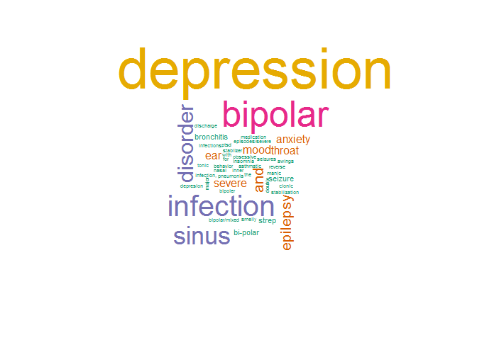
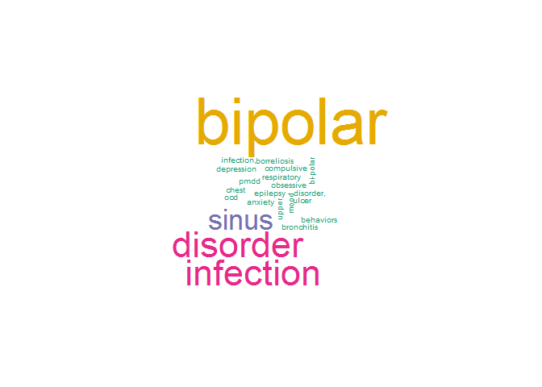

<a href="https://rajwantmishra.shinyapps.io/SymptomsDiseasesRecommendation/"> Shiny App </a>


## Prepare Data {.tabset .tabset-fade .tabset-pills}

### Pacakge

---
library(tidyverse)
library(ggplot2)
library(DT)
library(stringr)
library(lubridate)
library(corrr)
library(psych)
library(readxl)
library(readr)
library(plotly)
library(lme4)
library(lmerTest)
library(tm)
library(wordcloud)
library(e1071)
library(gmodels)
library(mongolite)
library(lubridate)
library(gridExtra)
---

### Load data 


```r
# load data
workDir <- getwd()


filePath = paste0(workDir,"/Data")
g_max <- 1048576

train_Data<- read_tsv("https://raw.githubusercontent.com/Rajwantmishra/msds/master/607/Project5/607Project/data/drugLibTrain_raw.tsv")
```

```
## Warning: Missing column names filled in: 'X1' [1]
```

```r
test_Data<- read_tsv("https://raw.githubusercontent.com/Rajwantmishra/msds/master/607/Project5/607Project/data/drugLibTest_raw.tsv")
```

```
## Warning: Missing column names filled in: 'X1' [1]
```

```r
glimpse(train_Data)
```

```
## Observations: 3,107
## Variables: 9
## $ X1                <dbl> 2202, 3117, 1146, 3947, 1951, 2372, 1043, 27...
## $ urlDrugName       <chr> "enalapril", "ortho-tri-cyclen", "ponstel", ...
## $ rating            <dbl> 4, 1, 10, 3, 2, 1, 9, 10, 10, 1, 7, 8, 8, 9,...
## $ effectiveness     <chr> "Highly Effective", "Highly Effective", "Hig...
## $ sideEffects       <chr> "Mild Side Effects", "Severe Side Effects", ...
## $ condition         <chr> "management of congestive heart failure", "b...
## $ benefitsReview    <chr> "slowed the progression of left ventricular ...
## $ sideEffectsReview <chr> "cough, hypotension , proteinuria, impotence...
## $ commentsReview    <chr> "monitor blood pressure , weight and asses f...
```


### Working with One Row 

```r
NROW(unique(train_Data$X1)) # indicate X1 is unique 
```

```
## [1] 3107
```

```r
t(train_Data[1,])
```

```
##                   [,1]                                                                                                                                                                                                   
## X1                "2202"                                                                                                                                                                                                 
## urlDrugName       "enalapril"                                                                                                                                                                                            
## rating            "4"                                                                                                                                                                                                    
## effectiveness     "Highly Effective"                                                                                                                                                                                     
## sideEffects       "Mild Side Effects"                                                                                                                                                                                    
## condition         "management of congestive heart failure"                                                                                                                                                               
## benefitsReview    "slowed the progression of left ventricular dysfunction into overt heart failure \r\r\nalone or with other agents in the managment of hypertension \r\r\nmangagement of congestive heart failur"       
## sideEffectsReview "cough, hypotension , proteinuria, impotence , renal failure , angina pectoris , tachycardia , eosinophilic pneumonitis, tastes disturbances , anusease anorecia , weakness fatigue insominca weakness"
## commentsReview    "monitor blood pressure , weight and asses for resolution of fluid"
```

```r
train_Data$condition[1]
```

```
## [1] "management of congestive heart failure"
```

```r
train_Data$sideEffects[1]
```

```
## [1] "Mild Side Effects"
```

```r
train_Data$sideEffectsReview[1]
```

```
## [1] "cough, hypotension , proteinuria, impotence , renal failure , angina pectoris , tachycardia , eosinophilic pneumonitis, tastes disturbances , anusease anorecia , weakness fatigue insominca weakness"
```

```r
train_Data$commentsReview[1]
```

```
## [1] "monitor blood pressure , weight and asses for resolution of fluid"
```

```r
#
#https://www.innerbody.com/diseases-conditions
# https://kidspicturedictionary.com/english-through-pictures/people-english-through-pictures/human-body/
```


## Using SVM suport vector meothd . 

Since data points were too high it was not possible to run the model with full data on the working machine. Result of this Methods were not accurate . All the valuses were calssifed as one.


```r
# library(e1071)
t(train_Data[2,])
```

```
##                   [,1]                                                                                                                                                                                                                                                                
## X1                "3117"                                                                                                                                                                                                                                                              
## urlDrugName       "ortho-tri-cyclen"                                                                                                                                                                                                                                                  
## rating            "1"                                                                                                                                                                                                                                                                 
## effectiveness     "Highly Effective"                                                                                                                                                                                                                                                  
## sideEffects       "Severe Side Effects"                                                                                                                                                                                                                                               
## condition         "birth prevention"                                                                                                                                                                                                                                                  
## benefitsReview    "Although this type of birth control has more cons than pros, it did help with my cramps. It's also effective with the prevention of pregnancy. (Along with use of condoms as well)"                                                                                
## sideEffectsReview "Heavy Cycle, Cramps, Hot Flashes, Fatigue, Long Lasting Cycles. It's only been 5 1/2 months, but i'm concidering changing to a different bc. This is my first time using any kind of bc, unfortunately due to the constant hassel, i'm not happy with the results."
## commentsReview    "I Hate This Birth Control, I Would Not Suggest This To Anyone."
```

```r
# str_detect(train_Data$condition,"hirschsprungs")
# t(conditionBuffer[1,])
# 
# str_detect(conditionBuffer$Dt.risknCause,"birth control")
# t(conditionBuffer[21,])

#---------------------------------------------------SVm Method 
train_Data$urlDrugName <- as.factor(train_Data$urlDrugName)
train_Data$effectiveness <- as.factor(train_Data$effectiveness)
summary(train_Data)
```

```
##        X1         urlDrugName       rating      
##  Min.   :   0   lexapro :  63   Min.   : 1.000  
##  1st Qu.:1062   prozac  :  46   1st Qu.: 5.000  
##  Median :2092   retin-a :  45   Median : 8.000  
##  Mean   :2081   zoloft  :  45   Mean   : 7.006  
##  3rd Qu.:3092   paxil   :  38   3rd Qu.: 9.000  
##  Max.   :4161   propecia:  38   Max.   :10.000  
##                 (Other) :2832                   
##                 effectiveness  sideEffects         condition        
##  Considerably Effective: 928   Length:3107        Length:3107       
##  Highly Effective      :1330   Class :character   Class :character  
##  Ineffective           : 247   Mode  :character   Mode  :character  
##  Marginally Effective  : 187                                        
##  Moderately Effective  : 415                                        
##                                                                     
##                                                                     
##  benefitsReview     sideEffectsReview  commentsReview    
##  Length:3107        Length:3107        Length:3107       
##  Class :character   Class :character   Class :character  
##  Mode  :character   Mode  :character   Mode  :character  
##                                                          
##                                                          
##                                                          
## 
```

```r
unique(train_Data$X1)
```

```
##    [1] 2202 3117 1146 3947 1951 2372 1043 2715 1591 1686  458 3479  959
##   [14]  928 2643 3692  338 3201 2566  723  305 1084 1246 1714  376 1571
##   [27] 2436 3716 1959 1872 1038 2745 1268  797 2801 2360  630  422  330
##   [40] 1899 1210 1762 1534 3060 3728 1804 1989  714 1290 2646 3100 3082
##   [53] 1018  494 1239 1325 2542 2118  175  985 2120  830 3938 1351 2075
##   [66] 4016 2285  768 3856 2412 3756 3077 1053  868  678 3995 1318 1441
##   [79] 1483 3471 2461  427 2059 2319  927  240 1377  674 3763 3350 3193
##   [92] 3435 2211 1029  732  133 1050  366 2859 3382 3144  259 4126 2555
##  [105] 3541 3702 1938 1514 1987  385 2447 3364 2236 3469  705    2  272
##  [118] 2839  277 1278 1588 2321 2006 3270 3582 2957 2088 3226 2518 1100
##  [131] 3493 2503 1255 4145 2332 2031 2944  179 2097 2637 2145 3486  109
##  [144]  691 3271 1321 1004 1906  489 4075 1261 3121 1340  591 3137 2395
##  [157] 1164 2735 3439 1757 3535 1058 3394 1181 2473 1232 2585 2224 3649
##  [170] 2598 2201 3718 1524 1128  884 2544 1691 3538 3867 2108   76 1470
##  [183] 2226 3665 2956 1338 1743 3434 1368 3883    9 1861 1360  620 3723
##  [196] 1880   69   29 2262 4013  850 2191 2345  300 3303 2268 3616 2320
##  [209] 3789 1371 3940  158  878 1541 1770 1386 3118 3864 1789 2112 3941
##  [222] 1536  349 1956 2724  549 1791 1498  228   37 1558 4125 2061 1284
##  [235]  235 4065 2531 3885 1230  137 2445 3606  353  446 3542 2297 2823
##  [248]  836  860 1843 2572 4037 1276 2945 1019 3446 1409 1273 3312 3052
##  [261] 2644 2751 3386 3755 2810 1358 1564 4115 2626   53 4101 3779 3899
##  [274]  795 3268 2635 1883 3814  661 3696  149 2099 2077 2667  332  856
##  [287] 1042  505  320 3697 2051 1008 3708 1319 4047 1157 3456  603 3071
##  [300]   98 1969 3053   40 1841 2301  113  938  454 3252  726 1114 1973
##  [313] 1468  411 3847 3329  122 2243 3007 2028 3609  396 3815 1106 1570
##  [326] 1665  518  706 4146 4007  406 3866  656 3064 2494 3586 1116  980
##  [339] 2618 1983 1905 2350  531  161 1663 3114 2422 2733 1604 2522 1786
##  [352] 1191 2124 2256 1382 3128  715 4147 2588 2687  566 1636   44 1460
##  [365] 2025 1532 3683 3838  810 2232 3597 2084 1927 1143 3832  425 2001
##  [378] 3407 4030 3098 3006 4004  602 2194 3289 2520 1044  787 1275 3843
##  [391] 2677 1504 3502  782  988 3146 1582 3813  749 2790 1947 1923 2342
##  [404] 1178 2239 1307 3529  851 3840 1654 3375 3162   82 1379  750  809
##  [417] 2356 1000 2498  141  866 1485 1326 1643 4148  509 3129 3020 3338
##  [430] 1774 1203 1206  121 2580 1772 3304 4121 2173  206 1660 1954 3046
##  [443] 1332 3401 3051 3322 4023  269 4090 2923 1364  854 1472  135 2425
##  [456] 1434  853 3158  824  890 3809  414 1592 2237 2442  747  476 1960
##  [469]  456 1709  766  993 3179  793 2969  271   11 1402 1950 3276 2337
##  [482] 3854 2090  676 1698  659 3970 2822 2812 2497 2877  704 3342 3571
##  [495]  592 3254 2483 1966  314  119  200 3416 3559 2106 1406 3632 2828
##  [508] 2294 1204 2486  946 3806 3010 1189  835  215 1846  392   27 3612
##  [521]  756 2263  478 2060 1458 1898 1911  913 2138 2370 3284 4060  621
##  [534] 1396 2820 2752 2832 2565 1391  132  283 2385  565 1677  925 3305
##  [547]  973 1219  394  917 2882 3063 2136 3111 4161  727 2917  413 2491
##  [560] 2980 1033  599 1346 3343 1067 1459 3022 1002 2313 3324 2852 3805
##  [573] 2840  657 2437 1477 2276 3326 1723 2785 3277 2985 2547  671 3981
##  [586]  882  241 2375 1262  340 4152 2690 1713 1985 3782 3084 3404 2567
##  [599] 3285 1719  520 2788 2514 2086  770 2371 1175  474 3770  910 2548
##  [612] 3143 3056  842 2283  268 1055 2306 3602 3008  107 3079 3526 2862
##  [625] 1087  576  735 3989 3757  238 2267 2475 2573 2197 1436 2066 3595
##  [638] 2409 1942 2323  984 2358 1487 1165 2907 1864  916  204  190  488
##  [651] 3977  438  244  611 2540 3607 3150 1190 2336 3464 3748 2011  108
##  [664] 1363 1085 3036 2670 3590  426 3963 3998 3807 2488 2340 1614  947
##  [677] 2951 2122 1304 2804 4141 3035  816  459  254  937  303 3974 1144
##  [690]  680 1561 3910 2205  144 1934 3032 1462 3422   41 4011 1560 1271
##  [703] 3870 2922 3244 1674 3962 3917 2390 2257 2880 2861 3774 2665 2831
##  [716] 4066 1623 2079  390 1863 1064  187 3645  251  537  357  278 1728
##  [729] 3967 1473 3123 3775 3969  232  612 2746 3091 2206  328  941 2368
##  [742]  785 2583   68 1711  998 1197 3902 1231 1802 2043 3892 1760 2780
##  [755] 2736 3088 2278 1795 2069 2156 3176 3715 1809  638 2967  788  524
##  [768] 2874  901 2325 3682 1217 1089 1023 1413 4044 3427 3351 1383 3134
##  [781] 1251 2893 3484  145    8  393 2904   80  162 3120  203 1112 1454
##  [794] 3259  359 1429  486 1194   13 1238 2213 2386  379 3264  294 1621
##  [807] 2534  761 1069 2678 4099 3431 1061 2851 2479  345  970 3879 2845
##  [820] 2899   59 3025 1584 2578 2689  967 3693 1080 3138 3213 3325 2454
##  [833] 1684 2927 4130 3759 3093  440 3674  477 3638 3803 1123 1840  719
##  [846] 3034 1925 2460 2730 3689    6 1830 3391 2532 1540 1381  125 2603
##  [859] 3850 2652  712 2857 3087  391 2740  220  990 2630 1245 1047   58
##  [872]  570 2659  817 4137 2414 2654  707 3592  261 2860 1908 1097 3787
##  [885] 1301 2833 1180 3566 1142 1637  721 1759 1031  384 1565  590 2082
##  [898] 1865 1488 3966 4039 3822 2196 1735 2958 2734 3109  859 2440 2741
##  [911] 3239 1748 4096 3777 1796 2364 1062  823 3524 2433 2781 3796 2135
##  [924] 1704  455   52 1667 1817 4035   20 1428  415 2045  194 1220 3353
##  [937] 1092 3818 1224 1669  264 2504 3426 1464 2179 3669 1644 3705 3924
##  [950] 3251  318 2012 2869  581  631 3808 2619   48 1850 1767 3698  807
##  [963] 3722 3380 1746 2853 1897  223 2806  587 3511 3610  360 1242 1658
##  [976] 3622  833 2992 3819 4153  693 3865 1610  968  468 1323 2359 1153
##  [989] 1697  286 1229 3092 1725 3878 1892 4108 1493 2290 3554 1237   97
## [1002] 1105   72 3939 3701  799 1778 4045 3572  285  559 2593 4001 4133
## [1015]  315 1615  930 3041  604 1109 1603 3925  157 2017 2446 1970 1992
## [1028] 2978 4019 1659 3488  344 3992 3272  442 3853 2718 1647 3421  507
## [1041] 2636   18 2155  649 4050  776   47 2885 1940 2185 2722 1496 3374
## [1054] 2113 1784 3066 1648 2228 2837 1051 1218 1259 1015 3871 1638 1267
## [1067] 1896  128 3880 1060 2905 1264 1111 1936 3743 3912 3646 2067 1856
## [1080] 2987 1309 2887 2929 3172 2775 1270 2381 2328 3862 3258 1036 3929
## [1093] 1868 1523 1720  354 1554  880 3647  888  491 2298 3741 4105 1148
## [1106]  826 3186  669 2363 3793 3495  139 3846 2579  250  342 3243  796
## [1119] 1005  441 1310 3721 2930  920   43 2343 3387 2141 2178  270 2824
## [1132]  513  475  534 1331  897  267  233 3261 4036 2076  287  737  514
## [1145]  814 2704 2662 3393 1690  819  832 2449  279 3731 2640 3908 3876
## [1158] 2091 3935 2543 2252 3623 3205 2536 3455 3585 4009 2984  309 1838
## [1171] 2586 2470 1993  822 2315 1790 2247 3047 1550 1769 1549 1172  896
## [1184]  974 3157 3520 1195 3095 2443 3948 2723   77 1427  262  198  725
## [1197] 3292 3004 2759 2642 3174  431 3408 2288 3765 3742 2856  106 2146
## [1210] 1233 1045  515 1736 3245 1689 3834 2539  635 3057 1975 1347 4054
## [1223] 3868  301 3537 1828 2714 3574  310 2248 1330 2711 2633 4140 1599
## [1236] 1764 1102  908  645 3475 3214 2970 3385  595 2382  260 4034 2854
## [1249] 2419 3219 3026 2538 4132 1581 3410 1851 3569 2013 2996  991 2094
## [1262] 3104  101 2713 2055 1497 4156  950 1912 1265 1694 2767 2171 1465
## [1275]  508 1463 2787 1212 4058 2121 1182 3848 3760 3749 3372 2693 2937
## [1288]  147 2789 3580 2085 1797 3922 3611 2795 1151 2254 2818 2203  312
## [1301] 2807 3521 1199 3653 3102 3626 2026 3054  152 3187 1622 3736 3823
## [1314] 1650 2102 3661 2065   55 3528 1688  992 1073 3038 4002 3314 1343
## [1327] 3915 1676  255 1286 2160 1812 2849  919 3898 2892  335  553 2126
## [1340] 1727 1953 2489 2041  722 2600  140 1891 1103 1035 3873  585 1852
## [1353] 4107  934 3002 3180 1639  102 1877 2417 1895 3406 3560 4091 2339
## [1366] 2157 2246  208 1200  728 3923   19 4064   54 1870 2308 1094 3012
## [1379] 3159 3363 2326 1548 3452 2891  754 2995 1132 2143 2183 3266 3090
## [1392] 2049 3949 1579 3255 2526 1354 2888 2675 3750 1152 2275 3246 2641
## [1405]   38 3498 2875 1082 3024 3630  339 1539 2376 4033 2220  293 2379
## [1418] 1687 3553  767 2251  982 3033 2792 2181 1672 2738 2558  815  479
## [1431] 3211  978 1303  730 1431 3278 2707 3800 3762 1013 3672 1235 2793
## [1444] 2469  434 2797 2280 4052 2682 2333 3067 2125 2292 2329 2507  563
## [1457] 2562  205 1693 3395 1527 2878 2408  662 3957 2304 2519   89  647
## [1470]  764 1056 2238  827 1241 1904 3598 1531 3257 3287  143  789 2062
## [1483] 3310 1875 2169 2645 3039  171  412 2553  416 2606 1302 2952 3725
## [1496]  364 2411 2949  744   73 3302 3368 1272 2221 2373 2000 3761 2439
## [1509] 2639 1503 2215 1223 3153 2111 3891 2010 2743 2369  633 3229 3955
## [1522] 3650 1086 1415  634 1466 2047 2591 1862 3491 1813 2242  178  500
## [1535] 3827  484 3059 3331 2259 2721 3248  881 1173 1700 1348  273 3419
## [1548]  763 2231 1608 1365 3614 1609  997 2105 2528 2808 3227 1854 3070
## [1561] 1476  319  184 2939 2901 3501 3021 2040  843 3523  541 1160  805
## [1574] 2258 3744 1141  210 3065 2525   65  867 3262 2858 4098 1138 3175
## [1587] 1032 2341  341 3212  879 1517  372 2638 2272 2581  893 3634 3931
## [1600] 3676 1333 2415 3627   96 2770 2651 3045 3874  129 2574 2131 1646
## [1613] 1997 4074 2784 3345 3510  370 1799 2517 2128 1831  999  885  741
## [1626]  231  377 3751 3979  432 1370 3037 1387 1602 1149 2657  172 1887
## [1639] 2668  818 3223 2279  952   16 2038 2032 3194  367 1416 3772 3926
## [1652] 2776 2918 3561 1859 3215 3220 1946 3085 1635 3352  544 2467 1469
## [1665] 1679 1914  554  362  551 3983   81 1741 3944  355 2095 2462 2705
## [1678] 4038  556  697 3709  653 3573 3487  420 2655 3242 3619 1236 1095
## [1691] 3078 3766 2318  964 1171  371 3733 2908 1586 1495 2561 3771 1869
## [1704]  258  773 2073 2994 2030 3453  114 1827 1605  961 2302 3115  683
## [1717] 2338   56 4029  435 1063  155 3075 1021   60 2089  786   35 3539
## [1730] 1661 1066  358 1129 4122 3551  526 1207 3280  265 1596 1675 1979
## [1743] 1529 3587 3300 3000 2527  336 2610 3651 1163  891  495  582 3882
## [1756] 3089 3198 2492 1196 2666 3933  212 3200 1070   75 3594 1320 1037
## [1769] 3670  247 1606 3934 1511 1930  186 2964 2027 2731 2068 2906 1633
## [1782] 2974 1081 2925 3656 3642 1792 2435 1666   32 3601 1130 3029  445
## [1795] 3615  464 3769 4139 2192 1692 2327 1820 2816 1957 2873 2594  243
## [1808] 1715  401 2044 1996 3355 4131 3017 2710  450 1234 3295 3447 2346
## [1821]  471 3504 2835 3829 3636 1685 2884 3448 1798 2825 1844  613 1417
## [1834] 2487 4078 3240 2895 4158 2134 4070 2948 3234 2935 2742 2334 1225
## [1847] 1787 1509 3890 3700 2109 1740  542  110 1642  512 1624 2007 3362
## [1860] 2057 2104 3247 1730 1618 3301   78 2989 2330 2008 3478 2890  313
## [1873] 3152 1315  915  701 2399  466 1025  363 3149 1853 3932 1352 1369
## [1886] 3576 2081 3465 4118 1535 1040 2749 3904 3023   83   79  666 1449
## [1899] 4097  923 1450 3398 3210 2977 2266 2389  812 1521 3267 2589  660
## [1912] 1932 1452 3978  862 1814 3019 3424 3061  848  837 2943 1625  213
## [1925] 2533 3699  131  439 4151 3588 2434 2537 2968 1620  857  448 3753
## [1938] 3831 3849 3402 1738  103 3549 2848  525 1108 1832 1425  165 3600
## [1951]  911 2676 2410 3525 2432 1871 3139 2568 1752 2512  395  627  699
## [1964]  951  765 2755 2324 1392 2241 3620 2910 2847 1411  648 3900 3608
## [1977] 4109 1893  775 3788   51 2612 2554 2663 2838 3291 1384 1127 3839
## [1990] 1041 2464 2299 2158 4086 3599  111  183 2530  615 3188 3283 1717
## [2003] 1568 4059 1722 1185 2142 2545  397 1299 1641 3009 3624 3256 1754
## [2016] 2149 2098 3371 3141  573 4159 3817 3232 2998 2322 3825 1545 3914
## [2029] 2661 1885  356  610 3648  239 4076 3545 2180 3369 3166 1825 2815
## [2042] 3282  374 3965 1948 1329 1131 3739 1538 3112 3396  733 2471 2508
## [2055] 1400 3768 1418 3837 2931 2277  382 3311 2602 1513 3336 3706 1328
## [2068] 3555 1240 2249 3231  685 3218 1281 2805 2377  123 2648 2938  664
## [2081] 1807 2592 2316 3119 2725 1971 3685  230  905 3367  769 3414 3532
## [2094] 2441 3392 1756 2928  791 2162 3691 3719 4083  421 3459 2941 4129
## [2107] 1884 2628 3858 2151  802 1881 2019 2584  628  496 3457 1627 1793
## [2120] 2219 1901  794 2570 3720 2427 3945 2289 2976 3390  417  746 2139
## [2133] 1221  493 1920 1176 2622 3016 1350  828 3476 3347 1492 3994 3984
## [2146] 3745 3507 1030 2474  594 3901 3982 3804 2521 1808 3273  127 3570
## [2159] 3841 2450  403  150 4055 2407 1447 1640 3411 2455   62 2349 2269
## [2172] 2557 2413   95 3126  963 2204 3306 1587 3318 2166  236  222 3946
## [2185] 2406 1821  120 1696 2650 4160 2393 3151 2653  193 2296  181 3783
## [2198]  389  972 3506 1556  673 3536 4049 1374 1403  331  616 1293 3094
## [2211]  266 3127 1943 2212 2607 3207 1818  225  105 2426 1519 4123  632
## [2224] 2747 2080  874 2303 2110 1193 2979 2502 1902 1766 1937  711 3399
## [2237] 3557 2886 2362 2233 1699  284 1670  924 1443 3617 3405  738 1823
## [2250] 3299 2405 2367 4143  926 1412 3980  167 2482 2286 3909   12 1557
## [2263]  619 1098   90  614 3820 1414  861 3466 3881  781 1649 1998 2365
## [2276] 3269 3713 3988   28 1533 1072 3297 1922 2551   74  517 1317 3160
## [2289] 2623 2240 2014 2170 1595 1528  116 2354 3165 1078 2706 1810 2836
## [2302] 3830 3514 1611  624 3797 3263  409 2699 1634  115  288 4112 3811
## [2315] 1188  337 3658 2702 3076   46  751 3855 3224  757  462 1949  677
## [2328] 2727 1208 3786  424  325  668  350  447  713 3105 1935 1733 1228
## [2341] 3544 1155  387 1378 1345  758 2199  451 1201  703 3222 2260 1619
## [2354]  834 3167  954 3083 3732 2457 1745 1423 1419 4150 4111 3730 1184
## [2367] 3677 2018 1260 2490   21 1313 2830 2453 2311 3332 3631 3124  675
## [2380] 3952 1952  849  698 3473 1362 1139  873  606  838 3444  629  906
## [2393] 2920 1758 3260 3327 2764 2063 3379 2773 4144  321 3209  700 1186
## [2406] 2794  626 3907 2186 1016 1491 1096  852 3534  784  607  174 1209
## [2419] 2282 2476  100 3335 1250  745  334 2924 3835 2898 1716 2897 3309
## [2432] 3480  596 3003 1341 2227 4073 1562 3519 3334 1553 3581  327 1944
## [2445] 3877  643 2165 2054 2879 1478 1849 3062 3140 3443 4080  460 1052
## [2458] 1408 1573 1986 3307 2647  419  742 1890 1398 1448 3294  498 2766
## [2471]  375  979 1216 3714  404 2480 1435 3567   93 3530 3221 1780 2234
## [2484] 2754 1860  831  428 1900 3784 3204 3911 2782  282 2915 3185  343
## [2497] 2698 2802 2560 3163 1119 1585  695 3449    0 1593 1718 1426 2033
## [2510] 3238 2015 2005 2990 1137 3844 2317 1254 3810 2388 2163 3412 3564
## [2523] 2274 1742 1166 2916  246 2132 3785 2700 1682  933 3857 1471 3290
## [2536] 1982  365 2309  740   26 2900 3373 1451 4006  684 4068 1257    3
## [2549] 2195  841 2416  292  702 1054 3888 3217 2430 3953 4102 1678 1974
## [2562] 1256 2287 3458 1306 1879 2400 1453 2686  605 3533 1297 2515   63
## [2575] 1590 1894  995 1393  237  654 1978  112 3040 1357  808 1567  579
## [2588] 1845  126 3348 3072 4032 3903 3845  855 2758 2198 3073 3791    7
## [2601] 2563  858 3011 2694 4008 2993 3833 3500  407 4134 2418 3442  153
## [2614] 3655 1577 2404 2366 1009 2674 3737  280 3897 4127 3145  400 1607
## [2627] 1508 2529 1490 3298 1811 2021  506 2595 3080 1755  907 2052 3767
## [2640] 1683  552 1873 3973 1816 3389 3798 1136  949 3659  163 1671 1701
## [2653] 2397 2119 3183 4062 3142 1525 3415  449 2919  945 2850 3976 1543
## [2666] 1858  437 3652 1322 3462  790  877  743 2883 3308 3522 1011 1855
## [2679]  588 1314 3005  348 2484 1034 1170 2524 3296 3225 4067 1552 2716
## [2692]  575  651  597 2954 1258 1569 3413 3365 1316  470 3515  804  281
## [2705]  936  736 2779 2896 3015 3842 1150 1628 3403 3101 3773 2516  586
## [2718] 2208  160 1117 2814 1926 3182  863  956 3851 1339 1226 1222 2691
## [2731] 3625  608  164 2167 1046 3664 1990 2680 4031 3629  329 2023 2541
## [2744] 2559 4053 1439 3894 2154  813  433 1113 2103  864  274  971 2774
## [2757] 3747 3503 3752 3640 4136 3430 2152 3712 1355 2829  889  558  912
## [2770] 1390 2129 2575  511 2401  221 1305  146 3378 1788 1059 1833 3203
## [2783] 2867  510  323 1572  176 2868 1919  168 3436 1410 4113 1401 2270
## [2796] 2190 2250  136 1480 3169 1285 1984  898  197 2351 1494 1803 2096
## [2809]  771 2293 2708 2093 1118 4063 2866 3133  869 2402 1091 1457  199
## [2822]  429 3628 3483 2841 1834 1806 2940 1981  734 2983  297 2133 3482
## [2835]  811 2609 3668 1576 3013 1179 4010 4017  825 2726 1248 1574 4000
## [2848] 4120  625 3758 3727 1455 1729 1169 2273 1651 3099 4015 2617 2791
## [2861] 3799 2765 1028 1761  291 2034 1751 2295 3861 1012 3042   67   24
## [2874] 3470  216 2876 1921 2799 1159 3438 2172  166 4110  207 3527 3641
## [2887] 2335 2101  593 1183 1731 1874  527 2348  469 1359 2182 2827 1542
## [2900] 3317  932 1907 2737 1630 1479 1147 2950 1924  960 1499   25 1140
## [2913] 2210  929 3241 1563 2760  847 1656 2953 3550 2660 1026 2200  753
## [2926] 3349 3954 3872 3919 3068 2384  180 1279 2511 1444 3930  609 3107
## [2939] 1361 2357 1915 3358 1910 3315   94 3604  774  640 1312 2347 3678
## [2952] 2549 2505 1215 1405 1589 1205  275 2870 1158 1213 2092 1110  307
## [2965] 2834 2071  876 3132   86 2842 3125 2769 3147 3130 2846 1445 2624
## [2978]  209 3237 2803 1977 2656 1999 2184 2798  935 3663 2159 2438  130
## [2991] 1734 2083 3472  958  557 2431 1941 1547 2444  201 2981 2035  368
## [3004]  977 3643 1645 2448 3951  820 1965 1324 3780 1916  256 3695 3286
## [3017] 3184 1482 1710 2230 1616 1337  562 1888  373 2973 2783 2855 3018
## [3030] 3316 1695 1174 3936 2036 1211 2932  976 1161 2048  642 1077 3028
## [3043]  778  324 2264   84 4028 2696 2972 1600 2673 2459 1931   91 3171
## [3056]  430 2843 3208 3960 2352 2117 4027 4089 3131 1652  760 3577 3639
## [3069] 1967 4124 2189  806 1214 2946 3548 2739  151 2305  718  546 2761
## [3082] 3354  423 3236  663  801  759 2020   99 2509 1882 2058 2176 2909
## [3095]  539 1712 2913 2235 2148 2613  709 3485 1039 3281 1664 2621 2748
```

```r
fitdefaultRadial <- e1071::svm(urlDrugName~condition + effectiveness  ,train_Data[which(train_Data$urlDrugName %in% c("biaxin","lamictal","depakene","sarafem")),])
fitdefaultRadial
```

```
## 
## Call:
## svm(formula = urlDrugName ~ condition + effectiveness, data = train_Data[which(train_Data$urlDrugName %in% 
##     c("biaxin", "lamictal", "depakene", "sarafem")), ])
## 
## 
## Parameters:
##    SVM-Type:  C-classification 
##  SVM-Kernel:  radial 
##        cost:  1 
##       gamma:  0.02777778 
## 
## Number of Support Vectors:  46
```

```r
summary(fitdefaultRadial)
```

```
## 
## Call:
## svm(formula = urlDrugName ~ condition + effectiveness, data = train_Data[which(train_Data$urlDrugName %in% 
##     c("biaxin", "lamictal", "depakene", "sarafem")), ])
## 
## 
## Parameters:
##    SVM-Type:  C-classification 
##  SVM-Kernel:  radial 
##        cost:  1 
##       gamma:  0.02777778 
## 
## Number of Support Vectors:  46
## 
##  ( 9 23 13 1 )
## 
## 
## Number of Classes:  4 
## 
## Levels: 
##  abilify accolate accupril accutane aciphex actiq actonel actos acyclovir aczone adcirca adderall adderall-xr adipex-p advair-diskus advair-hfa albuterol aldactone aldara alendronate alesse allegra allegra-d aloprim alprazolam ambien ambien-cr amerge amitiza amoxil amphetamine ampicillin anafranil androgel angeliq antivert aralen arava aricept arimidex armour-thyroid aromasin arthrotec asacol asmanex atacand atarax atenolol ativan atripla augmentin avage avapro avelox avita avodart axert aygestin azasan azelex azopt azor baciim baclofen bactrim-ds bactroban baraclude benadryl benicar benicar-hct benzaclin betamethasone betaseron biaxin bisoprolol boniva botox buprenorphine buspar byetta bystolic caduet carac cardura cardura-xl cataflam catapres ceclor cefzil celebrex celexa chantix cialis cipro citalopram clarinex claripel-cream clarithromycin claritin cleocin climara climara-pro clindamycin clindamycin-topical clobetasol clobex clomid clonazepam compazine concerta copaxone coreg corgard cosopt coumadin cozaar crestor cymbalta cyproheptadine cytomel danazol dapsone darvocet-n delestrogen deltasone depakene depakote depo-provera desonide desyrel detrol detrol-la dexamethasone dexedrine dextroamphetamine dextrostat diazepam diclofenac dicyclomine differin diflucan dilantin dilaudid diltiazem diovan dispermox ditropan divigel doryx dostinex dovonex doxepin doxycycline duac duragesic dysport ecotrin effexor effexor-xr efudex elavil elidel elmiron elocon emsam enablex enalapril enbrel erythra-derm erythromycin estrace estrasorb estratest estring estrostep-fe eulexin evista evoclin exelon femara femhrt femring fentanyl fexofenadine finacea fioricet fiorinal flagyl flexeril flomax flonase flovent fluconazole fluvoxamine follistim fortaz fosamax fosamax-plus-d fosinopril frova galzin geodon glucophage glucophage-xr gonal-f-rff grifulvin-v halcion haldol humira hydrochlorothiazide hydrocodone-and-acetaminophen hydrocortisone hyoscyamine hytrin hyzaar imitrex imodium imuran inderal innofem inspra isoniazid keflex kenalog keppra ketoconazole ketorolac klaron klonopin lac-hydrin lamictal lamisil lamotrigine lantus lasix latisse levaquin levetiracetam levitra levora levothroid levoxyl lexapro lidex lidocaine lipitor lithium-carbonate lo-ovral locoid-lipocream lodine lopressor lorazepam lortab lotrel lotronex lumigan lunesta lupron lybrel lyrica macrobid malarone maxalt medroxyprogesterone meperidine mercaptopurine meridia metformin metformin-extended-release methadone methimazole methotrexate metoclopramide metoprolol metrogel metrolotion metronidazole mevacor micardis minocin minocycline minoxidil miralax mirapex mirena mirtazapine mobic morphine motrin naltrexone naprosyn naproxen nardil nasacort nasacort-aq nasarel nasonex neoprofen neurontin nexium niacor niaspan nitrofurantoin nizoral nizoral-shampoo nolvadex noroxin norpramin nortriptyline norvasc nuvaring nuvigil nystatin omacor omnicef omnitrope oracea ortho-evra ortho-novum ortho-tri-cyclen ortho-tri-cyclen-lo oxazepam oxybutynin oxycodone oxycodone-and-acetaminophen oxycontin pamelor panixine-disperdose parlodel paxil paxil-cr penicillin-v penlac pentasa pepcid percocet periogard periostat permapen phendimetrazine phenergan pilocarpine plavix plendil polymyxin-b ponstel pravachol prednisolone prednisone premarin premarin-vaginal prempro prevacid prilosec prinivil pristiq proair-hfa prochlorperazine progesterone prograf proloprim prometrium propecia propranolol proquin-xr proscar protonix protopic provera provigil prozac quibron-t qvar ranitidine rebif reglan relafen relpax remeron remicade renova requip restasis restoril retin-a retin-a-micro rhinocort ribavirin rifadin risperdal risperdal-consta ritalin ritalin-la saizen sanctura-xr sarafem seasonale seasonique selegiline septra seroquel seroquel-xr serzone singulair skelaxin solodyn soltamox soma sonata sotret spiriva spironolactone strattera suboxone sular sulfasalazine sulindac sumatriptan symbicort symbyax synthroid tambocor tamiflu tapazole tarka tazorac tegretol tekturna temovate tenormin tequin tetracycline tirosint tobramycin tofranil-pm topamax topicort toprol-xl toradol tramadol trazodone trental tri-luma triamcinolone triaz trileptal trilipix trimethobenzamide trimethoprim triphasil tussionex tylenol ultracet ultram ultram-er vagifem valium valtrex vaniqa vasotec ventolin-hfa vesicare viagra vicodin vicoprofen vigamox vioxx vistaril vivelle vivelle-dot voltaren vytorin vyvanse warfarin wellbutrin wellbutrin-sr wellbutrin-xl xalatan xanax xanax-xr xenical xyrem xyzal yasmin zantac zegerid zestoretic ziac ziana zithromax zmax zocor zofran zoloft zomig zovirax zovirax-topical zyban zyprexa zyrtec zyrtec-d zyvox
```

```r
fitdefaultpolynomial <- e1071::svm(urlDrugName~condition + effectiveness  ,data= train_Data[1:5,] , kernel= "polynomial")
fitdefaultpolynomial
```

```
## 
## Call:
## svm(formula = urlDrugName ~ condition + effectiveness, data = train_Data[1:5, 
##     ], kernel = "polynomial")
## 
## 
## Parameters:
##    SVM-Type:  C-classification 
##  SVM-Kernel:  polynomial 
##        cost:  1 
##      degree:  3 
##       gamma:  0.1111111 
##      coef.0:  0 
## 
## Number of Support Vectors:  5
```

```r
summary(fitdefaultpolynomial)
```

```
## 
## Call:
## svm(formula = urlDrugName ~ condition + effectiveness, data = train_Data[1:5, 
##     ], kernel = "polynomial")
## 
## 
## Parameters:
##    SVM-Type:  C-classification 
##  SVM-Kernel:  polynomial 
##        cost:  1 
##      degree:  3 
##       gamma:  0.1111111 
##      coef.0:  0 
## 
## Number of Support Vectors:  5
## 
##  ( 1 1 1 1 1 )
## 
## 
## Number of Classes:  5 
## 
## Levels: 
##  abilify accolate accupril accutane aciphex actiq actonel actos acyclovir aczone adcirca adderall adderall-xr adipex-p advair-diskus advair-hfa albuterol aldactone aldara alendronate alesse allegra allegra-d aloprim alprazolam ambien ambien-cr amerge amitiza amoxil amphetamine ampicillin anafranil androgel angeliq antivert aralen arava aricept arimidex armour-thyroid aromasin arthrotec asacol asmanex atacand atarax atenolol ativan atripla augmentin avage avapro avelox avita avodart axert aygestin azasan azelex azopt azor baciim baclofen bactrim-ds bactroban baraclude benadryl benicar benicar-hct benzaclin betamethasone betaseron biaxin bisoprolol boniva botox buprenorphine buspar byetta bystolic caduet carac cardura cardura-xl cataflam catapres ceclor cefzil celebrex celexa chantix cialis cipro citalopram clarinex claripel-cream clarithromycin claritin cleocin climara climara-pro clindamycin clindamycin-topical clobetasol clobex clomid clonazepam compazine concerta copaxone coreg corgard cosopt coumadin cozaar crestor cymbalta cyproheptadine cytomel danazol dapsone darvocet-n delestrogen deltasone depakene depakote depo-provera desonide desyrel detrol detrol-la dexamethasone dexedrine dextroamphetamine dextrostat diazepam diclofenac dicyclomine differin diflucan dilantin dilaudid diltiazem diovan dispermox ditropan divigel doryx dostinex dovonex doxepin doxycycline duac duragesic dysport ecotrin effexor effexor-xr efudex elavil elidel elmiron elocon emsam enablex enalapril enbrel erythra-derm erythromycin estrace estrasorb estratest estring estrostep-fe eulexin evista evoclin exelon femara femhrt femring fentanyl fexofenadine finacea fioricet fiorinal flagyl flexeril flomax flonase flovent fluconazole fluvoxamine follistim fortaz fosamax fosamax-plus-d fosinopril frova galzin geodon glucophage glucophage-xr gonal-f-rff grifulvin-v halcion haldol humira hydrochlorothiazide hydrocodone-and-acetaminophen hydrocortisone hyoscyamine hytrin hyzaar imitrex imodium imuran inderal innofem inspra isoniazid keflex kenalog keppra ketoconazole ketorolac klaron klonopin lac-hydrin lamictal lamisil lamotrigine lantus lasix latisse levaquin levetiracetam levitra levora levothroid levoxyl lexapro lidex lidocaine lipitor lithium-carbonate lo-ovral locoid-lipocream lodine lopressor lorazepam lortab lotrel lotronex lumigan lunesta lupron lybrel lyrica macrobid malarone maxalt medroxyprogesterone meperidine mercaptopurine meridia metformin metformin-extended-release methadone methimazole methotrexate metoclopramide metoprolol metrogel metrolotion metronidazole mevacor micardis minocin minocycline minoxidil miralax mirapex mirena mirtazapine mobic morphine motrin naltrexone naprosyn naproxen nardil nasacort nasacort-aq nasarel nasonex neoprofen neurontin nexium niacor niaspan nitrofurantoin nizoral nizoral-shampoo nolvadex noroxin norpramin nortriptyline norvasc nuvaring nuvigil nystatin omacor omnicef omnitrope oracea ortho-evra ortho-novum ortho-tri-cyclen ortho-tri-cyclen-lo oxazepam oxybutynin oxycodone oxycodone-and-acetaminophen oxycontin pamelor panixine-disperdose parlodel paxil paxil-cr penicillin-v penlac pentasa pepcid percocet periogard periostat permapen phendimetrazine phenergan pilocarpine plavix plendil polymyxin-b ponstel pravachol prednisolone prednisone premarin premarin-vaginal prempro prevacid prilosec prinivil pristiq proair-hfa prochlorperazine progesterone prograf proloprim prometrium propecia propranolol proquin-xr proscar protonix protopic provera provigil prozac quibron-t qvar ranitidine rebif reglan relafen relpax remeron remicade renova requip restasis restoril retin-a retin-a-micro rhinocort ribavirin rifadin risperdal risperdal-consta ritalin ritalin-la saizen sanctura-xr sarafem seasonale seasonique selegiline septra seroquel seroquel-xr serzone singulair skelaxin solodyn soltamox soma sonata sotret spiriva spironolactone strattera suboxone sular sulfasalazine sulindac sumatriptan symbicort symbyax synthroid tambocor tamiflu tapazole tarka tazorac tegretol tekturna temovate tenormin tequin tetracycline tirosint tobramycin tofranil-pm topamax topicort toprol-xl toradol tramadol trazodone trental tri-luma triamcinolone triaz trileptal trilipix trimethobenzamide trimethoprim triphasil tussionex tylenol ultracet ultram ultram-er vagifem valium valtrex vaniqa vasotec ventolin-hfa vesicare viagra vicodin vicoprofen vigamox vioxx vistaril vivelle vivelle-dot voltaren vytorin vyvanse warfarin wellbutrin wellbutrin-sr wellbutrin-xl xalatan xanax xanax-xr xenical xyrem xyzal yasmin zantac zegerid zestoretic ziac ziana zithromax zmax zocor zofran zoloft zomig zovirax zovirax-topical zyban zyprexa zyrtec zyrtec-d zyvox
```

```r
fitdefaultsigmoid <- e1071::svm(urlDrugName~condition + effectiveness  ,data= train_Data[1:5,] , kernel= "sigmoid")
fitdefaultsigmoid
```

```
## 
## Call:
## svm(formula = urlDrugName ~ condition + effectiveness, data = train_Data[1:5, 
##     ], kernel = "sigmoid")
## 
## 
## Parameters:
##    SVM-Type:  C-classification 
##  SVM-Kernel:  sigmoid 
##        cost:  1 
##       gamma:  0.1111111 
##      coef.0:  0 
## 
## Number of Support Vectors:  5
```

```r
summary(fitdefaultsigmoid)
```

```
## 
## Call:
## svm(formula = urlDrugName ~ condition + effectiveness, data = train_Data[1:5, 
##     ], kernel = "sigmoid")
## 
## 
## Parameters:
##    SVM-Type:  C-classification 
##  SVM-Kernel:  sigmoid 
##        cost:  1 
##       gamma:  0.1111111 
##      coef.0:  0 
## 
## Number of Support Vectors:  5
## 
##  ( 1 1 1 1 1 )
## 
## 
## Number of Classes:  5 
## 
## Levels: 
##  abilify accolate accupril accutane aciphex actiq actonel actos acyclovir aczone adcirca adderall adderall-xr adipex-p advair-diskus advair-hfa albuterol aldactone aldara alendronate alesse allegra allegra-d aloprim alprazolam ambien ambien-cr amerge amitiza amoxil amphetamine ampicillin anafranil androgel angeliq antivert aralen arava aricept arimidex armour-thyroid aromasin arthrotec asacol asmanex atacand atarax atenolol ativan atripla augmentin avage avapro avelox avita avodart axert aygestin azasan azelex azopt azor baciim baclofen bactrim-ds bactroban baraclude benadryl benicar benicar-hct benzaclin betamethasone betaseron biaxin bisoprolol boniva botox buprenorphine buspar byetta bystolic caduet carac cardura cardura-xl cataflam catapres ceclor cefzil celebrex celexa chantix cialis cipro citalopram clarinex claripel-cream clarithromycin claritin cleocin climara climara-pro clindamycin clindamycin-topical clobetasol clobex clomid clonazepam compazine concerta copaxone coreg corgard cosopt coumadin cozaar crestor cymbalta cyproheptadine cytomel danazol dapsone darvocet-n delestrogen deltasone depakene depakote depo-provera desonide desyrel detrol detrol-la dexamethasone dexedrine dextroamphetamine dextrostat diazepam diclofenac dicyclomine differin diflucan dilantin dilaudid diltiazem diovan dispermox ditropan divigel doryx dostinex dovonex doxepin doxycycline duac duragesic dysport ecotrin effexor effexor-xr efudex elavil elidel elmiron elocon emsam enablex enalapril enbrel erythra-derm erythromycin estrace estrasorb estratest estring estrostep-fe eulexin evista evoclin exelon femara femhrt femring fentanyl fexofenadine finacea fioricet fiorinal flagyl flexeril flomax flonase flovent fluconazole fluvoxamine follistim fortaz fosamax fosamax-plus-d fosinopril frova galzin geodon glucophage glucophage-xr gonal-f-rff grifulvin-v halcion haldol humira hydrochlorothiazide hydrocodone-and-acetaminophen hydrocortisone hyoscyamine hytrin hyzaar imitrex imodium imuran inderal innofem inspra isoniazid keflex kenalog keppra ketoconazole ketorolac klaron klonopin lac-hydrin lamictal lamisil lamotrigine lantus lasix latisse levaquin levetiracetam levitra levora levothroid levoxyl lexapro lidex lidocaine lipitor lithium-carbonate lo-ovral locoid-lipocream lodine lopressor lorazepam lortab lotrel lotronex lumigan lunesta lupron lybrel lyrica macrobid malarone maxalt medroxyprogesterone meperidine mercaptopurine meridia metformin metformin-extended-release methadone methimazole methotrexate metoclopramide metoprolol metrogel metrolotion metronidazole mevacor micardis minocin minocycline minoxidil miralax mirapex mirena mirtazapine mobic morphine motrin naltrexone naprosyn naproxen nardil nasacort nasacort-aq nasarel nasonex neoprofen neurontin nexium niacor niaspan nitrofurantoin nizoral nizoral-shampoo nolvadex noroxin norpramin nortriptyline norvasc nuvaring nuvigil nystatin omacor omnicef omnitrope oracea ortho-evra ortho-novum ortho-tri-cyclen ortho-tri-cyclen-lo oxazepam oxybutynin oxycodone oxycodone-and-acetaminophen oxycontin pamelor panixine-disperdose parlodel paxil paxil-cr penicillin-v penlac pentasa pepcid percocet periogard periostat permapen phendimetrazine phenergan pilocarpine plavix plendil polymyxin-b ponstel pravachol prednisolone prednisone premarin premarin-vaginal prempro prevacid prilosec prinivil pristiq proair-hfa prochlorperazine progesterone prograf proloprim prometrium propecia propranolol proquin-xr proscar protonix protopic provera provigil prozac quibron-t qvar ranitidine rebif reglan relafen relpax remeron remicade renova requip restasis restoril retin-a retin-a-micro rhinocort ribavirin rifadin risperdal risperdal-consta ritalin ritalin-la saizen sanctura-xr sarafem seasonale seasonique selegiline septra seroquel seroquel-xr serzone singulair skelaxin solodyn soltamox soma sonata sotret spiriva spironolactone strattera suboxone sular sulfasalazine sulindac sumatriptan symbicort symbyax synthroid tambocor tamiflu tapazole tarka tazorac tegretol tekturna temovate tenormin tequin tetracycline tirosint tobramycin tofranil-pm topamax topicort toprol-xl toradol tramadol trazodone trental tri-luma triamcinolone triaz trileptal trilipix trimethobenzamide trimethoprim triphasil tussionex tylenol ultracet ultram ultram-er vagifem valium valtrex vaniqa vasotec ventolin-hfa vesicare viagra vicodin vicoprofen vigamox vioxx vistaril vivelle vivelle-dot voltaren vytorin vyvanse warfarin wellbutrin wellbutrin-sr wellbutrin-xl xalatan xanax xanax-xr xenical xyrem xyzal yasmin zantac zegerid zestoretic ziac ziana zithromax zmax zocor zofran zoloft zomig zovirax zovirax-topical zyban zyprexa zyrtec zyrtec-d zyvox
```

```r
#----------------------------------------------------------------
# Predict 
  predictdefaultRad <- predict(fitdefaultRadial,train_Data[which(train_Data$urlDrugName %in% c("biaxin","lamictal","depakene","sarafem")),])
  predictdefaultPloy <- predict(fitdefaultpolynomial,train_Data[1:5,])
  predictdefaultSig <- predict(fitdefaultsigmoid,train_Data[1:5,])
  
 CrossTable(predictdefaultRad,train_Data[which(train_Data$urlDrugName %in% c("biaxin","lamictal","depakene","sarafem")),]$urlDrugName,prop.chisq = TRUE, prop.t = FALSE, dnn = c("Predicted","Actual"))
```

```
## 
##  
##    Cell Contents
## |-------------------------|
## |                       N |
## |-------------------------|
## 
##  
## Total Observations in Table:  52 
## 
##  
##                   | train_Data[which(train_Data$urlDrugName %in% c("biaxin", "lamictal",      "depakene", "sarafem")), ]$urlDrugName 
## predictdefaultRad |    biaxin |  depakene |  lamictal |   sarafem | Row Total | 
## ------------------|-----------|-----------|-----------|-----------|-----------|
##          lamictal |        13 |         1 |        29 |         9 |        52 | 
## ------------------|-----------|-----------|-----------|-----------|-----------|
##      Column Total |        13 |         1 |        29 |         9 |        52 | 
## ------------------|-----------|-----------|-----------|-----------|-----------|
## 
## 
```


## Preare for Naive Bayes  {.tabset .tabset-fade .tabset-pills}

### TM Function 

```r
(funReplace <- content_transformer(function(x, pattern, rep="") str_replace(x,pattern,rep) ))
```

```
## function (x, ...) 
## {
##     content(x) <- FUN(content(x), ...)
##     x
## }
## <bytecode: 0x0000000013e87820>
## <environment: 0x0000000013e8ae70>
## attr(,"class")
## [1] "content_transformer" "function"
```

```r
# (getPattern <- content_transformer(  function(x,pattern)( str_extract_all(x, '<(.+?)>.+?</\\1>'))))
(getPattern <- content_transformer(  function(x,pattern)( str_extract_all(x, pattern))))
```

```
## function (x, ...) 
## {
##     content(x) <- FUN(content(x), ...)
##     x
## }
## <bytecode: 0x0000000013e87820>
## <environment: 0x00000000127805f8>
## attr(,"class")
## [1] "content_transformer" "function"
```

```r
# EMail
 regEmail <-"(?<=(From|Delivered-To:|To:){1} )(<?[[:alnum:]]+@[[:alnum:].?-?]+>?)"
 (getEmail<- content_transformer(function(x,pattern)(str_extract_all(x,regEmail)))) 
```

```
## function (x, ...) 
## {
##     content(x) <- FUN(content(x), ...)
##     x
## }
## <bytecode: 0x0000000013e87820>
## <environment: 0x000000001267e530>
## attr(,"class")
## [1] "content_transformer" "function"
```

```r
  # IP Address
  regIP <- "\\b\\d{1,3}\\.\\d{1,3}\\.\\d{1,3}\\.\\d{1,3}\\b"
 (getIP<- content_transformer(function(x,pattern)(str_extract_all(x,regIP)))) 
```

```
## function (x, ...) 
## {
##     content(x) <- FUN(content(x), ...)
##     x
## }
## <bytecode: 0x0000000013e87820>
## <environment: 0x000000001515efa0>
## attr(,"class")
## [1] "content_transformer" "function"
```

```r
   # Email Type
  # regEmailType <- "(?<=(Content-Type:){1} )([[:graph:]]+)"
  regEmailType <- "(?<=(Content-Type:){1} )([[:alpha:]]+/[[:alpha:]]+)"
(getEmailType <- content_transformer(function(x,pattern)(str_extract_all(x,regEmailType)))) 
```

```
## function (x, ...) 
## {
##     content(x) <- FUN(content(x), ...)
##     x
## }
## <bytecode: 0x0000000013e87820>
## <environment: 0x00000000152f5300>
## attr(,"class")
## [1] "content_transformer" "function"
```

```r
   #Subject
  # Subject 
regSub <- "(?<=(Subject:){1} )([[:graph:] [:graph:]]+)"

(getSubject <- content_transformer(function(x,pattern)(str_extract_all(x,regSub))))
```

```
## function (x, ...) 
## {
##     content(x) <- FUN(content(x), ...)
##     x
## }
## <bytecode: 0x0000000013e87820>
## <environment: 0x00000000153c5d10>
## attr(,"class")
## [1] "content_transformer" "function"
```

```r
(getBody<- content_transformer(function(x)(x[(str_which(x,regSub)):length(x)])))
```

```
## function (x, ...) 
## {
##     content(x) <- FUN(content(x), ...)
##     x
## }
## <bytecode: 0x0000000013e87820>
## <environment: 0x000000001542aa48>
## attr(,"class")
## [1] "content_transformer" "function"
```

```r
(getBodyLen <- content_transformer(function(x)( str_count(x))))
```

```
## function (x, ...) 
## {
##     content(x) <- FUN(content(x), ...)
##     x
## }
## <bytecode: 0x0000000013e87820>
## <environment: 0x0000000015494b90>
## attr(,"class")
## [1] "content_transformer" "function"
```

```r
# Remove HTML TAG from
(cleanHTML <- content_transformer (function(x) {
  return(gsub("<.*?>", "", x))
}))
```

```
## function (x, ...) 
## {
##     content(x) <- FUN(content(x), ...)
##     x
## }
## <bytecode: 0x0000000013e87820>
## <environment: 0x000000001550d350>
## attr(,"class")
## [1] "content_transformer" "function"
```


### Create Test/Train Data


### Using Term matrix and naiveBayes algorithm 


```r
#-------------------------------------------
#--------------------------------TEST With 4 drug 
#-------------------------------------------
# Creat Test and Train data 
train <- train_Data[which(train_Data$urlDrugName %in% c("biaxin","lamictal","depakene","sarafem")),]
test <- test_Data[which(test_Data$urlDrugName %in% c("biaxin","lamictal","depakene","sarafem")),]


# Chack Data 
head(train)
```

```
## # A tibble: 6 x 9
##      X1 urlDrugName rating effectiveness sideEffects condition
##   <dbl> <fct>        <dbl> <fct>         <chr>       <chr>    
## 1   959 sarafem          8 Considerably~ Mild Side ~ depressi~
## 2  3716 lamictal         8 Considerably~ Mild Side ~ bipolar ~
## 3  3728 lamictal         8 Highly Effec~ No Side Ef~ seizure ~
## 4  1377 biaxin           8 Considerably~ Mild Side ~ pneumonia
## 5  3718 lamictal        10 Highly Effec~ No Side Ef~ bipolar ~
## 6  1368 biaxin          10 Highly Effec~ Mild Side ~ severe s~
## # ... with 3 more variables: benefitsReview <chr>,
## #   sideEffectsReview <chr>, commentsReview <chr>
```

```r
head(test)
```

```
## # A tibble: 6 x 9
##      X1 urlDrugName rating effectiveness sideEffects condition
##   <dbl> <chr>        <dbl> <chr>         <chr>       <chr>    
## 1  1366 biaxin           9 Considerably~ Mild Side ~ sinus in~
## 2  3724 lamictal         9 Highly Effec~ Mild Side ~ bipolar ~
## 3  3824 depakene         4 Moderately E~ Severe Sid~ bipolar ~
## 4   969 sarafem         10 Highly Effec~ No Side Ef~ bi-polar~
## 5  1380 biaxin           2 Marginally E~ No Side Ef~ sinus in~
## 6  3738 lamictal        10 Highly Effec~ No Side Ef~ bipolar ~
## # ... with 3 more variables: benefitsReview <chr>,
## #   sideEffectsReview <chr>, commentsReview <chr>
```

```r
train$urlDrugName <- train$urlDrugName
test$urlDrugName <- test$urlDrugName
# prop.table(table(train$urlDrugName))
forcats::fct_infreq(train$urlDrugName, ordered = TRUE)
```

```
##  [1] sarafem  lamictal lamictal biaxin   lamictal biaxin   lamictal
##  [8] biaxin   biaxin   biaxin   lamictal lamictal biaxin   sarafem 
## [15] sarafem  biaxin   lamictal sarafem  lamictal lamictal lamictal
## [22] lamictal lamictal lamictal lamictal biaxin   lamictal biaxin  
## [29] lamictal sarafem  lamictal sarafem  biaxin   biaxin   depakene
## [36] lamictal lamictal lamictal lamictal sarafem  biaxin   lamictal
## [43] biaxin   lamictal lamictal lamictal lamictal lamictal lamictal
## [50] lamictal sarafem  sarafem 
## 502 Levels: lamictal < biaxin < sarafem < depakene < ... < zyvox
```

```r
head(forcats::fct_count(train$urlDrugName, sort = TRUE))
```

```
## # A tibble: 6 x 2
##   f            n
##   <fct>    <int>
## 1 lamictal    29
## 2 biaxin      13
## 3 sarafem      9
## 4 depakene     1
## 5 abilify      0
## 6 accolate     0
```

```r
(forcats::fct_count(test$urlDrugName, sort = TRUE))
```

```
## # A tibble: 4 x 2
##   f            n
##   <fct>    <int>
## 1 lamictal    10
## 2 biaxin       8
## 3 sarafem      4
## 4 depakene     1
```

```r
# reate Datframe good for TERM MATRIX 
## TRAIN...........................................
tm_dt_comment <- data.frame(doc_id = train$urlDrugName,text = train$commentsReview)
tm_dt_condition <- data.frame(doc_id = train$urlDrugName,text = train$condition)
## Test...........................................
tm_dte_comment <- data.frame(doc_id = test$urlDrugName,text = test$commentsReview)
tm_dte_condition <- data.frame(doc_id = test$urlDrugName,text = test$condition)
## ..........................................
#Create VCorpus 
## TRAIN...........................................
corpus_commentsReview <- VCorpus(DataframeSource(tm_dt_comment))
  # PCorpus(DataframeSource(tm_dt_comment),dbControl=list(useDb = TRUE,dbName = "texts.db",dbType = "DB1"))
corpus_condition <-VCorpus(DataframeSource(tm_dt_condition))
## TRAIN...........................................
corpus_commentsReview_test <- VCorpus(DataframeSource(tm_dte_comment))
corpus_condition_test <-VCorpus(DataframeSource(tm_dte_condition))
## ..........................................

#Cheack Corpus 
print(corpus_commentsReview)
```

```
## <<VCorpus>>
## Metadata:  corpus specific: 0, document level (indexed): 0
## Content:  documents: 52
```

```r
summary(corpus_commentsReview)
```

```
##          Length Class             Mode
## sarafem  2      PlainTextDocument list
## lamictal 2      PlainTextDocument list
## lamictal 2      PlainTextDocument list
## biaxin   2      PlainTextDocument list
## lamictal 2      PlainTextDocument list
## biaxin   2      PlainTextDocument list
## lamictal 2      PlainTextDocument list
## biaxin   2      PlainTextDocument list
## biaxin   2      PlainTextDocument list
## biaxin   2      PlainTextDocument list
## lamictal 2      PlainTextDocument list
## lamictal 2      PlainTextDocument list
## biaxin   2      PlainTextDocument list
## sarafem  2      PlainTextDocument list
## sarafem  2      PlainTextDocument list
## biaxin   2      PlainTextDocument list
## lamictal 2      PlainTextDocument list
## sarafem  2      PlainTextDocument list
## lamictal 2      PlainTextDocument list
## lamictal 2      PlainTextDocument list
## lamictal 2      PlainTextDocument list
## lamictal 2      PlainTextDocument list
## lamictal 2      PlainTextDocument list
## lamictal 2      PlainTextDocument list
## lamictal 2      PlainTextDocument list
## biaxin   2      PlainTextDocument list
## lamictal 2      PlainTextDocument list
## biaxin   2      PlainTextDocument list
## lamictal 2      PlainTextDocument list
## sarafem  2      PlainTextDocument list
## lamictal 2      PlainTextDocument list
## sarafem  2      PlainTextDocument list
## biaxin   2      PlainTextDocument list
## biaxin   2      PlainTextDocument list
## depakene 2      PlainTextDocument list
## lamictal 2      PlainTextDocument list
## lamictal 2      PlainTextDocument list
## lamictal 2      PlainTextDocument list
## lamictal 2      PlainTextDocument list
## sarafem  2      PlainTextDocument list
## biaxin   2      PlainTextDocument list
## lamictal 2      PlainTextDocument list
## biaxin   2      PlainTextDocument list
## lamictal 2      PlainTextDocument list
## lamictal 2      PlainTextDocument list
## lamictal 2      PlainTextDocument list
## lamictal 2      PlainTextDocument list
## lamictal 2      PlainTextDocument list
## lamictal 2      PlainTextDocument list
## lamictal 2      PlainTextDocument list
## sarafem  2      PlainTextDocument list
## sarafem  2      PlainTextDocument list
```

```r
print(corpus_condition)
```

```
## <<VCorpus>>
## Metadata:  corpus specific: 0, document level (indexed): 0
## Content:  documents: 52
```

```r
summary(corpus_condition)
```

```
##          Length Class             Mode
## sarafem  2      PlainTextDocument list
## lamictal 2      PlainTextDocument list
## lamictal 2      PlainTextDocument list
## biaxin   2      PlainTextDocument list
## lamictal 2      PlainTextDocument list
## biaxin   2      PlainTextDocument list
## lamictal 2      PlainTextDocument list
## biaxin   2      PlainTextDocument list
## biaxin   2      PlainTextDocument list
## biaxin   2      PlainTextDocument list
## lamictal 2      PlainTextDocument list
## lamictal 2      PlainTextDocument list
## biaxin   2      PlainTextDocument list
## sarafem  2      PlainTextDocument list
## sarafem  2      PlainTextDocument list
## biaxin   2      PlainTextDocument list
## lamictal 2      PlainTextDocument list
## sarafem  2      PlainTextDocument list
## lamictal 2      PlainTextDocument list
## lamictal 2      PlainTextDocument list
## lamictal 2      PlainTextDocument list
## lamictal 2      PlainTextDocument list
## lamictal 2      PlainTextDocument list
## lamictal 2      PlainTextDocument list
## lamictal 2      PlainTextDocument list
## biaxin   2      PlainTextDocument list
## lamictal 2      PlainTextDocument list
## biaxin   2      PlainTextDocument list
## lamictal 2      PlainTextDocument list
## sarafem  2      PlainTextDocument list
## lamictal 2      PlainTextDocument list
## sarafem  2      PlainTextDocument list
## biaxin   2      PlainTextDocument list
## biaxin   2      PlainTextDocument list
## depakene 2      PlainTextDocument list
## lamictal 2      PlainTextDocument list
## lamictal 2      PlainTextDocument list
## lamictal 2      PlainTextDocument list
## lamictal 2      PlainTextDocument list
## sarafem  2      PlainTextDocument list
## biaxin   2      PlainTextDocument list
## lamictal 2      PlainTextDocument list
## biaxin   2      PlainTextDocument list
## lamictal 2      PlainTextDocument list
## lamictal 2      PlainTextDocument list
## lamictal 2      PlainTextDocument list
## lamictal 2      PlainTextDocument list
## lamictal 2      PlainTextDocument list
## lamictal 2      PlainTextDocument list
## lamictal 2      PlainTextDocument list
## sarafem  2      PlainTextDocument list
## sarafem  2      PlainTextDocument list
```

```r
meta(corpus_condition[[1]])
```

```
##   author       : character(0)
##   datetimestamp: 2019-05-12 04:04:18
##   description  : character(0)
##   heading      : character(0)
##   id           : sarafem
##   language     : en
##   origin       : character(0)
```

```r
# Inspect cosrpus
inspect(corpus_commentsReview[2][[1]])
```

```
## <<PlainTextDocument>>
## Metadata:  7
## Content:  chars: 526
## 
## My doctor started me on a minimal dose (25 mg) of Lamotrigine, and this will be prior to starting Interferon/Ribavarin treatment for the Hep-C I've got.  (An antidepressant may be added in the near future as well.) Lamotrigine was prescribed to put me in a calmer state of mind, specifically because of the high anxiety effect I receive from antidepressants, which resulted in 2 visits to an emergency room - as well as a one month hospital stay due to extreme anxiety and paranoia.

## So far/so good is this layman's analysis.
```

```r
inspect(corpus_condition[1][[1]])
```

```
## <<PlainTextDocument>>
## Metadata:  7
## Content:  chars: 10
## 
## depression
```

```r
inspect(corpus_condition[1][[1]])
```

```
## <<PlainTextDocument>>
## Metadata:  7
## Content:  chars: 10
## 
## depression
```

```r
inspect(corpus_condition[2][[1]])
```

```
## <<PlainTextDocument>>
## Metadata:  7
## Content:  chars: 31
## 
## bipolar disorder and depression
```

```r
meta(corpus_condition[[1]])
```

```
##   author       : character(0)
##   datetimestamp: 2019-05-12 04:04:18
##   description  : character(0)
##   heading      : character(0)
##   id           : sarafem
##   language     : en
##   origin       : character(0)
```

```r
meta(corpus_condition[[2]])
```

```
##   author       : character(0)
##   datetimestamp: 2019-05-12 04:04:18
##   description  : character(0)
##   heading      : character(0)
##   id           : lamictal
##   language     : en
##   origin       : character(0)
```

```r
# meta(corpus_condition[[1]], "comment", type = c("indexed", "corpus", "local")) <- "TEST "


# Clean Data
# corpus_condition_clean <- tm_map(corpus_condition,tolower)
# corpus_condition_clean <- tm_map(corpus_condition,removePunctuation)
# corpus_condition_clean <- tm_map(corpus_condition,removeNumbers)
# corpus_condition_clean <- tm_map(corpus_condition,stripWhitespace)
# corpus_condition_clean <- tm_map(corpus_condition,removeWords,stopwords())

# Create Document Term Matrix 
## TRAIN...........................................
corpus_condition_clean_dtm <-  DocumentTermMatrix(corpus_condition, control = 
                                                    list(removePunctuation = TRUE,
                                                         tolower = TRUE,
                                                         stripWhitespace= TRUE,
                                                         removeNumbers = TRUE,
                                                         stopwords = TRUE))

corpus_commentsReview_clean_dtm <-  DocumentTermMatrix(corpus_commentsReview, control = 
                                                    list(removePunctuation = TRUE,
                                                         tolower = TRUE,
                                                         stripWhitespace= TRUE,
                                                         removeNumbers = TRUE,
                                                         stopwords = TRUE))

## Test...........................................

corpus_condition_test_dtm <-  DocumentTermMatrix(corpus_condition_test, control = 
                                                    list(removePunctuation = TRUE,
                                                         tolower = TRUE,
                                                         stripWhitespace= TRUE,
                                                         removeNumbers = TRUE,
                                                         stopwords = TRUE))

corpus_commentsReview_test_dtm <-  DocumentTermMatrix(corpus_commentsReview_test, control = 
                                                    list(removePunctuation = TRUE,
                                                         tolower = TRUE,
                                                         stripWhitespace= TRUE,
                                                         removeNumbers = TRUE,
                                                         stopwords = TRUE))


## .....................................................................................

#condition Coprpus DTM
corpus_condition_clean_dtm
```

```
## <<DocumentTermMatrix (documents: 52, terms: 40)>>
## Non-/sparse entries: 101/1979
## Sparsity           : 95%
## Maximal term length: 14
## Weighting          : term frequency (tf)
```

```r
#Comments Corpus DTM
corpus_commentsReview_clean_dtm
```

```
## <<DocumentTermMatrix (documents: 52, terms: 634)>>
## Non-/sparse entries: 1092/31876
## Sparsity           : 97%
## Maximal term length: 19
## Weighting          : term frequency (tf)
```

```r
inspect(corpus_condition_clean_dtm[1:2,])
```

```
## <<DocumentTermMatrix (documents: 2, terms: 40)>>
## Non-/sparse entries: 4/76
## Sparsity           : 95%
## Maximal term length: 14
## Weighting          : term frequency (tf)
## Sample             :
##           Terms
## Docs       anxiety asthmatic behavior bipolar bipolarmixed bipoler
##   lamictal       0         0        0       1            0       0
##   sarafem        0         0        0       0            0       0
##           Terms
## Docs       bronchitis clonic depression disorder
##   lamictal          0      0          1        1
##   sarafem           0      0          1        0
```

```r
library(wordcloud)
# wordcloud 
suppressWarnings(wordcloud(corpus_condition,  min.freq=20, scale=c(5, .1), colors=brewer.pal(6, "Dark2")) ) 
```

<!-- -->

```r
# suppressWarnings(wordcloud(corpus_condition_test,  min.freq=2, scale=c(3, .5), colors=brewer.pal(6, "Dark2")) )
suppressWarnings(wordcloud(corpus_condition_test,  min.freq=10,scale=c(5, .1), colors=brewer.pal(6, "Dark2")) ) 
```

<!-- -->

```r
# Organize terms by their frequency:

corpus_condition_clean_dtm_freq <- colSums(as.matrix(corpus_condition_clean_dtm))  
length(corpus_condition_clean_dtm_freq) 
```

```
## [1] 40
```

```r
# Find Frequent term 
dim(corpus_condition_clean_dtm[])
```

```
## [1] 52 40
```

```r
inspect(corpus_condition_clean_dtm[1,])
```

```
## <<DocumentTermMatrix (documents: 1, terms: 40)>>
## Non-/sparse entries: 1/39
## Sparsity           : 98%
## Maximal term length: 14
## Weighting          : term frequency (tf)
## Sample             :
##          Terms
## Docs      anxiety asthmatic behavior bipolar bipolarmixed bipoler
##   sarafem       0         0        0       0            0       0
##          Terms
## Docs      bronchitis clonic depresion depression
##   sarafem          0      0         0          1
```

```r
# We could create datapoint with most frequest terms used and then apply to the model for taining.. 
# In this case Iwould be usingi n my data as it is . as its not a big data set .
# but to avoid missing vlaue in test dat aset wwe would create a vector of most frequest words and drop every thing that is not in the vacotr. # from the test data for testin purpose to avoaid error at test time.
 corpus_condition_clean_dtm_freq_term  <- findMostFreqTerms(corpus_condition_clean_dtm,20)
 length(corpus_condition_clean_dtm_freq_term[])
```

```
## [1] 52
```

```r
 corpus_condition_clean_dtm_freq_term[1:3]
```

```
## $sarafem
## depression 
##          1 
## 
## $lamictal
##    bipolar depression   disorder 
##          1          1          1 
## 
## $lamictal
## disorder  seizure 
##        1        1
```

```r
 # Organize terms by their frequency:

corpus_condition_clean_dtm_freq <- colSums(as.matrix(corpus_condition_clean_dtm))  
length(corpus_condition_clean_dtm_freq) 
```

```
## [1] 40
```

```r
corpus_condition_test_dtm_freq <- colSums(as.matrix(corpus_condition_test_dtm))  
length(corpus_condition_test_dtm_freq) 
```

```
## [1] 19
```

```r
# $ Matrix to data frame
reshape2::melt(sort(corpus_condition_clean_dtm_freq,decreasing = TRUE)[1:20])
```

```
##              value
## depression      16
## bipolar         12
## infection        9
## sinus            7
## disorder         6
## epilepsy         4
## anxiety          3
## ear              3
## mood             3
## severe           3
## throat           3
## bronchitis       2
## seizure          2
## strep            2
## asthmatic        1
## behavior         1
## bipolarmixed     1
## bipoler          1
## clonic           1
## depresion        1
```

```r
data.frame(word=names(corpus_condition_clean_dtm_freq), freq=corpus_condition_clean_dtm_freq)  
```

```
##                          word freq
## anxiety               anxiety    3
## asthmatic           asthmatic    1
## behavior             behavior    1
## bipolar               bipolar   12
## bipolarmixed     bipolarmixed    1
## bipoler               bipoler    1
## bronchitis         bronchitis    2
## clonic                 clonic    1
## depresion           depresion    1
## depression         depression   16
## discharge           discharge    1
## disorder             disorder    6
## double                 double    1
## ear                       ear    3
## epilepsy             epilepsy    4
## episodessevere episodessevere    1
## infection           infection    9
## infections         infections    1
## inner                   inner    1
## insomnia             insomnia    1
## major                   major    1
## manic                   manic    1
## medication         medication    1
## mood                     mood    3
## nasal                   nasal    1
## obsessive           obsessive    1
## pneumonia           pneumonia    1
## ptsd                     ptsd    1
## reverse               reverse    1
## seizure               seizure    2
## seizures             seizures    1
## severe                 severe    3
## sinus                   sinus    7
## smelly                 smelly    1
## stabilization   stabilization    1
## stablizer           stablizer    1
## strep                   strep    2
## swings                 swings    1
## throat                 throat    3
## tonic                   tonic    1
```

```r
dim(corpus_condition_clean_dtm)
```

```
## [1] 52 40
```

```r
# Find terms with frequecy at least 5
freq_words <- findFreqTerms(corpus_condition_clean_dtm,5)
Mongo_freq_words <- findFreqTerms(corpus_condition_clean_dtm,1)
freq_words
```

```
## [1] "bipolar"    "depression" "disorder"   "infection"  "sinus"
```

```r
 # corpus_condition_test_dtm_freqword <- 
# https://www.youtube.com/watch?v=sujx3MjEH_0
    corpus_condition_clean_dtm_freqword <-  corpus_condition_clean_dtm[,freq_words]
    corpus_condition_test_dtm_freqword  <-   corpus_condition_test_dtm[,freq_words]
    
    #Build Trainng data set for Mongo 
   Mongo_corpus_condition_clean_dtm_freqword <-  corpus_condition_clean_dtm[,Mongo_freq_words]
  
     
    options(error=recover)
    
      
 # corpus_condition_test_dtm_Testready <- corpus_condition_test[[1]]
    
    freq_y_n <- function(x){
      y <- ifelse(x>0,1,0)
      y <- factor(y, level=c(0,1),labels = c("No","Yes"))
      y
    }

    new_train <- apply(corpus_condition_clean_dtm_freqword,2,freq_y_n)
    new_test <- apply(corpus_condition_test_dtm_freqword,2,freq_y_n)
    
    # Converting Train Data for trainig into Yes and No
    Mongo_Train_For_Model <- apply(Mongo_corpus_condition_clean_dtm_freqword,2,freq_y_n)
    
    new_test2 <- apply(corpus_condition_test_dtm_freqword,2,freq_y_n) 
    corpus_condition_test_dtm_freqword[1:4,]
```

```
## <<DocumentTermMatrix (documents: 4, terms: 5)>>
## Non-/sparse entries: 7/13
## Sparsity           : 65%
## Maximal term length: 10
## Weighting          : term frequency (tf)
```

### Apply Naive Bayes

```r
  #-- Start usng librarat e1071
    
    train_classifier <- naiveBayes(new_train,train$urlDrugName)
    # Will save Model Mong_train_classifier to Mongo
    Mong_train_classifier <- naiveBayes(Mongo_Train_For_Model,train$urlDrugName)
    class(train_classifier)
```

```
## [1] "naiveBayes"
```

```r
  # Test 
    test_predict <- predict(train_classifier, new_test)
    
    table (test_predict,test$urlDrugName)
```

```
##                                
## test_predict                    biaxin depakene lamictal sarafem
##   abilify                            0        0        0       0
##   accolate                           0        0        0       0
##   accupril                           0        0        0       0
##   accutane                           0        0        0       0
##   aciphex                            0        0        0       0
##   actiq                              0        0        0       0
##   actonel                            0        0        0       0
##   actos                              0        0        0       0
##   acyclovir                          0        0        0       0
##   aczone                             0        0        0       0
##   adcirca                            0        0        0       0
##   adderall                           0        0        0       0
##   adderall-xr                        0        0        0       0
##   adipex-p                           0        0        0       0
##   advair-diskus                      0        0        0       0
##   advair-hfa                         0        0        0       0
##   albuterol                          0        0        0       0
##   aldactone                          0        0        0       0
##   aldara                             0        0        0       0
##   alendronate                        0        0        0       0
##   alesse                             0        0        0       0
##   allegra                            0        0        0       0
##   allegra-d                          0        0        0       0
##   aloprim                            0        0        0       0
##   alprazolam                         0        0        0       0
##   ambien                             0        0        0       0
##   ambien-cr                          0        0        0       0
##   amerge                             0        0        0       0
##   amitiza                            0        0        0       0
##   amoxil                             0        0        0       0
##   amphetamine                        0        0        0       0
##   ampicillin                         0        0        0       0
##   anafranil                          0        0        0       0
##   androgel                           0        0        0       0
##   angeliq                            0        0        0       0
##   antivert                           0        0        0       0
##   aralen                             0        0        0       0
##   arava                              0        0        0       0
##   aricept                            0        0        0       0
##   arimidex                           0        0        0       0
##   armour-thyroid                     0        0        0       0
##   aromasin                           0        0        0       0
##   arthrotec                          0        0        0       0
##   asacol                             0        0        0       0
##   asmanex                            0        0        0       0
##   atacand                            0        0        0       0
##   atarax                             0        0        0       0
##   atenolol                           0        0        0       0
##   ativan                             0        0        0       0
##   atripla                            0        0        0       0
##   augmentin                          0        0        0       0
##   avage                              0        0        0       0
##   avapro                             0        0        0       0
##   avelox                             0        0        0       0
##   avita                              0        0        0       0
##   avodart                            0        0        0       0
##   axert                              0        0        0       0
##   aygestin                           0        0        0       0
##   azasan                             0        0        0       0
##   azelex                             0        0        0       0
##   azopt                              0        0        0       0
##   azor                               0        0        0       0
##   baciim                             0        0        0       0
##   baclofen                           0        0        0       0
##   bactrim-ds                         0        0        0       0
##   bactroban                          0        0        0       0
##   baraclude                          0        0        0       0
##   benadryl                           0        0        0       0
##   benicar                            0        0        0       0
##   benicar-hct                        0        0        0       0
##   benzaclin                          0        0        0       0
##   betamethasone                      0        0        0       0
##   betaseron                          0        0        0       0
##   biaxin                             5        0        0       0
##   bisoprolol                         0        0        0       0
##   boniva                             0        0        0       0
##   botox                              0        0        0       0
##   buprenorphine                      0        0        0       0
##   buspar                             0        0        0       0
##   byetta                             0        0        0       0
##   bystolic                           0        0        0       0
##   caduet                             0        0        0       0
##   carac                              0        0        0       0
##   cardura                            0        0        0       0
##   cardura-xl                         0        0        0       0
##   cataflam                           0        0        0       0
##   catapres                           0        0        0       0
##   ceclor                             0        0        0       0
##   cefzil                             0        0        0       0
##   celebrex                           0        0        0       0
##   celexa                             0        0        0       0
##   chantix                            0        0        0       0
##   cialis                             0        0        0       0
##   cipro                              0        0        0       0
##   citalopram                         0        0        0       0
##   clarinex                           0        0        0       0
##   claripel-cream                     0        0        0       0
##   clarithromycin                     0        0        0       0
##   claritin                           0        0        0       0
##   cleocin                            0        0        0       0
##   climara                            0        0        0       0
##   climara-pro                        0        0        0       0
##   clindamycin                        0        0        0       0
##   clindamycin-topical                0        0        0       0
##   clobetasol                         0        0        0       0
##   clobex                             0        0        0       0
##   clomid                             0        0        0       0
##   clonazepam                         0        0        0       0
##   compazine                          0        0        0       0
##   concerta                           0        0        0       0
##   copaxone                           0        0        0       0
##   coreg                              0        0        0       0
##   corgard                            0        0        0       0
##   cosopt                             0        0        0       0
##   coumadin                           0        0        0       0
##   cozaar                             0        0        0       0
##   crestor                            0        0        0       0
##   cymbalta                           0        0        0       0
##   cyproheptadine                     0        0        0       0
##   cytomel                            0        0        0       0
##   danazol                            0        0        0       0
##   dapsone                            0        0        0       0
##   darvocet-n                         0        0        0       0
##   delestrogen                        0        0        0       0
##   deltasone                          0        0        0       0
##   depakene                           0        0        0       0
##   depakote                           0        0        0       0
##   depo-provera                       0        0        0       0
##   desonide                           0        0        0       0
##   desyrel                            0        0        0       0
##   detrol                             0        0        0       0
##   detrol-la                          0        0        0       0
##   dexamethasone                      0        0        0       0
##   dexedrine                          0        0        0       0
##   dextroamphetamine                  0        0        0       0
##   dextrostat                         0        0        0       0
##   diazepam                           0        0        0       0
##   diclofenac                         0        0        0       0
##   dicyclomine                        0        0        0       0
##   differin                           0        0        0       0
##   diflucan                           0        0        0       0
##   dilantin                           0        0        0       0
##   dilaudid                           0        0        0       0
##   diltiazem                          0        0        0       0
##   diovan                             0        0        0       0
##   dispermox                          0        0        0       0
##   ditropan                           0        0        0       0
##   divigel                            0        0        0       0
##   doryx                              0        0        0       0
##   dostinex                           0        0        0       0
##   dovonex                            0        0        0       0
##   doxepin                            0        0        0       0
##   doxycycline                        0        0        0       0
##   duac                               0        0        0       0
##   duragesic                          0        0        0       0
##   dysport                            0        0        0       0
##   ecotrin                            0        0        0       0
##   effexor                            0        0        0       0
##   effexor-xr                         0        0        0       0
##   efudex                             0        0        0       0
##   elavil                             0        0        0       0
##   elidel                             0        0        0       0
##   elmiron                            0        0        0       0
##   elocon                             0        0        0       0
##   emsam                              0        0        0       0
##   enablex                            0        0        0       0
##   enalapril                          0        0        0       0
##   enbrel                             0        0        0       0
##   erythra-derm                       0        0        0       0
##   erythromycin                       0        0        0       0
##   estrace                            0        0        0       0
##   estrasorb                          0        0        0       0
##   estratest                          0        0        0       0
##   estring                            0        0        0       0
##   estrostep-fe                       0        0        0       0
##   eulexin                            0        0        0       0
##   evista                             0        0        0       0
##   evoclin                            0        0        0       0
##   exelon                             0        0        0       0
##   femara                             0        0        0       0
##   femhrt                             0        0        0       0
##   femring                            0        0        0       0
##   fentanyl                           0        0        0       0
##   fexofenadine                       0        0        0       0
##   finacea                            0        0        0       0
##   fioricet                           0        0        0       0
##   fiorinal                           0        0        0       0
##   flagyl                             0        0        0       0
##   flexeril                           0        0        0       0
##   flomax                             0        0        0       0
##   flonase                            0        0        0       0
##   flovent                            0        0        0       0
##   fluconazole                        0        0        0       0
##   fluvoxamine                        0        0        0       0
##   follistim                          0        0        0       0
##   fortaz                             0        0        0       0
##   fosamax                            0        0        0       0
##   fosamax-plus-d                     0        0        0       0
##   fosinopril                         0        0        0       0
##   frova                              0        0        0       0
##   galzin                             0        0        0       0
##   geodon                             0        0        0       0
##   glucophage                         0        0        0       0
##   glucophage-xr                      0        0        0       0
##   gonal-f-rff                        0        0        0       0
##   grifulvin-v                        0        0        0       0
##   halcion                            0        0        0       0
##   haldol                             0        0        0       0
##   humira                             0        0        0       0
##   hydrochlorothiazide                0        0        0       0
##   hydrocodone-and-acetaminophen      0        0        0       0
##   hydrocortisone                     0        0        0       0
##   hyoscyamine                        0        0        0       0
##   hytrin                             0        0        0       0
##   hyzaar                             0        0        0       0
##   imitrex                            0        0        0       0
##   imodium                            0        0        0       0
##   imuran                             0        0        0       0
##   inderal                            0        0        0       0
##   innofem                            0        0        0       0
##   inspra                             0        0        0       0
##   isoniazid                          0        0        0       0
##   keflex                             0        0        0       0
##   kenalog                            0        0        0       0
##   keppra                             0        0        0       0
##   ketoconazole                       0        0        0       0
##   ketorolac                          0        0        0       0
##   klaron                             0        0        0       0
##   klonopin                           0        0        0       0
##   lac-hydrin                         0        0        0       0
##   lamictal                           3        1       10       3
##   lamisil                            0        0        0       0
##   lamotrigine                        0        0        0       0
##   lantus                             0        0        0       0
##   lasix                              0        0        0       0
##   latisse                            0        0        0       0
##   levaquin                           0        0        0       0
##   levetiracetam                      0        0        0       0
##   levitra                            0        0        0       0
##   levora                             0        0        0       0
##   levothroid                         0        0        0       0
##   levoxyl                            0        0        0       0
##   lexapro                            0        0        0       0
##   lidex                              0        0        0       0
##   lidocaine                          0        0        0       0
##   lipitor                            0        0        0       0
##   lithium-carbonate                  0        0        0       0
##   lo-ovral                           0        0        0       0
##   locoid-lipocream                   0        0        0       0
##   lodine                             0        0        0       0
##   lopressor                          0        0        0       0
##   lorazepam                          0        0        0       0
##   lortab                             0        0        0       0
##   lotrel                             0        0        0       0
##   lotronex                           0        0        0       0
##   lumigan                            0        0        0       0
##   lunesta                            0        0        0       0
##   lupron                             0        0        0       0
##   lybrel                             0        0        0       0
##   lyrica                             0        0        0       0
##   macrobid                           0        0        0       0
##   malarone                           0        0        0       0
##   maxalt                             0        0        0       0
##   medroxyprogesterone                0        0        0       0
##   meperidine                         0        0        0       0
##   mercaptopurine                     0        0        0       0
##   meridia                            0        0        0       0
##   metformin                          0        0        0       0
##   metformin-extended-release         0        0        0       0
##   methadone                          0        0        0       0
##   methimazole                        0        0        0       0
##   methotrexate                       0        0        0       0
##   metoclopramide                     0        0        0       0
##   metoprolol                         0        0        0       0
##   metrogel                           0        0        0       0
##   metrolotion                        0        0        0       0
##   metronidazole                      0        0        0       0
##   mevacor                            0        0        0       0
##   micardis                           0        0        0       0
##   minocin                            0        0        0       0
##   minocycline                        0        0        0       0
##   minoxidil                          0        0        0       0
##   miralax                            0        0        0       0
##   mirapex                            0        0        0       0
##   mirena                             0        0        0       0
##   mirtazapine                        0        0        0       0
##   mobic                              0        0        0       0
##   morphine                           0        0        0       0
##   motrin                             0        0        0       0
##   naltrexone                         0        0        0       0
##   naprosyn                           0        0        0       0
##   naproxen                           0        0        0       0
##   nardil                             0        0        0       0
##   nasacort                           0        0        0       0
##   nasacort-aq                        0        0        0       0
##   nasarel                            0        0        0       0
##   nasonex                            0        0        0       0
##   neoprofen                          0        0        0       0
##   neurontin                          0        0        0       0
##   nexium                             0        0        0       0
##   niacor                             0        0        0       0
##   niaspan                            0        0        0       0
##   nitrofurantoin                     0        0        0       0
##   nizoral                            0        0        0       0
##   nizoral-shampoo                    0        0        0       0
##   nolvadex                           0        0        0       0
##   noroxin                            0        0        0       0
##   norpramin                          0        0        0       0
##   nortriptyline                      0        0        0       0
##   norvasc                            0        0        0       0
##   nuvaring                           0        0        0       0
##   nuvigil                            0        0        0       0
##   nystatin                           0        0        0       0
##   omacor                             0        0        0       0
##   omnicef                            0        0        0       0
##   omnitrope                          0        0        0       0
##   oracea                             0        0        0       0
##   ortho-evra                         0        0        0       0
##   ortho-novum                        0        0        0       0
##   ortho-tri-cyclen                   0        0        0       0
##   ortho-tri-cyclen-lo                0        0        0       0
##   oxazepam                           0        0        0       0
##   oxybutynin                         0        0        0       0
##   oxycodone                          0        0        0       0
##   oxycodone-and-acetaminophen        0        0        0       0
##   oxycontin                          0        0        0       0
##   pamelor                            0        0        0       0
##   panixine-disperdose                0        0        0       0
##   parlodel                           0        0        0       0
##   paxil                              0        0        0       0
##   paxil-cr                           0        0        0       0
##   penicillin-v                       0        0        0       0
##   penlac                             0        0        0       0
##   pentasa                            0        0        0       0
##   pepcid                             0        0        0       0
##   percocet                           0        0        0       0
##   periogard                          0        0        0       0
##   periostat                          0        0        0       0
##   permapen                           0        0        0       0
##   phendimetrazine                    0        0        0       0
##   phenergan                          0        0        0       0
##   pilocarpine                        0        0        0       0
##   plavix                             0        0        0       0
##   plendil                            0        0        0       0
##   polymyxin-b                        0        0        0       0
##   ponstel                            0        0        0       0
##   pravachol                          0        0        0       0
##   prednisolone                       0        0        0       0
##   prednisone                         0        0        0       0
##   premarin                           0        0        0       0
##   premarin-vaginal                   0        0        0       0
##   prempro                            0        0        0       0
##   prevacid                           0        0        0       0
##   prilosec                           0        0        0       0
##   prinivil                           0        0        0       0
##   pristiq                            0        0        0       0
##   proair-hfa                         0        0        0       0
##   prochlorperazine                   0        0        0       0
##   progesterone                       0        0        0       0
##   prograf                            0        0        0       0
##   proloprim                          0        0        0       0
##   prometrium                         0        0        0       0
##   propecia                           0        0        0       0
##   propranolol                        0        0        0       0
##   proquin-xr                         0        0        0       0
##   proscar                            0        0        0       0
##   protonix                           0        0        0       0
##   protopic                           0        0        0       0
##   provera                            0        0        0       0
##   provigil                           0        0        0       0
##   prozac                             0        0        0       0
##   quibron-t                          0        0        0       0
##   qvar                               0        0        0       0
##   ranitidine                         0        0        0       0
##   rebif                              0        0        0       0
##   reglan                             0        0        0       0
##   relafen                            0        0        0       0
##   relpax                             0        0        0       0
##   remeron                            0        0        0       0
##   remicade                           0        0        0       0
##   renova                             0        0        0       0
##   requip                             0        0        0       0
##   restasis                           0        0        0       0
##   restoril                           0        0        0       0
##   retin-a                            0        0        0       0
##   retin-a-micro                      0        0        0       0
##   rhinocort                          0        0        0       0
##   ribavirin                          0        0        0       0
##   rifadin                            0        0        0       0
##   risperdal                          0        0        0       0
##   risperdal-consta                   0        0        0       0
##   ritalin                            0        0        0       0
##   ritalin-la                         0        0        0       0
##   saizen                             0        0        0       0
##   sanctura-xr                        0        0        0       0
##   sarafem                            0        0        0       1
##   seasonale                          0        0        0       0
##   seasonique                         0        0        0       0
##   selegiline                         0        0        0       0
##   septra                             0        0        0       0
##   seroquel                           0        0        0       0
##   seroquel-xr                        0        0        0       0
##   serzone                            0        0        0       0
##   singulair                          0        0        0       0
##   skelaxin                           0        0        0       0
##   solodyn                            0        0        0       0
##   soltamox                           0        0        0       0
##   soma                               0        0        0       0
##   sonata                             0        0        0       0
##   sotret                             0        0        0       0
##   spiriva                            0        0        0       0
##   spironolactone                     0        0        0       0
##   strattera                          0        0        0       0
##   suboxone                           0        0        0       0
##   sular                              0        0        0       0
##   sulfasalazine                      0        0        0       0
##   sulindac                           0        0        0       0
##   sumatriptan                        0        0        0       0
##   symbicort                          0        0        0       0
##   symbyax                            0        0        0       0
##   synthroid                          0        0        0       0
##   tambocor                           0        0        0       0
##   tamiflu                            0        0        0       0
##   tapazole                           0        0        0       0
##   tarka                              0        0        0       0
##   tazorac                            0        0        0       0
##   tegretol                           0        0        0       0
##   tekturna                           0        0        0       0
##   temovate                           0        0        0       0
##   tenormin                           0        0        0       0
##   tequin                             0        0        0       0
##   tetracycline                       0        0        0       0
##   tirosint                           0        0        0       0
##   tobramycin                         0        0        0       0
##   tofranil-pm                        0        0        0       0
##   topamax                            0        0        0       0
##   topicort                           0        0        0       0
##   toprol-xl                          0        0        0       0
##   toradol                            0        0        0       0
##   tramadol                           0        0        0       0
##   trazodone                          0        0        0       0
##   trental                            0        0        0       0
##   tri-luma                           0        0        0       0
##   triamcinolone                      0        0        0       0
##   triaz                              0        0        0       0
##   trileptal                          0        0        0       0
##   trilipix                           0        0        0       0
##   trimethobenzamide                  0        0        0       0
##   trimethoprim                       0        0        0       0
##   triphasil                          0        0        0       0
##   tussionex                          0        0        0       0
##   tylenol                            0        0        0       0
##   ultracet                           0        0        0       0
##   ultram                             0        0        0       0
##   ultram-er                          0        0        0       0
##   vagifem                            0        0        0       0
##   valium                             0        0        0       0
##   valtrex                            0        0        0       0
##   vaniqa                             0        0        0       0
##   vasotec                            0        0        0       0
##   ventolin-hfa                       0        0        0       0
##   vesicare                           0        0        0       0
##   viagra                             0        0        0       0
##   vicodin                            0        0        0       0
##   vicoprofen                         0        0        0       0
##   vigamox                            0        0        0       0
##   vioxx                              0        0        0       0
##   vistaril                           0        0        0       0
##   vivelle                            0        0        0       0
##   vivelle-dot                        0        0        0       0
##   voltaren                           0        0        0       0
##   vytorin                            0        0        0       0
##   vyvanse                            0        0        0       0
##   warfarin                           0        0        0       0
##   wellbutrin                         0        0        0       0
##   wellbutrin-sr                      0        0        0       0
##   wellbutrin-xl                      0        0        0       0
##   xalatan                            0        0        0       0
##   xanax                              0        0        0       0
##   xanax-xr                           0        0        0       0
##   xenical                            0        0        0       0
##   xyrem                              0        0        0       0
##   xyzal                              0        0        0       0
##   yasmin                             0        0        0       0
##   zantac                             0        0        0       0
##   zegerid                            0        0        0       0
##   zestoretic                         0        0        0       0
##   ziac                               0        0        0       0
##   ziana                              0        0        0       0
##   zithromax                          0        0        0       0
##   zmax                               0        0        0       0
##   zocor                              0        0        0       0
##   zofran                             0        0        0       0
##   zoloft                             0        0        0       0
##   zomig                              0        0        0       0
##   zovirax                            0        0        0       0
##   zovirax-topical                    0        0        0       0
##   zyban                              0        0        0       0
##   zyprexa                            0        0        0       0
##   zyrtec                             0        0        0       0
##   zyrtec-d                           0        0        0       0
##   zyvox                              0        0        0       0
```

```r
 forcats::fct_count(test$urlDrugName)
```

```
## # A tibble: 4 x 2
##   f            n
##   <fct>    <int>
## 1 biaxin       8
## 2 depakene     1
## 3 lamictal    10
## 4 sarafem      4
```

```r
 forcats::fct_count(test_predict,sort = TRUE)
```

```
## # A tibble: 502 x 2
##    f            n
##    <fct>    <int>
##  1 lamictal    17
##  2 biaxin       5
##  3 sarafem      1
##  4 abilify      0
##  5 accolate     0
##  6 accupril     0
##  7 accutane     0
##  8 aciphex      0
##  9 actiq        0
## 10 actonel      0
## # ... with 492 more rows
```

```r
 library(gmodels)
 CrossTable(test_predict,test$urlDrugName,prop.chisq = TRUE, prop.t = FALSE, dnn = c("Predicted","Actual"))
```

```
## 
##  
##    Cell Contents
## |-------------------------|
## |                       N |
## | Chi-square contribution |
## |           N / Row Total |
## |           N / Col Total |
## |-------------------------|
## 
##  
## Total Observations in Table:  23 
## 
##  
##              | Actual 
##    Predicted |    biaxin |  depakene |  lamictal |   sarafem | Row Total | 
## -------------|-----------|-----------|-----------|-----------|-----------|
##       biaxin |         5 |         0 |         0 |         0 |         5 | 
##              |     6.114 |     0.217 |     2.174 |     0.870 |           | 
##              |     1.000 |     0.000 |     0.000 |     0.000 |     0.217 | 
##              |     0.625 |     0.000 |     0.000 |     0.000 |           | 
## -------------|-----------|-----------|-----------|-----------|-----------|
##     lamictal |         3 |         1 |        10 |         3 |        17 | 
##              |     1.435 |     0.092 |     0.921 |     0.001 |           | 
##              |     0.176 |     0.059 |     0.588 |     0.176 |     0.739 | 
##              |     0.375 |     1.000 |     1.000 |     0.750 |           | 
## -------------|-----------|-----------|-----------|-----------|-----------|
##      sarafem |         0 |         0 |         0 |         1 |         1 | 
##              |     0.348 |     0.043 |     0.435 |     3.924 |           | 
##              |     0.000 |     0.000 |     0.000 |     1.000 |     0.043 | 
##              |     0.000 |     0.000 |     0.000 |     0.250 |           | 
## -------------|-----------|-----------|-----------|-----------|-----------|
## Column Total |         8 |         1 |        10 |         4 |        23 | 
##              |     0.348 |     0.043 |     0.435 |     0.174 |           | 
## -------------|-----------|-----------|-----------|-----------|-----------|
## 
## 
```
 


## User Input Function

```r
  #--------------------------------------------------------------------------------------
 #----------------------------------User Input Functio ---------------------------------
 #--------------------------------------------------------------------------------------
 usr_ask <- name <- function(dtquestion ) {
   

 
 # tm_dte_condition <- data.frame(doc_id = test$urlDrugName,text = test$condition)
 # tm_dte_condition_User <- data.frame(doc_id = c("NoDRUG", "NoNEWDRUG",""),text = 
 #                                       c("I am in depression",
 #                                         "I have sinus",
 #                                         "I have throt infection"))
   
 tm_dte_condition_User <- data.frame(doc_id = c(rep("noDrug",1,length(dtquestion[,1]))),
                                     text = dtquestion$text )
 
corpus_condition_test_user <-VCorpus(DataframeSource(tm_dte_condition_User))
 
 # Use only 5 most frequent words (fivefreq) to build the DTM
# Find terms with frequecy at least 5
freq_words_user <- findFreqTerms(corpus_condition_clean_dtm,1)
freq_words_user
dtm.train.nb <- DocumentTermMatrix(corpus_condition, control=list(dictionary = freq_words,
                                                                        removePunctuation = TRUE,
                                                         tolower = TRUE,
                                                         stripWhitespace= TRUE,
                                                         removeNumbers = TRUE,
                                                         stopwords = TRUE))

dim(dtm.train.nb)

dtm.test.nb <- DocumentTermMatrix(corpus_condition_test_user, control=list(dictionary = freq_words,
                                                                        removePunctuation = TRUE,
                                                         tolower = TRUE,
                                                         stripWhitespace= TRUE,
                                                         removeNumbers = TRUE,
                                                         stopwords = TRUE))
dim(dtm.test.nb)

# Function to convert the word frequencies to yes (presence) and no (absence) labels
convert_count <- function(x) {
  y <- ifelse(x > 0, 1,0)
  y <- factor(y, levels=c(0,1), labels=c("No", "Yes"))
  y
}

# Apply the convert_count function to get final training and testing DTMs
trainNB <- apply(dtm.train.nb, 2, convert_count)
testNB <- apply(dtm.test.nb, 2, convert_count)

nav_lap <- naiveBayes(trainNB, train$urlDrugName, laplace = 1) 
red_lap <- predict(nav_lap,testNB)


fct_count(red_lap,sort = TRUE)
 CrossTable(tm_dte_condition_User$text,red_lap,prop.chisq = FALSE, prop.t = FALSE, dnn = c("Problem","Drug"))
 red_lap
 }
```

### User Input test

```r
 #--------------------------------------------------------------------------------------
 #----------------------------------User Input test ------------------------------------
 #--------------------------------------------------------------------------------------
 
 user_question <- data.frame(doc_id = c("NoDRUG", "NoNEWDRUG",""),text = 
                                       c("I am in depression",
                                         "I have sinus",
                                         "I have throt infection"))
 
 user_question <- data.frame(doc_id = c("NoDRUG"),text = 
                                       c("I am in depression","sinus"
                                        ))
 
 usr_ask(user_question)
```

```
## 
##  
##    Cell Contents
## |-------------------------|
## |                       N |
## |           N / Row Total |
## |           N / Col Total |
## |-------------------------|
## 
##  
## Total Observations in Table:  2 
## 
##  
##                    | Drug 
##            Problem |    biaxin |   sarafem | Row Total | 
## -------------------|-----------|-----------|-----------|
## I am in depression |         0 |         1 |         1 | 
##                    |     0.000 |     1.000 |     0.500 | 
##                    |     0.000 |     1.000 |           | 
## -------------------|-----------|-----------|-----------|
##              sinus |         1 |         0 |         1 | 
##                    |     1.000 |     0.000 |     0.500 | 
##                    |     1.000 |     0.000 |           | 
## -------------------|-----------|-----------|-----------|
##       Column Total |         1 |         1 |         2 | 
##                    |     0.500 |     0.500 |           | 
## -------------------|-----------|-----------|-----------|
## 
## 
```

```
## [1] sarafem biaxin 
## 502 Levels: abilify accolate accupril accutane aciphex actiq ... zyvox
```

```r
 #----------Test REgualr 
 user_question2 <- test[,c(1,6)]
 names(user_question2) <- c("doc_id","text")
res <- usr_ask(user_question2)
```

```
## 
##  
##    Cell Contents
## |-------------------------|
## |                       N |
## |           N / Row Total |
## |           N / Col Total |
## |-------------------------|
## 
##  
## Total Observations in Table:  23 
## 
##  
##                                  | Drug 
##                          Problem |    biaxin |  lamictal |   sarafem | Row Total | 
## ---------------------------------|-----------|-----------|-----------|-----------|
##               bi-polar / anxiety |         0 |         1 |         0 |         1 | 
##                                  |     0.000 |     1.000 |     0.000 |     0.043 | 
##                                  |     0.000 |     0.059 |     0.000 |           | 
## ---------------------------------|-----------|-----------|-----------|-----------|
##                          bipolar |         0 |         2 |         0 |         2 | 
##                                  |     0.000 |     1.000 |     0.000 |     0.087 | 
##                                  |     0.000 |     0.118 |     0.000 |           | 
## ---------------------------------|-----------|-----------|-----------|-----------|
##                 bipolar disorder |         0 |         3 |         0 |         3 | 
##                                  |     0.000 |     1.000 |     0.000 |     0.130 | 
##                                  |     0.000 |     0.176 |     0.000 |           | 
## ---------------------------------|-----------|-----------|-----------|-----------|
##  bipolar disorder, ocd behaviors |         0 |         1 |         0 |         1 | 
##                                  |     0.000 |     1.000 |     0.000 |     0.043 | 
##                                  |     0.000 |     0.059 |     0.000 |           | 
## ---------------------------------|-----------|-----------|-----------|-----------|
##                       bipolar ii |         0 |         3 |         0 |         3 | 
##                                  |     0.000 |     1.000 |     0.000 |     0.130 | 
##                                  |     0.000 |     0.176 |     0.000 |           | 
## ---------------------------------|-----------|-----------|-----------|-----------|
##                      borreliosis |         0 |         1 |         0 |         1 | 
##                                  |     0.000 |     1.000 |     0.000 |     0.043 | 
##                                  |     0.000 |     0.059 |     0.000 |           | 
## ---------------------------------|-----------|-----------|-----------|-----------|
##                       bronchitis |         0 |         1 |         0 |         1 | 
##                                  |     0.000 |     1.000 |     0.000 |     0.043 | 
##                                  |     0.000 |     0.059 |     0.000 |           | 
## ---------------------------------|-----------|-----------|-----------|-----------|
##                       depression |         0 |         0 |         1 |         1 | 
##                                  |     0.000 |     0.000 |     1.000 |     0.043 | 
##                                  |     0.000 |     0.000 |     1.000 |           | 
## ---------------------------------|-----------|-----------|-----------|-----------|
##                         epilepsy |         0 |         1 |         0 |         1 | 
##                                  |     0.000 |     1.000 |     0.000 |     0.043 | 
##                                  |     0.000 |     0.059 |     0.000 |           | 
## ---------------------------------|-----------|-----------|-----------|-----------|
##                    mood disorder |         0 |         1 |         0 |         1 | 
##                                  |     0.000 |     1.000 |     0.000 |     0.043 | 
##                                  |     0.000 |     0.059 |     0.000 |           | 
## ---------------------------------|-----------|-----------|-----------|-----------|
##    obsessive compulsive disorder |         0 |         1 |         0 |         1 | 
##                                  |     0.000 |     1.000 |     0.000 |     0.043 | 
##                                  |     0.000 |     0.059 |     0.000 |           | 
## ---------------------------------|-----------|-----------|-----------|-----------|
##                             pmdd |         0 |         1 |         0 |         1 | 
##                                  |     0.000 |     1.000 |     0.000 |     0.043 | 
##                                  |     0.000 |     0.059 |     0.000 |           | 
## ---------------------------------|-----------|-----------|-----------|-----------|
##                  sinus infection |         3 |         0 |         0 |         3 | 
##                                  |     1.000 |     0.000 |     0.000 |     0.130 | 
##                                  |     0.600 |     0.000 |     0.000 |           | 
## ---------------------------------|-----------|-----------|-----------|-----------|
## sinus infection, chest infection |         1 |         0 |         0 |         1 | 
##                                  |     1.000 |     0.000 |     0.000 |     0.043 | 
##                                  |     0.200 |     0.000 |     0.000 |           | 
## ---------------------------------|-----------|-----------|-----------|-----------|
##                            ulcer |         0 |         1 |         0 |         1 | 
##                                  |     0.000 |     1.000 |     0.000 |     0.043 | 
##                                  |     0.000 |     0.059 |     0.000 |           | 
## ---------------------------------|-----------|-----------|-----------|-----------|
##      upper respiratory infection |         1 |         0 |         0 |         1 | 
##                                  |     1.000 |     0.000 |     0.000 |     0.043 | 
##                                  |     0.200 |     0.000 |     0.000 |           | 
## ---------------------------------|-----------|-----------|-----------|-----------|
##                     Column Total |         5 |        17 |         1 |        23 | 
##                                  |     0.217 |     0.739 |     0.043 |           | 
## ---------------------------------|-----------|-----------|-----------|-----------|
## 
## 
```

```r
CrossTable(res,test$urlDrugName,prop.chisq = TRUE, prop.t = FALSE, dnn = c("Predicted","Actual")) 
```

```
## 
##  
##    Cell Contents
## |-------------------------|
## |                       N |
## | Chi-square contribution |
## |           N / Row Total |
## |           N / Col Total |
## |-------------------------|
## 
##  
## Total Observations in Table:  23 
## 
##  
##              | Actual 
##    Predicted |    biaxin |  depakene |  lamictal |   sarafem | Row Total | 
## -------------|-----------|-----------|-----------|-----------|-----------|
##       biaxin |         5 |         0 |         0 |         0 |         5 | 
##              |     6.114 |     0.217 |     2.174 |     0.870 |           | 
##              |     1.000 |     0.000 |     0.000 |     0.000 |     0.217 | 
##              |     0.625 |     0.000 |     0.000 |     0.000 |           | 
## -------------|-----------|-----------|-----------|-----------|-----------|
##     lamictal |         3 |         1 |        10 |         3 |        17 | 
##              |     1.435 |     0.092 |     0.921 |     0.001 |           | 
##              |     0.176 |     0.059 |     0.588 |     0.176 |     0.739 | 
##              |     0.375 |     1.000 |     1.000 |     0.750 |           | 
## -------------|-----------|-----------|-----------|-----------|-----------|
##      sarafem |         0 |         0 |         0 |         1 |         1 | 
##              |     0.348 |     0.043 |     0.435 |     3.924 |           | 
##              |     0.000 |     0.000 |     0.000 |     1.000 |     0.043 | 
##              |     0.000 |     0.000 |     0.000 |     0.250 |           | 
## -------------|-----------|-----------|-----------|-----------|-----------|
## Column Total |         8 |         1 |        10 |         4 |        23 | 
##              |     0.348 |     0.043 |     0.435 |     0.174 |           | 
## -------------|-----------|-----------|-----------|-----------|-----------|
## 
## 
```

```r
 usr_ask(user_question2)
```

```
## 
##  
##    Cell Contents
## |-------------------------|
## |                       N |
## |           N / Row Total |
## |           N / Col Total |
## |-------------------------|
## 
##  
## Total Observations in Table:  23 
## 
##  
##                                  | Drug 
##                          Problem |    biaxin |  lamictal |   sarafem | Row Total | 
## ---------------------------------|-----------|-----------|-----------|-----------|
##               bi-polar / anxiety |         0 |         1 |         0 |         1 | 
##                                  |     0.000 |     1.000 |     0.000 |     0.043 | 
##                                  |     0.000 |     0.059 |     0.000 |           | 
## ---------------------------------|-----------|-----------|-----------|-----------|
##                          bipolar |         0 |         2 |         0 |         2 | 
##                                  |     0.000 |     1.000 |     0.000 |     0.087 | 
##                                  |     0.000 |     0.118 |     0.000 |           | 
## ---------------------------------|-----------|-----------|-----------|-----------|
##                 bipolar disorder |         0 |         3 |         0 |         3 | 
##                                  |     0.000 |     1.000 |     0.000 |     0.130 | 
##                                  |     0.000 |     0.176 |     0.000 |           | 
## ---------------------------------|-----------|-----------|-----------|-----------|
##  bipolar disorder, ocd behaviors |         0 |         1 |         0 |         1 | 
##                                  |     0.000 |     1.000 |     0.000 |     0.043 | 
##                                  |     0.000 |     0.059 |     0.000 |           | 
## ---------------------------------|-----------|-----------|-----------|-----------|
##                       bipolar ii |         0 |         3 |         0 |         3 | 
##                                  |     0.000 |     1.000 |     0.000 |     0.130 | 
##                                  |     0.000 |     0.176 |     0.000 |           | 
## ---------------------------------|-----------|-----------|-----------|-----------|
##                      borreliosis |         0 |         1 |         0 |         1 | 
##                                  |     0.000 |     1.000 |     0.000 |     0.043 | 
##                                  |     0.000 |     0.059 |     0.000 |           | 
## ---------------------------------|-----------|-----------|-----------|-----------|
##                       bronchitis |         0 |         1 |         0 |         1 | 
##                                  |     0.000 |     1.000 |     0.000 |     0.043 | 
##                                  |     0.000 |     0.059 |     0.000 |           | 
## ---------------------------------|-----------|-----------|-----------|-----------|
##                       depression |         0 |         0 |         1 |         1 | 
##                                  |     0.000 |     0.000 |     1.000 |     0.043 | 
##                                  |     0.000 |     0.000 |     1.000 |           | 
## ---------------------------------|-----------|-----------|-----------|-----------|
##                         epilepsy |         0 |         1 |         0 |         1 | 
##                                  |     0.000 |     1.000 |     0.000 |     0.043 | 
##                                  |     0.000 |     0.059 |     0.000 |           | 
## ---------------------------------|-----------|-----------|-----------|-----------|
##                    mood disorder |         0 |         1 |         0 |         1 | 
##                                  |     0.000 |     1.000 |     0.000 |     0.043 | 
##                                  |     0.000 |     0.059 |     0.000 |           | 
## ---------------------------------|-----------|-----------|-----------|-----------|
##    obsessive compulsive disorder |         0 |         1 |         0 |         1 | 
##                                  |     0.000 |     1.000 |     0.000 |     0.043 | 
##                                  |     0.000 |     0.059 |     0.000 |           | 
## ---------------------------------|-----------|-----------|-----------|-----------|
##                             pmdd |         0 |         1 |         0 |         1 | 
##                                  |     0.000 |     1.000 |     0.000 |     0.043 | 
##                                  |     0.000 |     0.059 |     0.000 |           | 
## ---------------------------------|-----------|-----------|-----------|-----------|
##                  sinus infection |         3 |         0 |         0 |         3 | 
##                                  |     1.000 |     0.000 |     0.000 |     0.130 | 
##                                  |     0.600 |     0.000 |     0.000 |           | 
## ---------------------------------|-----------|-----------|-----------|-----------|
## sinus infection, chest infection |         1 |         0 |         0 |         1 | 
##                                  |     1.000 |     0.000 |     0.000 |     0.043 | 
##                                  |     0.200 |     0.000 |     0.000 |           | 
## ---------------------------------|-----------|-----------|-----------|-----------|
##                            ulcer |         0 |         1 |         0 |         1 | 
##                                  |     0.000 |     1.000 |     0.000 |     0.043 | 
##                                  |     0.000 |     0.059 |     0.000 |           | 
## ---------------------------------|-----------|-----------|-----------|-----------|
##      upper respiratory infection |         1 |         0 |         0 |         1 | 
##                                  |     1.000 |     0.000 |     0.000 |     0.043 | 
##                                  |     0.200 |     0.000 |     0.000 |           | 
## ---------------------------------|-----------|-----------|-----------|-----------|
##                     Column Total |         5 |        17 |         1 |        23 | 
##                                  |     0.217 |     0.739 |     0.043 |           | 
## ---------------------------------|-----------|-----------|-----------|-----------|
## 
## 
```

```
##  [1] biaxin   lamictal lamictal lamictal biaxin   lamictal lamictal
##  [8] biaxin   lamictal lamictal lamictal lamictal biaxin   lamictal
## [15] lamictal biaxin   lamictal lamictal sarafem  lamictal lamictal
## [22] lamictal lamictal
## 502 Levels: abilify accolate accupril accutane aciphex actiq ... zyvox
```


## Mongo Data for Model {.tabset .tabset-fade .tabset-pills}

### STORE NAIVE MODEL to Mongo


```r
# install.packages("gridExtra")


# Mongo_Train_Cond_Corpus$drop()
Mongo_Train_Cond_Corpus$count()

#upload corpus_condition_clean_dtm

Mongo_Train_Cond_Corpus$insert(as.data.frame(Mongo_freq_words))
Mongo_Train_Cond_Corpus$index()

# Read Freq words from Mongo 
Mongo_Read_Freq <- Mongo_Train_Cond_Corpus$find()
 
# Prepare for Test

Nav_model <- Mong_train_classifier

# Upload the Nav_Model to Mongo
saveRDS(Nav_model,"model/Nav_model.rds")

fs_model$remove('Nav_model.rds')
fs_model$upload("model/Nav_model.rds")

# Downlaod Model fromMOngo 
fs_model$download("Nav_model.rds","mongo/MongoNav.rds")

#------------------------------------------------------------
```


###  Mongo Test 

```r
 # Mongo_tm_dte_condition <- data.frame(doc_id = test$urlDrugName,text = test$condition)
 Mongo_tm_dte_condition_User <- data.frame(doc_id = c("NoDRUG", "NoNEWDRUG",""),text =
                                       c("I am in depression",
                                         "I have sinus",
                                         "I have throt infection"))
   

dtquestion <- Mongo_tm_dte_condition_User
 Mongo_tm_dte_condition_User <- data.frame(doc_id = c(rep("noDrug",1,length(dtquestion[,1]))),
                                     text = dtquestion$text )
 

Mongo_corpus_condition_test_user <-VCorpus(DataframeSource(Mongo_tm_dte_condition_User))

# Create Document Term Matrix with only Freuest word as per train data  using Mongo_freq_words
as.list(Mongo_Read_Freq)

Mongo_dtm.test.nb <- DocumentTermMatrix(Mongo_corpus_condition_test_user, control=list(dictionary = 
Mongo_Read_Freq$Mongo_freq_words,
                                                                        removePunctuation = 
TRUE,
                                                         tolower = TRUE,
                                                         stripWhitespace= TRUE,
                                                         removeNumbers = TRUE,
                                                         stopwords = TRUE))


  


dim(Mongo_dtm.test.nb)

# Function to convert the word frequencies to yes (presence) and no (absence) labels
convert_mongo <- function(x) {
  y <- ifelse(x > 0, 1,0)
  y <- factor(y, levels=c(0,1), labels=c("No", "Yes"))
  y
}

Mongo_testNB <- apply(Mongo_dtm.test.nb, 2, convert_mongo)

# Read Model from Mongo
# Do Predict

#------------------------------------------------------------

# load the model
saved_model <- readRDS("mongo/MongoNav.rds")


MOngo_red_lap <- predict(Mong_train_classifier,Mongo_testNB)

Mongo_Pred_lap <- predict(saved_model,Mongo_testNB)


fct_count(MOngo_red_lap,sort = TRUE)
 CrossTable(Mongo_tm_dte_condition_User$text,MOngo_red_lap,prop.chisq = FALSE, prop.t = FALSE, dnn = c("Problem","Drug"))
```


## Using laplace smoothing

No change in result noted , mostly due to samll sample size. 


```r
#--------------------------------------------------------------------------------------
#--------------------------------------------------------------------------------------

 

 # ------------- Using laplace 
 train_classifier_lp <- naiveBayes(new_train,train$urlDrugName,laplace = 1)
    
    class(train_classifier)
```

```
## [1] "naiveBayes"
```

```r
  # Test 
    test_predict_lp <- predict(train_classifier_lp, new_test)
    
    table (test_predict,test$urlDrugName)
```

```
##                                
## test_predict                    biaxin depakene lamictal sarafem
##   abilify                            0        0        0       0
##   accolate                           0        0        0       0
##   accupril                           0        0        0       0
##   accutane                           0        0        0       0
##   aciphex                            0        0        0       0
##   actiq                              0        0        0       0
##   actonel                            0        0        0       0
##   actos                              0        0        0       0
##   acyclovir                          0        0        0       0
##   aczone                             0        0        0       0
##   adcirca                            0        0        0       0
##   adderall                           0        0        0       0
##   adderall-xr                        0        0        0       0
##   adipex-p                           0        0        0       0
##   advair-diskus                      0        0        0       0
##   advair-hfa                         0        0        0       0
##   albuterol                          0        0        0       0
##   aldactone                          0        0        0       0
##   aldara                             0        0        0       0
##   alendronate                        0        0        0       0
##   alesse                             0        0        0       0
##   allegra                            0        0        0       0
##   allegra-d                          0        0        0       0
##   aloprim                            0        0        0       0
##   alprazolam                         0        0        0       0
##   ambien                             0        0        0       0
##   ambien-cr                          0        0        0       0
##   amerge                             0        0        0       0
##   amitiza                            0        0        0       0
##   amoxil                             0        0        0       0
##   amphetamine                        0        0        0       0
##   ampicillin                         0        0        0       0
##   anafranil                          0        0        0       0
##   androgel                           0        0        0       0
##   angeliq                            0        0        0       0
##   antivert                           0        0        0       0
##   aralen                             0        0        0       0
##   arava                              0        0        0       0
##   aricept                            0        0        0       0
##   arimidex                           0        0        0       0
##   armour-thyroid                     0        0        0       0
##   aromasin                           0        0        0       0
##   arthrotec                          0        0        0       0
##   asacol                             0        0        0       0
##   asmanex                            0        0        0       0
##   atacand                            0        0        0       0
##   atarax                             0        0        0       0
##   atenolol                           0        0        0       0
##   ativan                             0        0        0       0
##   atripla                            0        0        0       0
##   augmentin                          0        0        0       0
##   avage                              0        0        0       0
##   avapro                             0        0        0       0
##   avelox                             0        0        0       0
##   avita                              0        0        0       0
##   avodart                            0        0        0       0
##   axert                              0        0        0       0
##   aygestin                           0        0        0       0
##   azasan                             0        0        0       0
##   azelex                             0        0        0       0
##   azopt                              0        0        0       0
##   azor                               0        0        0       0
##   baciim                             0        0        0       0
##   baclofen                           0        0        0       0
##   bactrim-ds                         0        0        0       0
##   bactroban                          0        0        0       0
##   baraclude                          0        0        0       0
##   benadryl                           0        0        0       0
##   benicar                            0        0        0       0
##   benicar-hct                        0        0        0       0
##   benzaclin                          0        0        0       0
##   betamethasone                      0        0        0       0
##   betaseron                          0        0        0       0
##   biaxin                             5        0        0       0
##   bisoprolol                         0        0        0       0
##   boniva                             0        0        0       0
##   botox                              0        0        0       0
##   buprenorphine                      0        0        0       0
##   buspar                             0        0        0       0
##   byetta                             0        0        0       0
##   bystolic                           0        0        0       0
##   caduet                             0        0        0       0
##   carac                              0        0        0       0
##   cardura                            0        0        0       0
##   cardura-xl                         0        0        0       0
##   cataflam                           0        0        0       0
##   catapres                           0        0        0       0
##   ceclor                             0        0        0       0
##   cefzil                             0        0        0       0
##   celebrex                           0        0        0       0
##   celexa                             0        0        0       0
##   chantix                            0        0        0       0
##   cialis                             0        0        0       0
##   cipro                              0        0        0       0
##   citalopram                         0        0        0       0
##   clarinex                           0        0        0       0
##   claripel-cream                     0        0        0       0
##   clarithromycin                     0        0        0       0
##   claritin                           0        0        0       0
##   cleocin                            0        0        0       0
##   climara                            0        0        0       0
##   climara-pro                        0        0        0       0
##   clindamycin                        0        0        0       0
##   clindamycin-topical                0        0        0       0
##   clobetasol                         0        0        0       0
##   clobex                             0        0        0       0
##   clomid                             0        0        0       0
##   clonazepam                         0        0        0       0
##   compazine                          0        0        0       0
##   concerta                           0        0        0       0
##   copaxone                           0        0        0       0
##   coreg                              0        0        0       0
##   corgard                            0        0        0       0
##   cosopt                             0        0        0       0
##   coumadin                           0        0        0       0
##   cozaar                             0        0        0       0
##   crestor                            0        0        0       0
##   cymbalta                           0        0        0       0
##   cyproheptadine                     0        0        0       0
##   cytomel                            0        0        0       0
##   danazol                            0        0        0       0
##   dapsone                            0        0        0       0
##   darvocet-n                         0        0        0       0
##   delestrogen                        0        0        0       0
##   deltasone                          0        0        0       0
##   depakene                           0        0        0       0
##   depakote                           0        0        0       0
##   depo-provera                       0        0        0       0
##   desonide                           0        0        0       0
##   desyrel                            0        0        0       0
##   detrol                             0        0        0       0
##   detrol-la                          0        0        0       0
##   dexamethasone                      0        0        0       0
##   dexedrine                          0        0        0       0
##   dextroamphetamine                  0        0        0       0
##   dextrostat                         0        0        0       0
##   diazepam                           0        0        0       0
##   diclofenac                         0        0        0       0
##   dicyclomine                        0        0        0       0
##   differin                           0        0        0       0
##   diflucan                           0        0        0       0
##   dilantin                           0        0        0       0
##   dilaudid                           0        0        0       0
##   diltiazem                          0        0        0       0
##   diovan                             0        0        0       0
##   dispermox                          0        0        0       0
##   ditropan                           0        0        0       0
##   divigel                            0        0        0       0
##   doryx                              0        0        0       0
##   dostinex                           0        0        0       0
##   dovonex                            0        0        0       0
##   doxepin                            0        0        0       0
##   doxycycline                        0        0        0       0
##   duac                               0        0        0       0
##   duragesic                          0        0        0       0
##   dysport                            0        0        0       0
##   ecotrin                            0        0        0       0
##   effexor                            0        0        0       0
##   effexor-xr                         0        0        0       0
##   efudex                             0        0        0       0
##   elavil                             0        0        0       0
##   elidel                             0        0        0       0
##   elmiron                            0        0        0       0
##   elocon                             0        0        0       0
##   emsam                              0        0        0       0
##   enablex                            0        0        0       0
##   enalapril                          0        0        0       0
##   enbrel                             0        0        0       0
##   erythra-derm                       0        0        0       0
##   erythromycin                       0        0        0       0
##   estrace                            0        0        0       0
##   estrasorb                          0        0        0       0
##   estratest                          0        0        0       0
##   estring                            0        0        0       0
##   estrostep-fe                       0        0        0       0
##   eulexin                            0        0        0       0
##   evista                             0        0        0       0
##   evoclin                            0        0        0       0
##   exelon                             0        0        0       0
##   femara                             0        0        0       0
##   femhrt                             0        0        0       0
##   femring                            0        0        0       0
##   fentanyl                           0        0        0       0
##   fexofenadine                       0        0        0       0
##   finacea                            0        0        0       0
##   fioricet                           0        0        0       0
##   fiorinal                           0        0        0       0
##   flagyl                             0        0        0       0
##   flexeril                           0        0        0       0
##   flomax                             0        0        0       0
##   flonase                            0        0        0       0
##   flovent                            0        0        0       0
##   fluconazole                        0        0        0       0
##   fluvoxamine                        0        0        0       0
##   follistim                          0        0        0       0
##   fortaz                             0        0        0       0
##   fosamax                            0        0        0       0
##   fosamax-plus-d                     0        0        0       0
##   fosinopril                         0        0        0       0
##   frova                              0        0        0       0
##   galzin                             0        0        0       0
##   geodon                             0        0        0       0
##   glucophage                         0        0        0       0
##   glucophage-xr                      0        0        0       0
##   gonal-f-rff                        0        0        0       0
##   grifulvin-v                        0        0        0       0
##   halcion                            0        0        0       0
##   haldol                             0        0        0       0
##   humira                             0        0        0       0
##   hydrochlorothiazide                0        0        0       0
##   hydrocodone-and-acetaminophen      0        0        0       0
##   hydrocortisone                     0        0        0       0
##   hyoscyamine                        0        0        0       0
##   hytrin                             0        0        0       0
##   hyzaar                             0        0        0       0
##   imitrex                            0        0        0       0
##   imodium                            0        0        0       0
##   imuran                             0        0        0       0
##   inderal                            0        0        0       0
##   innofem                            0        0        0       0
##   inspra                             0        0        0       0
##   isoniazid                          0        0        0       0
##   keflex                             0        0        0       0
##   kenalog                            0        0        0       0
##   keppra                             0        0        0       0
##   ketoconazole                       0        0        0       0
##   ketorolac                          0        0        0       0
##   klaron                             0        0        0       0
##   klonopin                           0        0        0       0
##   lac-hydrin                         0        0        0       0
##   lamictal                           3        1       10       3
##   lamisil                            0        0        0       0
##   lamotrigine                        0        0        0       0
##   lantus                             0        0        0       0
##   lasix                              0        0        0       0
##   latisse                            0        0        0       0
##   levaquin                           0        0        0       0
##   levetiracetam                      0        0        0       0
##   levitra                            0        0        0       0
##   levora                             0        0        0       0
##   levothroid                         0        0        0       0
##   levoxyl                            0        0        0       0
##   lexapro                            0        0        0       0
##   lidex                              0        0        0       0
##   lidocaine                          0        0        0       0
##   lipitor                            0        0        0       0
##   lithium-carbonate                  0        0        0       0
##   lo-ovral                           0        0        0       0
##   locoid-lipocream                   0        0        0       0
##   lodine                             0        0        0       0
##   lopressor                          0        0        0       0
##   lorazepam                          0        0        0       0
##   lortab                             0        0        0       0
##   lotrel                             0        0        0       0
##   lotronex                           0        0        0       0
##   lumigan                            0        0        0       0
##   lunesta                            0        0        0       0
##   lupron                             0        0        0       0
##   lybrel                             0        0        0       0
##   lyrica                             0        0        0       0
##   macrobid                           0        0        0       0
##   malarone                           0        0        0       0
##   maxalt                             0        0        0       0
##   medroxyprogesterone                0        0        0       0
##   meperidine                         0        0        0       0
##   mercaptopurine                     0        0        0       0
##   meridia                            0        0        0       0
##   metformin                          0        0        0       0
##   metformin-extended-release         0        0        0       0
##   methadone                          0        0        0       0
##   methimazole                        0        0        0       0
##   methotrexate                       0        0        0       0
##   metoclopramide                     0        0        0       0
##   metoprolol                         0        0        0       0
##   metrogel                           0        0        0       0
##   metrolotion                        0        0        0       0
##   metronidazole                      0        0        0       0
##   mevacor                            0        0        0       0
##   micardis                           0        0        0       0
##   minocin                            0        0        0       0
##   minocycline                        0        0        0       0
##   minoxidil                          0        0        0       0
##   miralax                            0        0        0       0
##   mirapex                            0        0        0       0
##   mirena                             0        0        0       0
##   mirtazapine                        0        0        0       0
##   mobic                              0        0        0       0
##   morphine                           0        0        0       0
##   motrin                             0        0        0       0
##   naltrexone                         0        0        0       0
##   naprosyn                           0        0        0       0
##   naproxen                           0        0        0       0
##   nardil                             0        0        0       0
##   nasacort                           0        0        0       0
##   nasacort-aq                        0        0        0       0
##   nasarel                            0        0        0       0
##   nasonex                            0        0        0       0
##   neoprofen                          0        0        0       0
##   neurontin                          0        0        0       0
##   nexium                             0        0        0       0
##   niacor                             0        0        0       0
##   niaspan                            0        0        0       0
##   nitrofurantoin                     0        0        0       0
##   nizoral                            0        0        0       0
##   nizoral-shampoo                    0        0        0       0
##   nolvadex                           0        0        0       0
##   noroxin                            0        0        0       0
##   norpramin                          0        0        0       0
##   nortriptyline                      0        0        0       0
##   norvasc                            0        0        0       0
##   nuvaring                           0        0        0       0
##   nuvigil                            0        0        0       0
##   nystatin                           0        0        0       0
##   omacor                             0        0        0       0
##   omnicef                            0        0        0       0
##   omnitrope                          0        0        0       0
##   oracea                             0        0        0       0
##   ortho-evra                         0        0        0       0
##   ortho-novum                        0        0        0       0
##   ortho-tri-cyclen                   0        0        0       0
##   ortho-tri-cyclen-lo                0        0        0       0
##   oxazepam                           0        0        0       0
##   oxybutynin                         0        0        0       0
##   oxycodone                          0        0        0       0
##   oxycodone-and-acetaminophen        0        0        0       0
##   oxycontin                          0        0        0       0
##   pamelor                            0        0        0       0
##   panixine-disperdose                0        0        0       0
##   parlodel                           0        0        0       0
##   paxil                              0        0        0       0
##   paxil-cr                           0        0        0       0
##   penicillin-v                       0        0        0       0
##   penlac                             0        0        0       0
##   pentasa                            0        0        0       0
##   pepcid                             0        0        0       0
##   percocet                           0        0        0       0
##   periogard                          0        0        0       0
##   periostat                          0        0        0       0
##   permapen                           0        0        0       0
##   phendimetrazine                    0        0        0       0
##   phenergan                          0        0        0       0
##   pilocarpine                        0        0        0       0
##   plavix                             0        0        0       0
##   plendil                            0        0        0       0
##   polymyxin-b                        0        0        0       0
##   ponstel                            0        0        0       0
##   pravachol                          0        0        0       0
##   prednisolone                       0        0        0       0
##   prednisone                         0        0        0       0
##   premarin                           0        0        0       0
##   premarin-vaginal                   0        0        0       0
##   prempro                            0        0        0       0
##   prevacid                           0        0        0       0
##   prilosec                           0        0        0       0
##   prinivil                           0        0        0       0
##   pristiq                            0        0        0       0
##   proair-hfa                         0        0        0       0
##   prochlorperazine                   0        0        0       0
##   progesterone                       0        0        0       0
##   prograf                            0        0        0       0
##   proloprim                          0        0        0       0
##   prometrium                         0        0        0       0
##   propecia                           0        0        0       0
##   propranolol                        0        0        0       0
##   proquin-xr                         0        0        0       0
##   proscar                            0        0        0       0
##   protonix                           0        0        0       0
##   protopic                           0        0        0       0
##   provera                            0        0        0       0
##   provigil                           0        0        0       0
##   prozac                             0        0        0       0
##   quibron-t                          0        0        0       0
##   qvar                               0        0        0       0
##   ranitidine                         0        0        0       0
##   rebif                              0        0        0       0
##   reglan                             0        0        0       0
##   relafen                            0        0        0       0
##   relpax                             0        0        0       0
##   remeron                            0        0        0       0
##   remicade                           0        0        0       0
##   renova                             0        0        0       0
##   requip                             0        0        0       0
##   restasis                           0        0        0       0
##   restoril                           0        0        0       0
##   retin-a                            0        0        0       0
##   retin-a-micro                      0        0        0       0
##   rhinocort                          0        0        0       0
##   ribavirin                          0        0        0       0
##   rifadin                            0        0        0       0
##   risperdal                          0        0        0       0
##   risperdal-consta                   0        0        0       0
##   ritalin                            0        0        0       0
##   ritalin-la                         0        0        0       0
##   saizen                             0        0        0       0
##   sanctura-xr                        0        0        0       0
##   sarafem                            0        0        0       1
##   seasonale                          0        0        0       0
##   seasonique                         0        0        0       0
##   selegiline                         0        0        0       0
##   septra                             0        0        0       0
##   seroquel                           0        0        0       0
##   seroquel-xr                        0        0        0       0
##   serzone                            0        0        0       0
##   singulair                          0        0        0       0
##   skelaxin                           0        0        0       0
##   solodyn                            0        0        0       0
##   soltamox                           0        0        0       0
##   soma                               0        0        0       0
##   sonata                             0        0        0       0
##   sotret                             0        0        0       0
##   spiriva                            0        0        0       0
##   spironolactone                     0        0        0       0
##   strattera                          0        0        0       0
##   suboxone                           0        0        0       0
##   sular                              0        0        0       0
##   sulfasalazine                      0        0        0       0
##   sulindac                           0        0        0       0
##   sumatriptan                        0        0        0       0
##   symbicort                          0        0        0       0
##   symbyax                            0        0        0       0
##   synthroid                          0        0        0       0
##   tambocor                           0        0        0       0
##   tamiflu                            0        0        0       0
##   tapazole                           0        0        0       0
##   tarka                              0        0        0       0
##   tazorac                            0        0        0       0
##   tegretol                           0        0        0       0
##   tekturna                           0        0        0       0
##   temovate                           0        0        0       0
##   tenormin                           0        0        0       0
##   tequin                             0        0        0       0
##   tetracycline                       0        0        0       0
##   tirosint                           0        0        0       0
##   tobramycin                         0        0        0       0
##   tofranil-pm                        0        0        0       0
##   topamax                            0        0        0       0
##   topicort                           0        0        0       0
##   toprol-xl                          0        0        0       0
##   toradol                            0        0        0       0
##   tramadol                           0        0        0       0
##   trazodone                          0        0        0       0
##   trental                            0        0        0       0
##   tri-luma                           0        0        0       0
##   triamcinolone                      0        0        0       0
##   triaz                              0        0        0       0
##   trileptal                          0        0        0       0
##   trilipix                           0        0        0       0
##   trimethobenzamide                  0        0        0       0
##   trimethoprim                       0        0        0       0
##   triphasil                          0        0        0       0
##   tussionex                          0        0        0       0
##   tylenol                            0        0        0       0
##   ultracet                           0        0        0       0
##   ultram                             0        0        0       0
##   ultram-er                          0        0        0       0
##   vagifem                            0        0        0       0
##   valium                             0        0        0       0
##   valtrex                            0        0        0       0
##   vaniqa                             0        0        0       0
##   vasotec                            0        0        0       0
##   ventolin-hfa                       0        0        0       0
##   vesicare                           0        0        0       0
##   viagra                             0        0        0       0
##   vicodin                            0        0        0       0
##   vicoprofen                         0        0        0       0
##   vigamox                            0        0        0       0
##   vioxx                              0        0        0       0
##   vistaril                           0        0        0       0
##   vivelle                            0        0        0       0
##   vivelle-dot                        0        0        0       0
##   voltaren                           0        0        0       0
##   vytorin                            0        0        0       0
##   vyvanse                            0        0        0       0
##   warfarin                           0        0        0       0
##   wellbutrin                         0        0        0       0
##   wellbutrin-sr                      0        0        0       0
##   wellbutrin-xl                      0        0        0       0
##   xalatan                            0        0        0       0
##   xanax                              0        0        0       0
##   xanax-xr                           0        0        0       0
##   xenical                            0        0        0       0
##   xyrem                              0        0        0       0
##   xyzal                              0        0        0       0
##   yasmin                             0        0        0       0
##   zantac                             0        0        0       0
##   zegerid                            0        0        0       0
##   zestoretic                         0        0        0       0
##   ziac                               0        0        0       0
##   ziana                              0        0        0       0
##   zithromax                          0        0        0       0
##   zmax                               0        0        0       0
##   zocor                              0        0        0       0
##   zofran                             0        0        0       0
##   zoloft                             0        0        0       0
##   zomig                              0        0        0       0
##   zovirax                            0        0        0       0
##   zovirax-topical                    0        0        0       0
##   zyban                              0        0        0       0
##   zyprexa                            0        0        0       0
##   zyrtec                             0        0        0       0
##   zyrtec-d                           0        0        0       0
##   zyvox                              0        0        0       0
```

```r
 forcats::fct_count(test$urlDrugName)
```

```
## # A tibble: 4 x 2
##   f            n
##   <fct>    <int>
## 1 biaxin       8
## 2 depakene     1
## 3 lamictal    10
## 4 sarafem      4
```

```r
 forcats::fct_count(test_predict,sort = TRUE)
```

```
## # A tibble: 502 x 2
##    f            n
##    <fct>    <int>
##  1 lamictal    17
##  2 biaxin       5
##  3 sarafem      1
##  4 abilify      0
##  5 accolate     0
##  6 accupril     0
##  7 accutane     0
##  8 aciphex      0
##  9 actiq        0
## 10 actonel      0
## # ... with 492 more rows
```

```r
 CrossTable(test_predict,test$urlDrugName,prop.chisq = TRUE, prop.t = FALSE, dnn = c("Predicted","Actual"))
```

```
## 
##  
##    Cell Contents
## |-------------------------|
## |                       N |
## | Chi-square contribution |
## |           N / Row Total |
## |           N / Col Total |
## |-------------------------|
## 
##  
## Total Observations in Table:  23 
## 
##  
##              | Actual 
##    Predicted |    biaxin |  depakene |  lamictal |   sarafem | Row Total | 
## -------------|-----------|-----------|-----------|-----------|-----------|
##       biaxin |         5 |         0 |         0 |         0 |         5 | 
##              |     6.114 |     0.217 |     2.174 |     0.870 |           | 
##              |     1.000 |     0.000 |     0.000 |     0.000 |     0.217 | 
##              |     0.625 |     0.000 |     0.000 |     0.000 |           | 
## -------------|-----------|-----------|-----------|-----------|-----------|
##     lamictal |         3 |         1 |        10 |         3 |        17 | 
##              |     1.435 |     0.092 |     0.921 |     0.001 |           | 
##              |     0.176 |     0.059 |     0.588 |     0.176 |     0.739 | 
##              |     0.375 |     1.000 |     1.000 |     0.750 |           | 
## -------------|-----------|-----------|-----------|-----------|-----------|
##      sarafem |         0 |         0 |         0 |         1 |         1 | 
##              |     0.348 |     0.043 |     0.435 |     3.924 |           | 
##              |     0.000 |     0.000 |     0.000 |     1.000 |     0.043 | 
##              |     0.000 |     0.000 |     0.000 |     0.250 |           | 
## -------------|-----------|-----------|-----------|-----------|-----------|
## Column Total |         8 |         1 |        10 |         4 |        23 | 
##              |     0.348 |     0.043 |     0.435 |     0.174 |           | 
## -------------|-----------|-----------|-----------|-----------|-----------|
## 
## 
```

```r
 CrossTable(test_predict_lp,test$urlDrugName,prop.chisq = TRUE, prop.t = FALSE, dnn = c("Predicted","Actual"))
```

```
## 
##  
##    Cell Contents
## |-------------------------|
## |                       N |
## | Chi-square contribution |
## |           N / Row Total |
## |           N / Col Total |
## |-------------------------|
## 
##  
## Total Observations in Table:  23 
## 
##  
##              | Actual 
##    Predicted |    biaxin |  depakene |  lamictal |   sarafem | Row Total | 
## -------------|-----------|-----------|-----------|-----------|-----------|
##       biaxin |         5 |         0 |         0 |         0 |         5 | 
##              |     6.114 |     0.217 |     2.174 |     0.870 |           | 
##              |     1.000 |     0.000 |     0.000 |     0.000 |     0.217 | 
##              |     0.625 |     0.000 |     0.000 |     0.000 |           | 
## -------------|-----------|-----------|-----------|-----------|-----------|
##     lamictal |         3 |         1 |        10 |         3 |        17 | 
##              |     1.435 |     0.092 |     0.921 |     0.001 |           | 
##              |     0.176 |     0.059 |     0.588 |     0.176 |     0.739 | 
##              |     0.375 |     1.000 |     1.000 |     0.750 |           | 
## -------------|-----------|-----------|-----------|-----------|-----------|
##      sarafem |         0 |         0 |         0 |         1 |         1 | 
##              |     0.348 |     0.043 |     0.435 |     3.924 |           | 
##              |     0.000 |     0.000 |     0.000 |     1.000 |     0.043 | 
##              |     0.000 |     0.000 |     0.000 |     0.250 |           | 
## -------------|-----------|-----------|-----------|-----------|-----------|
## Column Total |         8 |         1 |        10 |         4 |        23 | 
##              |     0.348 |     0.043 |     0.435 |     0.174 |           | 
## -------------|-----------|-----------|-----------|-----------|-----------|
## 
## 
```
