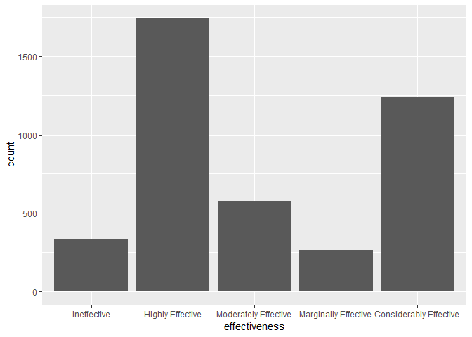
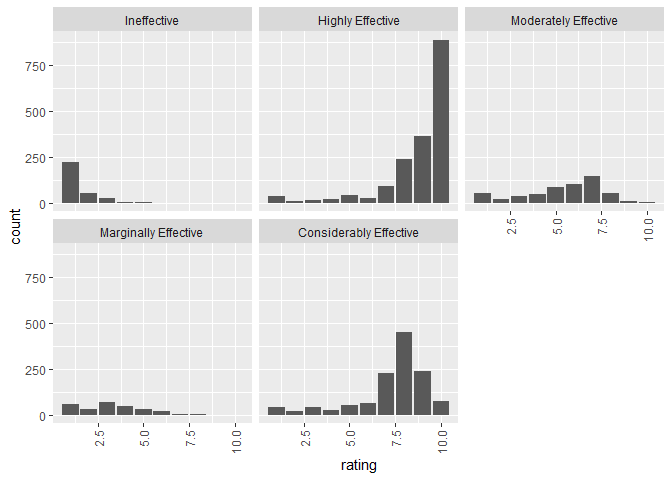

---
output:
  html_document:
    keep_md: yes
    theme: journal
    toc: yes
    toc_float: yes
---

Medical Recommender System
===============================

*Establishing a Medical Recommender System that can give recommendation with an excellent efficiency and accuracy based on diagnosis and symptoms.*

#### DATA 607 Final Project
#### May 12, 2019
#### Team SPARC

* [Santosh Cheruku](https://github.com/san123i)
* [Samantha Deokinanan](https://github.com/greeneyefirefly)
* [Rajwant Mishra](https://github.com/rajwantmishra)
* [Priya Shaji](https://github.com/PriyaShaji)

#### Github 

All the project data sets, codes, and graphics are available under [Final Project repository](https://github.com/greeneyefirefly/MSDS-DATA-607-FinalProject) on Github.

#### Rpub 

The presentation is published on [Final Project](http://rpubs.com/greeneyefirefly/data607-FinalProject) Rpub.<br>
[Naive Bayes Work](http://rpubs.com/Rajwantmishra/project5) 

#### Recommender System

[Shiny App](https://rajwantmishra.shinyapps.io/SymptomsDiseasesRecommendation/)

#### Project Documentation 

All the project work and ideas were documented and available under [Project Documentation](https://github.com/greeneyefirefly/MSDS-DATA-607-FinalProject) on Github.

***

### Overview 

According to the World Health Organization, more than 42% medication errors are caused by doctors because experts write the prescription according to their experiences which are quite limited. With the advancement of technology and data analytic technique such as data mining and recommender systems, it is possibilities to explore potential knowledge from diagnosis history records and help doctors to prescribe medication correctly. A recommendation of right medicine based on diagnosis can target healing and decreasing trial-and-error when prescribing drugs. This can may further decrease undesirable drug side-effects. Therefore, in this project, we developed two recommender systems that can give a medical recommendation with an excellent efficiency and accuracy based on diagnosis and symptoms. 

#### Limitations

Team SPARC is aware that this recommendation system will not be quite accurate since we are not specialist to say one medicine can indeed be recommended instead of another, nor can an performance test be conducted at this time. In addition, there is the limitation on data avabliable, for instance, there is no patient information, true diagnosis, cost of medicine, the insurance company that covers the specific type of drug, etc since these are not easily obtainable. Therefore, our model is thought as a basis in the right direction, and with more data, the better the recommendation can become.

#### R Packages


```r
library(tidyverse)
library(rpart)
library(rpart.plot)
library(caret)
library(kableExtra)
library(tidytext)
library(sentimentr)
library(SnowballC)
library(lattice)
library(FSA)
library(DT)
library(lubridate)
library(corrr)
library(corrplot)
library(psych)
library(rcompanion)
library(multcompView)
library(readxl)
library(plotly)
library(lme4)
library(lmerTest)
library(tm)
library(e1071)
library(gmodels)
library(mongolite)
library(gridExtra)
library(RMySQL)
```


***
### Methodology   
#### Approaching the Problem  {.tabset .tabset-fade .tabset-pills}

Team SPARC aims to design medical recommender systems that applies supervised learning algorithms. In Machine Learning, tree-based techniques and Bayesian Classifier are popular tools to build prediction models. Decision trees and Bayesian can be intuitively understood as classifying different groups (labels), given their theories. By utilizing Naive Bayesian Classifier method, a medicine recommender system was developed in which users input the area of the body they are experiencing symptom, the kind of symptom, and the system would then recommend highly effective drugs that can treat such illness. The other system utilizes the decision tree algorithm to predict the events that can lead diabetic patients to a change in their medication.

Moreover, statistical inferences were performed to investigate the following:

1. A sentimental analysis was conducted to examine how well, or not so well, drug ratings are actually reflective of their effectiveness and side effects.
2. A statistic test to understand how drug benefits and side effects affect actual drug rating scores. 

<!-- -->

***
##### Data Collection

Data sets are retrieved from:

Felix Gr‰fler, Surya Kallumadi, Hagen Malberg, and Sebastian Zaunseder. 2018. Aspect-Based Sentiment Analysis of Drug Reviews Applying Cross-Domain and Cross-Data Learning. In Proceedings of the 2018 International Conference on Digital Health (DH '18). ACM, New York, NY, USA, 121-125. DOI: [https://doi.org/10.1145/3194658.3194677]

* These data sets provide patient reviews on specific drugs along with related conditions. Reviews and ratings are grouped into reports on the three aspects benefits, side effects and overall comment.    

Beata Strack, Jonathan P. DeShazo, Chris Gennings, Juan L. Olmo, Sebastian Ventura, Krzysztof J. Cios, and John N. Clore, "Impact of HbA1c Measurement on Hospital Readmission Rates: Analysis of 70,000 Clinical Database Patient Records," BioMed Research International, vol. 2014, Article ID 781670, 11 pages, 2014.

* This data set represents 10 years (1999-2008) of clinical care at 130 US hospitals and integrated delivery networks. It includes over 50 features representing patient and hospital outcomes such as inpatient encounter (a hospital admission), diabetic encounter, length of stay, race, gender, age, admission type, time in hospital, medical specialty of admitting physician, number of lab test performed, HbA1c test result, diagnosis, number of medication, diabetic medications, number of outpatient, inpatient, and emergency visits in the year before the hospitalization, etc.  

***
##### Storage & Retrieve

The following is a sample of how the data was read from the respective sources. The full code on web scraping and database storage can be found at [Final Project Supporting Rmd](https://github.com/greeneyefirefly/MSDS-DATA-607-FinalProject) on Github. 

<details>
  <summary> *MySQL Database Code Sample* </summary>

```r
CheckDB <- function() {
# Open Connection 
  con2 <- dbConnect(RMySQL::MySQL(), dbname = "Data607FinalProject", host="localhost", user="root",password= "Sparc@DATA_607")
# Drop Table if Exists 
  
if(dbExistsTable(con2, "dataset")){
    dbRemoveTable(con2,"dataset")
  }
 
# Create first table for dataset
query <- "CREATE TABLE `dataset` (  
`Drug_id`  INT AUTO_INCREMENT,
`urlDrugName` VARCHAR(45) NULL,
`rating` VARCHAR(45) NULL,
`effectiveness` VARCHAR(45) NULL, 
`sideEffects` VARCHAR(45) NULL, 
`condition` VARCHAR(45) NULL,
`benefitsReview` VARCHAR(45) NULL,
`sideEffectsReview` VARCHAR(45) NULL,
`commentsReview` VARCHAR(45) NULL,
PRIMARY KEY (`Drug_id`))"
tab1 <- dbSendQuery(con2,query)
tab1data <- dbFetch(tab1)

# Close Connection
dbDisconnect(con2)
}

# Update tables
updateDB <- function(urlDrugName, rating, effectiveness, sideEffects, condition, benefitsReview, sideEffectsReview, commentsReview)
    {
  con2 <- dbConnect(RMySQL::MySQL(), dbname = "Data607FinalProject", host="localhost", user="root",password= "root")
  
# Update dataset table 
query <- sprintf("insert into dataset (DrugName, Rating, Effectiveness, SideEffects, Condition, BenefitsReview, SideEffectsReview, CommentsReview) values('%s','%s','%s','%s','%s','%s','%s','%s')",urlDrugName, rating, effectiveness, sideEffects, condition, benefitsReview, sideEffectsReview, commentsReview)
  print (query)
tab1 <- dbSendQuery(con2,query)
tab1data <- dbFetch(tab1)

# Get 'Drug_id' to update dataset table
query <- sprintf("select Drug_id from dataset where DrugName='%s', Rating='%s', Effectiveness='%s', SideEffects='%s', Condition='%s', BenefitsReview='%s', SideEffectsReview='%s', CommentsReview='%s' limit 1",urlDrugName, rating, effectiveness, sideEffects, condition, benefitsReview, sideEffectsReview, commentsReview)
  
tab1 <- dbSendQuery(con2,query)
tab1data <- dbFetch(tab1)
data_id <- tab1data$Drug_id

# Close Connection
dbDisconnect(con2)
}
```
</details>

***
##### Our Data

> Drug Review Data Set

<div style="border: 1px solid #ddd; padding: 0px; overflow-y: scroll; height:300px; overflow-x: scroll; width:100%; "><table class="table" style="margin-left: auto; margin-right: auto;">
 <thead>
  <tr>
   <th style="text-align:right;position: sticky; top:0; background-color: #FFFFFF;"> X1 </th>
   <th style="text-align:left;position: sticky; top:0; background-color: #FFFFFF;"> urlDrugName </th>
   <th style="text-align:right;position: sticky; top:0; background-color: #FFFFFF;"> rating </th>
   <th style="text-align:left;position: sticky; top:0; background-color: #FFFFFF;"> effectiveness </th>
   <th style="text-align:left;position: sticky; top:0; background-color: #FFFFFF;"> sideEffects </th>
   <th style="text-align:left;position: sticky; top:0; background-color: #FFFFFF;"> condition </th>
   <th style="text-align:left;position: sticky; top:0; background-color: #FFFFFF;"> benefitsReview </th>
   <th style="text-align:left;position: sticky; top:0; background-color: #FFFFFF;"> sideEffectsReview </th>
   <th style="text-align:left;position: sticky; top:0; background-color: #FFFFFF;"> commentsReview </th>
  </tr>
 </thead>
<tbody>
  <tr>
   <td style="text-align:right;"> 2202 </td>
   <td style="text-align:left;"> enalapril </td>
   <td style="text-align:right;"> 4 </td>
   <td style="text-align:left;"> Highly Effective </td>
   <td style="text-align:left;"> Mild Side Effects </td>
   <td style="text-align:left;"> management of congestive heart failure </td>
   <td style="text-align:left;"> slowed the progression of left ventricular dysfunction into overt heart failure 

alone or with other agents in the managment of hypertension 

mangagement of congestive heart failur </td>
   <td style="text-align:left;"> cough, hypotension , proteinuria, impotence , renal failure , angina pectoris , tachycardia , eosinophilic pneumonitis, tastes disturbances , anusease anorecia , weakness fatigue insominca weakness </td>
   <td style="text-align:left;"> monitor blood pressure , weight and asses for resolution of fluid </td>
  </tr>
  <tr>
   <td style="text-align:right;"> 3117 </td>
   <td style="text-align:left;"> ortho-tri-cyclen </td>
   <td style="text-align:right;"> 1 </td>
   <td style="text-align:left;"> Highly Effective </td>
   <td style="text-align:left;"> Severe Side Effects </td>
   <td style="text-align:left;"> birth prevention </td>
   <td style="text-align:left;"> Although this type of birth control has more cons than pros, it did help with my cramps. It's also effective with the prevention of pregnancy. (Along with use of condoms as well) </td>
   <td style="text-align:left;"> Heavy Cycle, Cramps, Hot Flashes, Fatigue, Long Lasting Cycles. It's only been 5 1/2 months, but i'm concidering changing to a different bc. This is my first time using any kind of bc, unfortunately due to the constant hassel, i'm not happy with the results. </td>
   <td style="text-align:left;"> I Hate This Birth Control, I Would Not Suggest This To Anyone. </td>
  </tr>
  <tr>
   <td style="text-align:right;"> 1146 </td>
   <td style="text-align:left;"> ponstel </td>
   <td style="text-align:right;"> 10 </td>
   <td style="text-align:left;"> Highly Effective </td>
   <td style="text-align:left;"> No Side Effects </td>
   <td style="text-align:left;"> menstrual cramps </td>
   <td style="text-align:left;"> I was used to having cramps so badly that they would leave me balled up in bed for at least 2 days.  The Ponstel doesn't take the pain away completely, but takes the edge off so much that normal activities were possible. Definitely a miracle medication!! </td>
   <td style="text-align:left;"> Heavier bleeding and clotting than normal. </td>
   <td style="text-align:left;"> I took 2 pills at the onset of my menstrual cramps and then every 8-12 hours took 1 pill as needed for about 3-4 days until cramps were over. If cramps are bad, make sure to take every 8 hours on the dot because the medication stops working suddenly and unfortunately takes about an hour to an hour and a half to kick back in.. if cramps are only moderate, taking every 12 hours is okay. </td>
  </tr>
  <tr>
   <td style="text-align:right;"> 3947 </td>
   <td style="text-align:left;"> prilosec </td>
   <td style="text-align:right;"> 3 </td>
   <td style="text-align:left;"> Marginally Effective </td>
   <td style="text-align:left;"> Mild Side Effects </td>
   <td style="text-align:left;"> acid reflux </td>
   <td style="text-align:left;"> The acid reflux went away for a few months after just a few days of being on the drug. The heartburn started again as soon as I stopped taking it. So I began treatment again. 6 months passed and I stopped taking it. The heartburn came back, and seemed worse even. The doctor said I should try another 6 month treatment. I did, and the same exact thing happened. This went on for about three years. I asked why this wasn't curing my reflux. The doctor quite frankly told me that it wasn't a cure, but a "treatment for the symptoms". I was told that I would probably be on it for the rest of my life. </td>
   <td style="text-align:left;"> Constipation, dry mouth and some mild dizziness that would go away after medication was stopped for a few days. </td>
   <td style="text-align:left;"> I was given Prilosec prescription at a dose of 45mg per day. Medication was taken once, every morning before eating. Each treatment duration was for 6 months. </td>
  </tr>
  <tr>
   <td style="text-align:right;"> 1951 </td>
   <td style="text-align:left;"> lyrica </td>
   <td style="text-align:right;"> 2 </td>
   <td style="text-align:left;"> Marginally Effective </td>
   <td style="text-align:left;"> Severe Side Effects </td>
   <td style="text-align:left;"> fibromyalgia </td>
   <td style="text-align:left;"> I think that the Lyrica was starting to help with the pain, but the side-effects were just too severe to continue. </td>
   <td style="text-align:left;"> I felt extremely drugged and dopey.  Could not drive at all while on this med.  Also had extreme ankle and feet swelling and couldn't even wear shoes. </td>
   <td style="text-align:left;"> See above </td>
  </tr>
  <tr>
   <td style="text-align:right;"> 2372 </td>
   <td style="text-align:left;"> propecia </td>
   <td style="text-align:right;"> 1 </td>
   <td style="text-align:left;"> Ineffective </td>
   <td style="text-align:left;"> Severe Side Effects </td>
   <td style="text-align:left;"> hair loss </td>
   <td style="text-align:left;"> after taking propecia for over a year, starting when i was 20 years of age my hair continued to thin, and i noticed no significant benefits </td>
   <td style="text-align:left;"> Low sex drive, before i started taking this drug i was 19 years of age and full of "enthousiasm". Now engaged and 21 years old, my sex drive is very low, my wife and I are very unsatisfied. I am also very tired even during peak hours throughout the day, and its hard to concentrate on mundain tasks </td>
   <td style="text-align:left;"> one pill once daily </td>
  </tr>
</tbody>
</table></div>

> Diabetes Data Set

<div style="border: 1px solid #ddd; padding: 0px; overflow-y: scroll; height:300px; overflow-x: scroll; width:100%; "><table class="table" style="margin-left: auto; margin-right: auto;">
 <thead>
  <tr>
   <th style="text-align:right;position: sticky; top:0; background-color: #FFFFFF;"> encounter_id </th>
   <th style="text-align:right;position: sticky; top:0; background-color: #FFFFFF;"> patient_nbr </th>
   <th style="text-align:left;position: sticky; top:0; background-color: #FFFFFF;"> race </th>
   <th style="text-align:left;position: sticky; top:0; background-color: #FFFFFF;"> gender </th>
   <th style="text-align:left;position: sticky; top:0; background-color: #FFFFFF;"> age </th>
   <th style="text-align:left;position: sticky; top:0; background-color: #FFFFFF;"> weight </th>
   <th style="text-align:right;position: sticky; top:0; background-color: #FFFFFF;"> admission_type_id </th>
   <th style="text-align:right;position: sticky; top:0; background-color: #FFFFFF;"> discharge_disposition_id </th>
   <th style="text-align:right;position: sticky; top:0; background-color: #FFFFFF;"> admission_source_id </th>
   <th style="text-align:right;position: sticky; top:0; background-color: #FFFFFF;"> time_in_hospital </th>
   <th style="text-align:left;position: sticky; top:0; background-color: #FFFFFF;"> payer_code </th>
   <th style="text-align:left;position: sticky; top:0; background-color: #FFFFFF;"> medical_specialty </th>
   <th style="text-align:right;position: sticky; top:0; background-color: #FFFFFF;"> num_lab_procedures </th>
   <th style="text-align:right;position: sticky; top:0; background-color: #FFFFFF;"> num_procedures </th>
   <th style="text-align:right;position: sticky; top:0; background-color: #FFFFFF;"> num_medications </th>
   <th style="text-align:right;position: sticky; top:0; background-color: #FFFFFF;"> number_outpatient </th>
   <th style="text-align:right;position: sticky; top:0; background-color: #FFFFFF;"> number_emergency </th>
   <th style="text-align:right;position: sticky; top:0; background-color: #FFFFFF;"> number_inpatient </th>
   <th style="text-align:left;position: sticky; top:0; background-color: #FFFFFF;"> diag_1 </th>
   <th style="text-align:left;position: sticky; top:0; background-color: #FFFFFF;"> diag_2 </th>
   <th style="text-align:left;position: sticky; top:0; background-color: #FFFFFF;"> diag_3 </th>
   <th style="text-align:right;position: sticky; top:0; background-color: #FFFFFF;"> number_diagnoses </th>
   <th style="text-align:left;position: sticky; top:0; background-color: #FFFFFF;"> max_glu_serum </th>
   <th style="text-align:left;position: sticky; top:0; background-color: #FFFFFF;"> A1Cresult </th>
   <th style="text-align:left;position: sticky; top:0; background-color: #FFFFFF;"> metformin </th>
   <th style="text-align:left;position: sticky; top:0; background-color: #FFFFFF;"> repaglinide </th>
   <th style="text-align:left;position: sticky; top:0; background-color: #FFFFFF;"> nateglinide </th>
   <th style="text-align:left;position: sticky; top:0; background-color: #FFFFFF;"> chlorpropamide </th>
   <th style="text-align:left;position: sticky; top:0; background-color: #FFFFFF;"> glimepiride </th>
   <th style="text-align:left;position: sticky; top:0; background-color: #FFFFFF;"> acetohexamide </th>
   <th style="text-align:left;position: sticky; top:0; background-color: #FFFFFF;"> glipizide </th>
   <th style="text-align:left;position: sticky; top:0; background-color: #FFFFFF;"> glyburide </th>
   <th style="text-align:left;position: sticky; top:0; background-color: #FFFFFF;"> tolbutamide </th>
   <th style="text-align:left;position: sticky; top:0; background-color: #FFFFFF;"> pioglitazone </th>
   <th style="text-align:left;position: sticky; top:0; background-color: #FFFFFF;"> rosiglitazone </th>
   <th style="text-align:left;position: sticky; top:0; background-color: #FFFFFF;"> acarbose </th>
   <th style="text-align:left;position: sticky; top:0; background-color: #FFFFFF;"> miglitol </th>
   <th style="text-align:left;position: sticky; top:0; background-color: #FFFFFF;"> troglitazone </th>
   <th style="text-align:left;position: sticky; top:0; background-color: #FFFFFF;"> tolazamide </th>
   <th style="text-align:left;position: sticky; top:0; background-color: #FFFFFF;"> examide </th>
   <th style="text-align:left;position: sticky; top:0; background-color: #FFFFFF;"> citoglipton </th>
   <th style="text-align:left;position: sticky; top:0; background-color: #FFFFFF;"> insulin </th>
   <th style="text-align:left;position: sticky; top:0; background-color: #FFFFFF;"> glyburide-metformin </th>
   <th style="text-align:left;position: sticky; top:0; background-color: #FFFFFF;"> glipizide-metformin </th>
   <th style="text-align:left;position: sticky; top:0; background-color: #FFFFFF;"> glimepiride-pioglitazone </th>
   <th style="text-align:left;position: sticky; top:0; background-color: #FFFFFF;"> metformin-rosiglitazone </th>
   <th style="text-align:left;position: sticky; top:0; background-color: #FFFFFF;"> metformin-pioglitazone </th>
   <th style="text-align:left;position: sticky; top:0; background-color: #FFFFFF;"> change </th>
   <th style="text-align:left;position: sticky; top:0; background-color: #FFFFFF;"> diabetesMed </th>
   <th style="text-align:left;position: sticky; top:0; background-color: #FFFFFF;"> readmitted </th>
  </tr>
 </thead>
<tbody>
  <tr>
   <td style="text-align:right;"> 2278392 </td>
   <td style="text-align:right;"> 8222157 </td>
   <td style="text-align:left;"> Caucasian </td>
   <td style="text-align:left;"> Female </td>
   <td style="text-align:left;"> [0-10) </td>
   <td style="text-align:left;"> ? </td>
   <td style="text-align:right;"> 6 </td>
   <td style="text-align:right;"> 25 </td>
   <td style="text-align:right;"> 1 </td>
   <td style="text-align:right;"> 1 </td>
   <td style="text-align:left;"> ? </td>
   <td style="text-align:left;"> Pediatrics-Endocrinology </td>
   <td style="text-align:right;"> 41 </td>
   <td style="text-align:right;"> 0 </td>
   <td style="text-align:right;"> 1 </td>
   <td style="text-align:right;"> 0 </td>
   <td style="text-align:right;"> 0 </td>
   <td style="text-align:right;"> 0 </td>
   <td style="text-align:left;"> 250.83 </td>
   <td style="text-align:left;"> ? </td>
   <td style="text-align:left;"> ? </td>
   <td style="text-align:right;"> 1 </td>
   <td style="text-align:left;"> None </td>
   <td style="text-align:left;"> None </td>
   <td style="text-align:left;"> No </td>
   <td style="text-align:left;"> No </td>
   <td style="text-align:left;"> No </td>
   <td style="text-align:left;"> No </td>
   <td style="text-align:left;"> No </td>
   <td style="text-align:left;"> No </td>
   <td style="text-align:left;"> No </td>
   <td style="text-align:left;"> No </td>
   <td style="text-align:left;"> No </td>
   <td style="text-align:left;"> No </td>
   <td style="text-align:left;"> No </td>
   <td style="text-align:left;"> No </td>
   <td style="text-align:left;"> No </td>
   <td style="text-align:left;"> No </td>
   <td style="text-align:left;"> No </td>
   <td style="text-align:left;"> No </td>
   <td style="text-align:left;"> No </td>
   <td style="text-align:left;"> No </td>
   <td style="text-align:left;"> No </td>
   <td style="text-align:left;"> No </td>
   <td style="text-align:left;"> No </td>
   <td style="text-align:left;"> No </td>
   <td style="text-align:left;"> No </td>
   <td style="text-align:left;"> No </td>
   <td style="text-align:left;"> No </td>
   <td style="text-align:left;"> NO </td>
  </tr>
  <tr>
   <td style="text-align:right;"> 149190 </td>
   <td style="text-align:right;"> 55629189 </td>
   <td style="text-align:left;"> Caucasian </td>
   <td style="text-align:left;"> Female </td>
   <td style="text-align:left;"> [10-20) </td>
   <td style="text-align:left;"> ? </td>
   <td style="text-align:right;"> 1 </td>
   <td style="text-align:right;"> 1 </td>
   <td style="text-align:right;"> 7 </td>
   <td style="text-align:right;"> 3 </td>
   <td style="text-align:left;"> ? </td>
   <td style="text-align:left;"> ? </td>
   <td style="text-align:right;"> 59 </td>
   <td style="text-align:right;"> 0 </td>
   <td style="text-align:right;"> 18 </td>
   <td style="text-align:right;"> 0 </td>
   <td style="text-align:right;"> 0 </td>
   <td style="text-align:right;"> 0 </td>
   <td style="text-align:left;"> 276 </td>
   <td style="text-align:left;"> 250.01 </td>
   <td style="text-align:left;"> 255 </td>
   <td style="text-align:right;"> 9 </td>
   <td style="text-align:left;"> None </td>
   <td style="text-align:left;"> None </td>
   <td style="text-align:left;"> No </td>
   <td style="text-align:left;"> No </td>
   <td style="text-align:left;"> No </td>
   <td style="text-align:left;"> No </td>
   <td style="text-align:left;"> No </td>
   <td style="text-align:left;"> No </td>
   <td style="text-align:left;"> No </td>
   <td style="text-align:left;"> No </td>
   <td style="text-align:left;"> No </td>
   <td style="text-align:left;"> No </td>
   <td style="text-align:left;"> No </td>
   <td style="text-align:left;"> No </td>
   <td style="text-align:left;"> No </td>
   <td style="text-align:left;"> No </td>
   <td style="text-align:left;"> No </td>
   <td style="text-align:left;"> No </td>
   <td style="text-align:left;"> No </td>
   <td style="text-align:left;"> Up </td>
   <td style="text-align:left;"> No </td>
   <td style="text-align:left;"> No </td>
   <td style="text-align:left;"> No </td>
   <td style="text-align:left;"> No </td>
   <td style="text-align:left;"> No </td>
   <td style="text-align:left;"> Ch </td>
   <td style="text-align:left;"> Yes </td>
   <td style="text-align:left;"> &gt;30 </td>
  </tr>
  <tr>
   <td style="text-align:right;"> 64410 </td>
   <td style="text-align:right;"> 86047875 </td>
   <td style="text-align:left;"> AfricanAmerican </td>
   <td style="text-align:left;"> Female </td>
   <td style="text-align:left;"> [20-30) </td>
   <td style="text-align:left;"> ? </td>
   <td style="text-align:right;"> 1 </td>
   <td style="text-align:right;"> 1 </td>
   <td style="text-align:right;"> 7 </td>
   <td style="text-align:right;"> 2 </td>
   <td style="text-align:left;"> ? </td>
   <td style="text-align:left;"> ? </td>
   <td style="text-align:right;"> 11 </td>
   <td style="text-align:right;"> 5 </td>
   <td style="text-align:right;"> 13 </td>
   <td style="text-align:right;"> 2 </td>
   <td style="text-align:right;"> 0 </td>
   <td style="text-align:right;"> 1 </td>
   <td style="text-align:left;"> 648 </td>
   <td style="text-align:left;"> 250 </td>
   <td style="text-align:left;"> V27 </td>
   <td style="text-align:right;"> 6 </td>
   <td style="text-align:left;"> None </td>
   <td style="text-align:left;"> None </td>
   <td style="text-align:left;"> No </td>
   <td style="text-align:left;"> No </td>
   <td style="text-align:left;"> No </td>
   <td style="text-align:left;"> No </td>
   <td style="text-align:left;"> No </td>
   <td style="text-align:left;"> No </td>
   <td style="text-align:left;"> Steady </td>
   <td style="text-align:left;"> No </td>
   <td style="text-align:left;"> No </td>
   <td style="text-align:left;"> No </td>
   <td style="text-align:left;"> No </td>
   <td style="text-align:left;"> No </td>
   <td style="text-align:left;"> No </td>
   <td style="text-align:left;"> No </td>
   <td style="text-align:left;"> No </td>
   <td style="text-align:left;"> No </td>
   <td style="text-align:left;"> No </td>
   <td style="text-align:left;"> No </td>
   <td style="text-align:left;"> No </td>
   <td style="text-align:left;"> No </td>
   <td style="text-align:left;"> No </td>
   <td style="text-align:left;"> No </td>
   <td style="text-align:left;"> No </td>
   <td style="text-align:left;"> No </td>
   <td style="text-align:left;"> Yes </td>
   <td style="text-align:left;"> NO </td>
  </tr>
  <tr>
   <td style="text-align:right;"> 500364 </td>
   <td style="text-align:right;"> 82442376 </td>
   <td style="text-align:left;"> Caucasian </td>
   <td style="text-align:left;"> Male </td>
   <td style="text-align:left;"> [30-40) </td>
   <td style="text-align:left;"> ? </td>
   <td style="text-align:right;"> 1 </td>
   <td style="text-align:right;"> 1 </td>
   <td style="text-align:right;"> 7 </td>
   <td style="text-align:right;"> 2 </td>
   <td style="text-align:left;"> ? </td>
   <td style="text-align:left;"> ? </td>
   <td style="text-align:right;"> 44 </td>
   <td style="text-align:right;"> 1 </td>
   <td style="text-align:right;"> 16 </td>
   <td style="text-align:right;"> 0 </td>
   <td style="text-align:right;"> 0 </td>
   <td style="text-align:right;"> 0 </td>
   <td style="text-align:left;"> 8 </td>
   <td style="text-align:left;"> 250.43 </td>
   <td style="text-align:left;"> 403 </td>
   <td style="text-align:right;"> 7 </td>
   <td style="text-align:left;"> None </td>
   <td style="text-align:left;"> None </td>
   <td style="text-align:left;"> No </td>
   <td style="text-align:left;"> No </td>
   <td style="text-align:left;"> No </td>
   <td style="text-align:left;"> No </td>
   <td style="text-align:left;"> No </td>
   <td style="text-align:left;"> No </td>
   <td style="text-align:left;"> No </td>
   <td style="text-align:left;"> No </td>
   <td style="text-align:left;"> No </td>
   <td style="text-align:left;"> No </td>
   <td style="text-align:left;"> No </td>
   <td style="text-align:left;"> No </td>
   <td style="text-align:left;"> No </td>
   <td style="text-align:left;"> No </td>
   <td style="text-align:left;"> No </td>
   <td style="text-align:left;"> No </td>
   <td style="text-align:left;"> No </td>
   <td style="text-align:left;"> Up </td>
   <td style="text-align:left;"> No </td>
   <td style="text-align:left;"> No </td>
   <td style="text-align:left;"> No </td>
   <td style="text-align:left;"> No </td>
   <td style="text-align:left;"> No </td>
   <td style="text-align:left;"> Ch </td>
   <td style="text-align:left;"> Yes </td>
   <td style="text-align:left;"> NO </td>
  </tr>
  <tr>
   <td style="text-align:right;"> 16680 </td>
   <td style="text-align:right;"> 42519267 </td>
   <td style="text-align:left;"> Caucasian </td>
   <td style="text-align:left;"> Male </td>
   <td style="text-align:left;"> [40-50) </td>
   <td style="text-align:left;"> ? </td>
   <td style="text-align:right;"> 1 </td>
   <td style="text-align:right;"> 1 </td>
   <td style="text-align:right;"> 7 </td>
   <td style="text-align:right;"> 1 </td>
   <td style="text-align:left;"> ? </td>
   <td style="text-align:left;"> ? </td>
   <td style="text-align:right;"> 51 </td>
   <td style="text-align:right;"> 0 </td>
   <td style="text-align:right;"> 8 </td>
   <td style="text-align:right;"> 0 </td>
   <td style="text-align:right;"> 0 </td>
   <td style="text-align:right;"> 0 </td>
   <td style="text-align:left;"> 197 </td>
   <td style="text-align:left;"> 157 </td>
   <td style="text-align:left;"> 250 </td>
   <td style="text-align:right;"> 5 </td>
   <td style="text-align:left;"> None </td>
   <td style="text-align:left;"> None </td>
   <td style="text-align:left;"> No </td>
   <td style="text-align:left;"> No </td>
   <td style="text-align:left;"> No </td>
   <td style="text-align:left;"> No </td>
   <td style="text-align:left;"> No </td>
   <td style="text-align:left;"> No </td>
   <td style="text-align:left;"> Steady </td>
   <td style="text-align:left;"> No </td>
   <td style="text-align:left;"> No </td>
   <td style="text-align:left;"> No </td>
   <td style="text-align:left;"> No </td>
   <td style="text-align:left;"> No </td>
   <td style="text-align:left;"> No </td>
   <td style="text-align:left;"> No </td>
   <td style="text-align:left;"> No </td>
   <td style="text-align:left;"> No </td>
   <td style="text-align:left;"> No </td>
   <td style="text-align:left;"> Steady </td>
   <td style="text-align:left;"> No </td>
   <td style="text-align:left;"> No </td>
   <td style="text-align:left;"> No </td>
   <td style="text-align:left;"> No </td>
   <td style="text-align:left;"> No </td>
   <td style="text-align:left;"> Ch </td>
   <td style="text-align:left;"> Yes </td>
   <td style="text-align:left;"> NO </td>
  </tr>
  <tr>
   <td style="text-align:right;"> 35754 </td>
   <td style="text-align:right;"> 82637451 </td>
   <td style="text-align:left;"> Caucasian </td>
   <td style="text-align:left;"> Male </td>
   <td style="text-align:left;"> [50-60) </td>
   <td style="text-align:left;"> ? </td>
   <td style="text-align:right;"> 2 </td>
   <td style="text-align:right;"> 1 </td>
   <td style="text-align:right;"> 2 </td>
   <td style="text-align:right;"> 3 </td>
   <td style="text-align:left;"> ? </td>
   <td style="text-align:left;"> ? </td>
   <td style="text-align:right;"> 31 </td>
   <td style="text-align:right;"> 6 </td>
   <td style="text-align:right;"> 16 </td>
   <td style="text-align:right;"> 0 </td>
   <td style="text-align:right;"> 0 </td>
   <td style="text-align:right;"> 0 </td>
   <td style="text-align:left;"> 414 </td>
   <td style="text-align:left;"> 411 </td>
   <td style="text-align:left;"> 250 </td>
   <td style="text-align:right;"> 9 </td>
   <td style="text-align:left;"> None </td>
   <td style="text-align:left;"> None </td>
   <td style="text-align:left;"> No </td>
   <td style="text-align:left;"> No </td>
   <td style="text-align:left;"> No </td>
   <td style="text-align:left;"> No </td>
   <td style="text-align:left;"> No </td>
   <td style="text-align:left;"> No </td>
   <td style="text-align:left;"> No </td>
   <td style="text-align:left;"> No </td>
   <td style="text-align:left;"> No </td>
   <td style="text-align:left;"> No </td>
   <td style="text-align:left;"> No </td>
   <td style="text-align:left;"> No </td>
   <td style="text-align:left;"> No </td>
   <td style="text-align:left;"> No </td>
   <td style="text-align:left;"> No </td>
   <td style="text-align:left;"> No </td>
   <td style="text-align:left;"> No </td>
   <td style="text-align:left;"> Steady </td>
   <td style="text-align:left;"> No </td>
   <td style="text-align:left;"> No </td>
   <td style="text-align:left;"> No </td>
   <td style="text-align:left;"> No </td>
   <td style="text-align:left;"> No </td>
   <td style="text-align:left;"> No </td>
   <td style="text-align:left;"> Yes </td>
   <td style="text-align:left;"> &gt;30 </td>
  </tr>
</tbody>
</table></div>

***
### Results & Discussion {.tabset .tabset-fade .tabset-pills}
***
#### Statisical Analysis 
***
**Hypothesis Testing**  

***

<details>
  <summary> *Explorative Data Analysis* </summary>
  
> Plotting drug effectiveness

<!-- -->

> Plotting drug side effects for effectiveness

<!-- -->

> Drug effectiveness vs Patient Rating

<!-- --><!-- -->

> Distribution of patient ratings

<!-- -->


```r
Drugs_summary <- Summarize(dataset$rating ~ dataset$urlDrugName, digits=3)
head(Drugs_summary)
```

```
##   dataset$urlDrugName  n  mean    sd min   Q1 median    Q3 max
## 1             abilify  8 5.375 2.875   2 2.75    6.0  6.50  10
## 2              acanya  1 9.000    NA   9 9.00    9.0  9.00   9
## 3            accolate  1 1.000    NA   1 1.00    1.0  1.00   1
## 4            accupril  1 9.000    NA   9 9.00    9.0  9.00   9
## 5            accutane 44 7.727 2.286   1 7.00    8.0  9.25  10
## 6             aciphex  6 8.833 1.602   6 8.25    9.5 10.00  10
```

<!-- -->

Given a patient claim that a drug is 'Extremely Effective', with a 95% confidence calculate the probability of a drug having 'No SideEffect'
 

```r
highlyEffectiveDrugs <- subset(dataset, effectiveness=="Highly Effective")
meanRating <- mean(highlyEffectiveDrugs$rating)
sdRating <- sd(highlyEffectiveDrugs$rating)
noSideEffectDrugs <- subset(highlyEffectiveDrugs, sideEffects=='No Side Effects')
p <- nrow(noSideEffectDrugs)/nrow(highlyEffectiveDrugs)
n <- nrow(highlyEffectiveDrugs)
SE<- sqrt(p * (1-p)/n)
CILower <- p - 1.96 * SE
CIUpper <- p + 1.96 * SE
c(CILower, CIUpper)
```

```
## [1] 0.3750536 0.4210406
```

Thus, with 95% confidence, it can be confirmed that given a drug is rated 'Extremely Effective', the probability of drug having 'No Side Effect' between 0.3750536 and 0.4210406

</details>

In the Drug Review data set, there are different ratings provided by the patients for each drug based on the experiences they have with it. Patient can assign the drug effectiveiness varying from 'Ineffective' to 'Highly Effective', the side effects from 'No Side effects' to 'Extremely Severe Side Effects' and a rating from 1 to 10. After performing exploratory data analysis to obtain insights about the data on patient rating, effectiveness and side effects distributions, the histograms and QQ plots revealed that the variables do not follow a normal distribution. Therefore, the hypothesis of whether or not an extremely effective drug means a high rated drug will be tested through the Kruskal-Wallis H test.

Kruskal-Wallis is a rank-based nonparametric test that can be used to determine if there are statistically significant differences between two or more groups of an independent variable on a continuous or ordinal dependent variable. It is considered the nonparametric alternative to the one-way ANOVA, and an extension of the Mann-Whitney U test to allow the comparison of more than two independent groups. 

The testing hypothesis is:

$H_0$ = An extremely effective drug means a high rated drug  
$H_1$ = An extremely effective drug is not necessarily a high rated drug


```r
kruskal.test(dataset$rating ~ dataset$effectiveness)
```

```
## 
## 	Kruskal-Wallis rank sum test
## 
## data:  dataset$rating by dataset$effectiveness
## Kruskal-Wallis chi-squared = 2225.6, df = 4, p-value < 2.2e-16
```

From the above, since the p-value is less than 0.05, the null hypothesis can be rejected. Therefore, an extremely effective drug is not necessarily a high rated drug. 

> Dunn Test for Multiple Comparisons 

Since the Kruskal-Wallis test is significant, two post-hoc analyses were performed to determine which levels of the independent variable differ from each other level. Probably the most popular test for this is the Dunn test, which is performed with the `dunnTest` function in the FSA package Adjustments to the p-values could be made using the method option to control the familywise error rate or to control the false discovery rate. 

The Dunn test is appropriate for groups with unequal numbers of observations.


```r
drug.dunn = dunnTest(dataset$rating ~ dataset$effectiveness, method = "bonferroni")
drug.dunn
```

```
## Dunn (1964) Kruskal-Wallis multiple comparison
```

```
##   p-values adjusted with the Bonferroni method.
```

```
##                                       Comparison          Z       P.unadj
## 1      Considerably Effective - Highly Effective -20.414370  1.246274e-92
## 2           Considerably Effective - Ineffective  22.720925 2.782884e-114
## 3                 Highly Effective - Ineffective  36.067841 7.244258e-285
## 4  Considerably Effective - Marginally Effective  16.282639  1.310925e-59
## 5        Highly Effective - Marginally Effective  28.183132 9.413532e-175
## 6             Ineffective - Marginally Effective  -3.672238  2.404352e-04
## 7  Considerably Effective - Moderately Effective  13.235382  5.481739e-40
## 8        Highly Effective - Moderately Effective  29.632241 5.744724e-193
## 9             Ineffective - Moderately Effective -10.696863  1.052818e-26
## 10   Marginally Effective - Moderately Effective  -5.857644  4.694792e-09
##            P.adj
## 1   1.246274e-91
## 2  2.782884e-113
## 3  7.244258e-284
## 4   1.310925e-58
## 5  9.413532e-174
## 6   2.404352e-03
## 7   5.481739e-39
## 8  5.744724e-192
## 9   1.052818e-25
## 10  4.694792e-08
```

Since the dataset has several values to compare, it can be beneficial to have R convert this table to a compact letter display for you.  The `cldList` function in the rcompanion package can do this.


```r
cldList(comparison = drug.dunn$Comparison, p.value = drug.dunn$P.adj, threshold  = 0.05)
```

```
##                   Group Letter MonoLetter
## 1 ConsiderablyEffective      a      a    
## 2       HighlyEffective      b       b   
## 3           Ineffective      c        c  
## 4   MarginallyEffective      d         d 
## 5   ModeratelyEffective      e          e
```

As we see, all the 5 levels of effectiveness have different letters, therefore, they are significant and independent of each other.

> Pairwise Mann-Whitney U-tests 

Another post-hoc approach is to use Pairwise Mann-Whitney U-tests. Mann-Whitney U-tests is also called the Wilcoxon Rank-Sum Test. It is use to calculate pairwise comparisons between group levels with corrections for multiple testing. In order to prevent the inflation of Type I error rates, adjustments to the p-values can be made using the `p.adjust.method` option to control the familywise error rate or to control the false discovery rate.

If there are several values to compare, it can be beneficial to have R convert this table to a compact letter display for you. The multcompLetters function in the multcompView package can do this, but first the table of p-values must be converted to a full table.


```r
drug.wilcox = pairwise.wilcox.test(dataset$rating, dataset$effectiveness, p.adjust.method="none")
drug.wilcox
```

```
## 
## 	Pairwise comparisons using Wilcoxon rank sum test 
## 
## data:  dataset$rating and dataset$effectiveness 
## 
##                        Ineffective Highly Effective Moderately Effective
## Highly Effective       <2e-16      -                -                   
## Moderately Effective   <2e-16      <2e-16           -                   
## Marginally Effective   <2e-16      <2e-16           <2e-16              
## Considerably Effective <2e-16      <2e-16           <2e-16              
##                        Marginally Effective
## Highly Effective       -                   
## Moderately Effective   -                   
## Marginally Effective   -                   
## Considerably Effective <2e-16              
## 
## P value adjustment method: none
```


```r
drug.wilcox = drug.wilcox$p.value
drug.wilcox.table = fullPTable(drug.wilcox)
drug.wilcox.table
```

```
##                          Ineffective Highly Effective Moderately Effective
## Ineffective             1.000000e+00    5.475203e-183         1.305142e-97
## Highly Effective       5.475203e-183     1.000000e+00        1.461579e-197
## Moderately Effective    1.305142e-97    1.461579e-197         1.000000e+00
## Marginally Effective    3.547849e-39    3.352882e-138         4.116903e-38
## Considerably Effective 2.700675e-152    1.714933e-149         1.521928e-85
##                        Marginally Effective Considerably Effective
## Ineffective                    3.547849e-39          2.700675e-152
## Highly Effective              3.352882e-138          1.714933e-149
## Moderately Effective           4.116903e-38           1.521928e-85
## Marginally Effective           1.000000e+00          3.127169e-100
## Considerably Effective        3.127169e-100           1.000000e+00
```


```r
multcompLetters(drug.wilcox.table, compare="<", threshold=0.05, Letters=letters, reversed = FALSE)
```

```
##            Ineffective       Highly Effective   Moderately Effective 
##                    "a"                    "b"                    "c" 
##   Marginally Effective Considerably Effective 
##                    "d"                    "e"
```

Values not sharing the same letter are significantly different. In this case , all the levels of effectiveness are significantly different.

And lastly, a chi-squared test is used to further examine if effectiveness is independent of as the rating changes at 0.05 significance level. Here, the hypothesis is:

$H_0$ = The effectiveness review is independent of users' rating scores  
$H_1$ = The effectiveness review is not independent of users' rating scores  


```r
chi_test <- chisq.test(data.matrix(cbind(dataset$rating,dataset$effectiveness)))
chi_test
```

```
## 
## 	Pearson's Chi-squared test
## 
## data:  data.matrix(cbind(dataset$rating, dataset$effectiveness))
## X-squared = 3840.9, df = 4142, p-value = 0.9996
```

The results shows that the p-value > 0.05 significance level. This suggests that the null hypothesis that the effectiveness review is independent of users' rating scores cannot be rejected.

Overall, it is apparent that an extremely effective drug does not mean a highly rated drug. Therefore, it can stated that even if a drug is classified as 'Highly Effective' it does not necessarily means it is the right drug that can be suggested to a patient, since the patient may not have felt comfortable due to its side effects.

***
**Sentimental Analysis**  

***

Using the effectiveness and the side effects reviews from the Drug Reviews data, a sentimental analysis was done to identify the user's experiences with the specific drug. In this analysis, the lexicon AFINN words and associated ratings from Finn ≈rup Nielsen were used. Moreover, since the hypothesis testing found that some results would have an overall negative experience even though their drug ratings were very high, conditions were establish to reverse sentiment ratings if they are not accurate representations of the reviews. 

As a result, firstly, the reviews of drug benefits shows that there are more true (indicated in blue) positive sentiments for highly rated drugs than true negative sentiments for low rated drugs. However, the analysis did produced 15% of sentiments that are inaccurate representations of how the drug benefit review and drug rating are classified in this data set. That is, indicated in red, there are highly rated drugs with an overall negative sentiment score for their "benefits" reviews, and low rated drugs with positive "benefits" reviews.

<details>
  <summary> *Drug Benefit Reviews* </summary>

```r
words <- dataset %>%
  select(urlDrugName, rating, effectiveness, condition, benefitsReview) %>%
  unnest_tokens(word, benefitsReview) %>%
  filter(!word %in% stop_words$word,
         str_detect(word, "^[a-z']+$"))
afinn <- get_sentiments("afinn") %>% mutate(word = wordStem(word))
reviews.afinn <- words %>% inner_join(afinn, by = "word")

reviews.afinn$EffectRate <- as.numeric(recode(reviews.afinn$effectiveness, "Highly Effective" = "3", "Considerably Effective" = "2", "Moderately Effective" = "1", "Marginally Effective" = "1", "Ineffective" = "1"))

# Reverse rating
reviews.afinn$TrueEffectScore = ifelse(reviews.afinn$EffectRate >= 2 & reviews.afinn$score < 0, abs(reviews.afinn$score), ifelse(reviews.afinn$EffectRate == 1 & reviews.afinn$score > 0,(reviews.afinn$score)*(-1), reviews.afinn$score))

word_summary <- reviews.afinn %>%
  group_by(word) %>%
  summarise(mean_rating = mean(rating), score = max(TrueEffectScore), count_word = n()) %>%
  arrange(desc(count_word))

review_summary <- reviews.afinn %>%
  group_by(condition) %>%
  summarise(mean_rating = mean(rating), sentiment = mean(TrueEffectScore))

x_mid = 5
```
</details>

<!-- -->

Secondly, the review of drug side effect review shows that there are also more true positive sentiments for highly rated drugs than true negative sentiments for low rated drugs. Moreover, the analysis did produced 18% of sentiment that are inaccurate representations of how the drug side effect reviews and drug rating are classified in this data set. That is, there are highly rated drugs with an overall negative sentiment score for their "side effect" reviews, and low rated drugs with positive "side effect" reviews.

<details>
  <summary> *Side Effect Reviews* </summary>

```r
words <- dataset %>%
  select(urlDrugName, rating, sideEffects, condition, sideEffectsReview) %>%
  unnest_tokens(word, sideEffectsReview) %>%
  filter(!word %in% stop_words$word,
         str_detect(word, "^[a-z']+$"))
afinn <- get_sentiments("afinn") %>% mutate(word = wordStem(word))
reviews.afinn <- words %>% inner_join(afinn, by = "word")

reviews.afinn$SDEffectRate <- as.numeric(recode(reviews.afinn$sideEffects, "No Side Effects" = "1", "Mild Side Effects" = "2", "Moderate Side Effects" = "2", "Severe Side Effects" = "3", "Extremely Severe Side Effects" = "3"))

reviews.afinn$TrueSDEffectScore = ifelse(reviews.afinn$SDEffectRate <= 2 & reviews.afinn$score < 0, abs(reviews.afinn$score), ifelse(reviews.afinn$SDEffectRate == 3 & reviews.afinn$score > 0,(reviews.afinn$score)*(-1), reviews.afinn$score))

word_summary <- reviews.afinn %>%
  group_by(word) %>%
  summarise(mean_rating = mean(rating), score = max(TrueSDEffectScore), count_word = n()) %>%
  arrange(desc(count_word))

review_summary <- reviews.afinn %>%
  group_by(condition) %>%
  summarise(mean_rating = mean(rating), sentiment = mean(TrueSDEffectScore))
```
</details>

<!-- -->


***
#### Decision Tree 

A decision tree is a graphical representation that makes use of branching methodology to exemplify all possible outcomes of a decision, based on certain conditions. In a decision tree, the internal node represents a test on the attribute, each branch of the tree represents the outcome of the test and the leaf node represents a particular class label i.e. the decision made after computing all of the attributes. The classification rules are represented through the path from root to the leaf node. There are two types of Decision Trees:

* Classification Trees - These are considered as the default kind of decision trees used to separate a data set into different classes, based on the response variable. These are generally used when the response variable is categorical in nature.

* Regression Trees - When the response or target variable is continuous or numerical, regression trees are used. These are generally used in predictive type of problems when compared to classification.

These machine learning algorithms help make decisions under uncertainty and help you improve communication, as they present a visual representation of a decision situation. Decision tree machine learning algorithms help a data scientist capture the idea that if a different decision was taken, then how the operational nature of a situation or model would have changed intensely. Decision trees can be explained to anyone from a non-technical background as they are self-explanatory.It does not require making any assumption on the linearity in the data and hence can be used in circumstances where the parameters are non-linearly related. Drawbacks of using Decision Tree machine learning algorithms is that the more the number of decisions in a tree, less is the accuracy of any expected outcome. Thus, we split in a few trees. 

Applications of Decision Tree Machine Learning Algorithm  

* In finance for option pricing  
* Healthcare to identify at-risk patients and disease trends  

In this project, multiple tries were performed to correct over-fitting problem by pruning, i.e. to reduce the size of decision trees by removing sections of the tree that provide little power to classify instances, thus making the tree less complex. 

<details>
  <summary> *Decision Tree* </summary>

```r
set.seed(525)
# Remove unncessary columns and items
diabetes <- subset(diabetes, select = -c(1:2,6:9,11:12,27:28,30,33,36:41,43:47))
diabetes <- diabetes[diabetes$race != "?",] 
diabetes <- diabetes[diabetes$diag_1 != "?",] 
diabetes <- diabetes[diabetes$diag_2 != "?",] 
diabetes <- diabetes[diabetes$diag_3 != "?",] 
diabetes$change <- ifelse(diabetes$change == "Ch", "Change", "No Change") 

# First split is if patient use a medicine or not to treat their diabetes
diabetes1 <- gather(diabetes, "drug", "amount", 17:24)
diabetes1$drugbin <- ifelse(diabetes1$amount == "Steady" | diabetes1$amount == "Up" | diabetes1$amount == "Down", "Use a Medicine", "No Medicine") 
diabetes1 <- cbind(diabetes1[c(4:10,14)],lapply(diabetes1[c(1:3,15:22)], factor))

trainingdb <- createDataPartition(diabetes1$drugbin, p=.75, list=FALSE)
Traindb <-diabetes[trainingdb,]
Testdb <- diabetes[-trainingdb,]

c(nrow(Traindb),nrow(Testdb))
```

```
## [1] 588319  24580
```
</details>

***

> What events would lead to change in diabetes medication?

Testing predictors for patients hospital outcomes such as length of stay, laboratory tests, number of lab test performed, number of diagnosis, number of medication, diabetic medications, number of outpatient, inpatient, and emergency visits in the year before the hospitalization.


```r
rtree_fit1 <- rpart(change ~ time_in_hospital + num_lab_procedures + number_outpatient + number_emergency + number_inpatient + number_diagnoses, data = Traindb, method = "class", minsplit = 20, minbucket = 5, cp = 0.001)
rpart.rules(rtree_fit1, cover = TRUE)
```

```
##  change                                                                                                                                             cover
##    0.39 when time_in_hospital >=      7                         & num_lab_procedures >=       68                                                       5%
##    0.40 when time_in_hospital >=      7 & number_emergency >= 1 & num_lab_procedures <  68                                                             2%
##    0.45 when time_in_hospital is 3 to 7 & number_emergency >= 1                                                                                        6%
##    0.46 when time_in_hospital is 3 to 7 & number_emergency <  1                                  & number_outpatient >= 2                              3%
##    0.47 when time_in_hospital is 3 to 7 & number_emergency <  1 & num_lab_procedures >=       71 & number_outpatient <  2                              2%
##    0.47 when time_in_hospital >=      7 & number_emergency <  1 & num_lab_procedures <  68                                & number_diagnoses >= 7     12%
##    0.52 when time_in_hospital is 3 to 7 & number_emergency <  1 & num_lab_procedures is 48 to 71 & number_outpatient <  2                             15%
##    0.54 when time_in_hospital >=      7 & number_emergency <  1 & num_lab_procedures <  68                                & number_diagnoses <  7      3%
##    0.55 when time_in_hospital is 3 to 7 & number_emergency <  1 & num_lab_procedures <  48       & number_outpatient <  2                             22%
##    0.61 when time_in_hospital <  3                                                                                                                    30%
```

***

> Does A1C results lead to a change in medication?

Testing the previous predictors in additional to patients A1C results. The decision tree changes as a result.


```r
# Add A1C level
rtree_fit2 <- rpart(change ~ time_in_hospital + num_lab_procedures + number_outpatient + number_emergency + number_inpatient + number_diagnoses + A1Cresult, data = Traindb, method = "class", minsplit = 20, minbucket = 5, cp = 0.001)
rpart.rules(rtree_fit2, cover = TRUE)
```

```
##  change                                                                                                                                              cover
##    0.34 when A1Cresult is                 >8                                                                                                            8%
##    0.45 when A1Cresult is                 >7 & time_in_hospital is 3 to 7 & number_diagnoses >= 8 & number_emergency <  1 & number_outpatient <  2      1%
##    0.46 when A1Cresult is >7 or None or Norm & time_in_hospital >=      7 & number_diagnoses >= 7                                                      16%
##    0.47 when A1Cresult is >7 or None or Norm & time_in_hospital is 3 to 7                         & number_emergency >= 1                               5%
##    0.47 when A1Cresult is >7 or None or Norm & time_in_hospital is 3 to 7                         & number_emergency <  1 & number_outpatient >= 2      3%
##    0.54 when A1Cresult is       None or Norm & time_in_hospital is 3 to 7 & number_diagnoses >= 8 & number_emergency <  1 & number_outpatient <  2     21%
##    0.55 when A1Cresult is >7 or None or Norm & time_in_hospital >=      7 & number_diagnoses <  7                                                       3%
##    0.58 when A1Cresult is >7 or None or Norm & time_in_hospital is 3 to 7 & number_diagnoses <  8 & number_emergency <  1 & number_outpatient <  2     15%
##    0.63 when A1Cresult is >7 or None or Norm & time_in_hospital <  3                                                                                   28%
```

***

> Measuring the prediction fit of the analysis

In the both example, approximately 46% of training cases are changes in medication. The first example had the splitting criteria of "time spent in hospital", which separates the data into a set of nine cases, while in the second example, the splitting criteria was "patient A1c result", which separates the data into a set of eight cases. Moreover, the graphs show what is the optimal level for the decision tree. Thus, pruning can be done with the appropriate complexity parameter (cp) of 0.0016 and 0.0048, respectively.


```r
printcp(rtree_fit1)
```

```
## 
## Classification tree:
## rpart(formula = change ~ time_in_hospital + num_lab_procedures + 
##     number_outpatient + number_emergency + number_inpatient + 
##     number_diagnoses, data = Traindb, method = "class", minsplit = 20, 
##     minbucket = 5, cp = 0.001)
## 
## Variables actually used in tree construction:
## [1] num_lab_procedures number_diagnoses   number_emergency  
## [4] number_outpatient  time_in_hospital  
## 
## Root node error: 34080/73473 = 0.46384
## 
## n=73473 (514846 observations deleted due to missingness)
## 
##          CP nsplit rel error  xerror      xstd
## 1 0.0189261      0   1.00000 1.00000 0.0039664
## 2 0.0108275      2   0.96215 0.96215 0.0039538
## 3 0.0054577      3   0.95132 0.95132 0.0039493
## 4 0.0016236      4   0.94586 0.94566 0.0039467
## 5 0.0016138      7   0.94099 0.94387 0.0039459
## 6 0.0010000      9   0.93776 0.94114 0.0039446
```

```r
plotcp(rtree_fit1, lty = 3, col = 1)
```

<!-- -->

```r
rtree_fit1 <- prune(rtree_fit1, cp = 0.0016)
```


```r
printcp(rtree_fit2)
```

```
## 
## Classification tree:
## rpart(formula = change ~ time_in_hospital + num_lab_procedures + 
##     number_outpatient + number_emergency + number_inpatient + 
##     number_diagnoses + A1Cresult, data = Traindb, method = "class", 
##     minsplit = 20, minbucket = 5, cp = 0.001)
## 
## Variables actually used in tree construction:
## [1] A1Cresult         number_diagnoses  number_emergency  number_outpatient
## [5] time_in_hospital 
## 
## Root node error: 34080/73473 = 0.46384
## 
## n=73473 (514846 observations deleted due to missingness)
## 
##          CP nsplit rel error  xerror      xstd
## 1 0.0556925      0   1.00000 1.00000 0.0039664
## 2 0.0091109      1   0.94431 0.94431 0.0039461
## 3 0.0069542      3   0.92609 0.92641 0.0039373
## 4 0.0064261      4   0.91913 0.92245 0.0039352
## 5 0.0035505      5   0.91271 0.91353 0.0039303
## 6 0.0011297      6   0.90915 0.90998 0.0039282
## 7 0.0010000      8   0.90690 0.90954 0.0039280
```

```r
plotcp(rtree_fit2, lty = 3, col = 1)
```

<!-- -->

```r
rtree_fit2 <- prune(rtree_fit2, cp = 0.0048)
```


***
#### Naive Bayesian Classifier 

Naive Bayes classifiers are a collection of classification algorithms based on Bayes' Theorem. It is not a single algorithm but a family of algorithms where all of them share a common principle, i.e. every pair of features being classified is independent of each other. It assumes there is no dependency between the predictors. 

Naive Bayesian classifiers have several advantages:

* They are extremely fast for both training and prediction  
* They provide straightforward probabilistic prediction  
* They are often very easily interpretable  
* They have very few (if any) tunable parameters  

These advantages mean a naive Bayesian classifier is often a good choice as an initial baseline classification. It tend to perform especially well when the naive assumptions actually match the data but this is very rare in practice.

<details>
  <summary> *Naive Baysian Classifier* </summary>

```r
library(e1071)
train_Data$urlDrugName <- as.factor(train_Data$urlDrugName)
train_Data$effectiveness <- as.factor(train_Data$effectiveness)

fitdefaultRadial <- e1071::svm(urlDrugName~condition + effectiveness  , train_Data[which(train_Data$urlDrugName %in% c("biaxin","lamictal","depakene","sarafem")),])
fitdefaultRadial

fitdefaultpolynomial <- e1071::svm(urlDrugName~condition + effectiveness  ,data= train_Data[1:5,] , kernel= "polynomial")
fitdefaultpolynomial

fitdefaultsigmoid <- e1071::svm(urlDrugName~condition + effectiveness  ,data= train_Data[1:5,] , kernel= "sigmoid")

## Predict 
predictdefaultRad <- predict(fitdefaultRadial,train_Data[which(train_Data$urlDrugName %in% c("biaxin","lamictal","depakene","sarafem")),])
predictdefaultPloy <- predict(fitdefaultpolynomial,train_Data[1:5,])
predictdefaultSig <- predict(fitdefaultsigmoid,train_Data[1:5,])

## Prepare for Naive Bayes  

(funReplace <- content_transformer(function(x, pattern, rep="") str_replace(x,pattern,rep)))
(getPattern <- content_transformer(  function(x,pattern)( str_extract_all(x, pattern))))
# EMail
regEmail <-"(?<=(From|Delivered-To:|To:){1} )(<?[[:alnum:]]+@[[:alnum:].?-?]+>?)"
(getEmail<- content_transformer(function(x,pattern)(str_extract_all(x,regEmail)))) 
# IP Address
regIP <- "\\b\\d{1,3}\\.\\d{1,3}\\.\\d{1,3}\\.\\d{1,3}\\b"
(getIP<- content_transformer(function(x,pattern)(str_extract_all(x,regIP)))) 
# Email Type
regEmailType <- "(?<=(Content-Type:){1} )([[:alpha:]]+/[[:alpha:]]+)"
(getEmailType <- content_transformer(function(x,pattern)(str_extract_all(x,regEmailType)))) 
# Subject
regSub <- "(?<=(Subject:){1} )([[:graph:] [:graph:]]+)"

(getSubject <- content_transformer(function(x,pattern)(str_extract_all(x,regSub))))
(getBody<- content_transformer(function(x)(x[(str_which(x,regSub)):length(x)])))
(getBodyLen <- content_transformer(function(x)( str_count(x))))

# Remove HTML TAG from
(cleanHTML <- content_transformer (function(x) {
  return(gsub("<.*?>", "", x))
}))

# Apply Naive Bayes

train_classifier <- naiveBayes(new_train,train$urlDrugName)
    
# Will save Model Mong_train_classifier to Mongo
Mong_train_classifier <- naiveBayes(Mongo_Train_For_Model,train$urlDrugName)

test_predict <- predict(train_classifier, new_test)

forcats::fct_count(test$urlDrugName)
forcats::fct_count(test_predict,sort = TRUE)

#------------------------------------------------------------------------------
## User Input Function

 usr_ask <- name <- function(dtquestion ) {

 # tm_dte_condition <- data.frame(doc_id = test$urlDrugName,text = test$condition)
 # tm_dte_condition_User <- data.frame(doc_id = c("NoDRUG", "NoNEWDRUG",""),text = 
 #                                       c("I am in depression",
 #                                         "I have sinus",
 #                                         "I have throt infection"))
   
tm_dte_condition_User <- data.frame(doc_id = c(rep("noDrug",1,length(dtquestion[,1]))), text = dtquestion$text )
 
corpus_condition_test_user <- VCorpus(DataframeSource(tm_dte_condition_User))
 
# Use only 5 most frequent words (fivefreq) to build the DTM
# Find terms with frequecy at least 5
freq_words_user <- findFreqTerms(corpus_condition_clean_dtm,1)

dtm.train.nb <- DocumentTermMatrix(corpus_condition, control=list(dictionary = freq_words, removePunctuation = TRUE, tolower = TRUE, stripWhitespace= TRUE, removeNumbers = TRUE, stopwords = TRUE))

dtm.test.nb <- DocumentTermMatrix(corpus_condition_test_user, control=list(dictionary = freq_words, removePunctuation = TRUE, tolower = TRUE, stripWhitespace= TRUE, removeNumbers = TRUE, stopwords = TRUE))

# Function to convert the word frequencies to yes (presence) and no (absence) labels
convert_count <- function(x) {
  y <- ifelse(x > 0, 1,0)
  y <- factor(y, levels=c(0,1), labels=c("No", "Yes"))
  y
}

# Apply the convert_count function to get final training and testing DTMs
trainNB <- apply(dtm.train.nb, 2, convert_count)
testNB <- apply(dtm.test.nb, 2, convert_count)
nav_lap <- naiveBayes(trainNB, train$urlDrugName, laplace = 1) 
red_lap <- predict(nav_lap,testNB)
```
</details>


<style>
body {
    margin: 0;            /* Reset default margin */
}
iframe {
    display: block;       /* iframes are inline by default */
    background: #000;
    border: none;         /* Reset default border */
    height: 1000px;        /* Viewport-relative units */
    width: 70vw;
}
.container-fluid.main-container {
    max-width: 99%;
}

iframe navbar navbar-fixed-bottom,  iframe div#pageheader, iframe  navbar .navbar-inner
{
display: none;
}

</style>
<iframe src="https://rajwantmishra.shinyapps.io/SymptomsDiseasesRecommendation/" width="400" height="1000"></iframe>

Access all the codes avaliable for this [Shiny App here](https://github.com/Rajwantmishra/msds/tree/master/607/Project5/607Project/checkme).

***

### Conclusion

In conclusion, by utilizing supervised learning algorithms, classification algorithms in Machine Learning allowed us to developed two recommender systems that can give a medical recommendation with an excellent efficiency and accuracy based on diagnosis and symptoms. With the Naive Bayes Classifier, it was do by an underlying probabilistic model, i.e. Bayes theorem, while with the decision trees it identify the most significant dimensions and interactions using regression models.

Advantages of Classification Algorithms

* It is easy to implement  
* Requires small amount of data to train model  
* Good results obtained in most of the cases  

Disadvantages of Classification Algorithms

* It's assumption, class conditional independence else loss of accuracy
* If you have no occurrences of a class label and a certain attribute value togetherthen the frequency-based probability estimate will be zero


And so, our model can serve as a basis in the right direction, and with more data, the better the recommendation can become.

***

### Challenges & Solutions {.tabset .tabset-fade .tabset-pills}

* Computer systems were not able to handle the programming because to required too much memory, in addition to ram power.
    + More research on robust techniques were needed to build our model.

* How to reuse a model code.
    + Store model in MongoDB as R objects and load it when needed.

<details>
  <summary> *MongoDB Storage* </summary>

```r
### STORE NAIVE MODEL to Mongo

# Mongo_Train_Cond_Corpus$drop()
Mongo_Train_Cond_Corpus$count()

#upload corpus_condition_clean_dtm
Mongo_Train_Cond_Corpus$insert(as.data.frame(Mongo_freq_words))
Mongo_Train_Cond_Corpus$index()

# Read Freq words from Mongo 
Mongo_Read_Freq <- Mongo_Train_Cond_Corpus$find()
 
# Prepare for Test
Nav_model <- Mong_train_classifier

# Upload the Nav_Model to Mongo
saveRDS(Nav_model,"model/Nav_model.rds")
fs_model$remove('Nav_model.rds')
fs_model$upload("model/Nav_model.rds")

# Downlaod Model fromMOngo 
fs_model$download("Nav_model.rds","mongo/MongoNav.rds")
```
</details>

***
### Works Cited

* Beata Strack, Jonathan P. DeShazo, Chris Gennings, Juan L. Olmo, Sebastian Ventura, Krzysztof J. Cios, and John N. Clore, "Impact of HbA1c Measurement on Hospital Readmission Rates: Analysis of 70,000 Clinical Database Patient Records," BioMed Research International, vol. 2014, Article ID 781670, 11 pages, 2014. 

* Dima, Shinechimeg et al. "Decision Tree Approach to the Impact of Parents' Oral Health on Dental Caries Experience in Children: A Cross-Sectional Study." International journal of environmental research and public health vol. 15,4 692. 6 Apr. 2018, doi:10.3390/ijerph15040692

* Dua, D. and Graff, C. (2019). [UCI Machine Learning Repository](http://archive.ics.uci.edu/ml). Irvine, CA: University of California, School of Information and Computer Science.

* Meisamshabanpoor & Mahdavi, Mehregan. (2012). Implementation of a recommender system on medical recognition and treatment. International Journal of E-Education, E-Business, E-Management and E-Learning. 2. 315-318.

* Learn by Marketing. [Naive Bayes Classification Simple Explanation.](http://www.learnbymarketing.com/methods/naive-bayes-classification/). Accessed April 27, 2019.

* Learn by Marketing. [Naive Bayes in R Tutorial](http://www.learnbymarketing.com/tutorials/naive-bayes-in-r/). Accessed April 27, 2019. 

* Liske, Debbie. [Tidy Sentiment Analysis in R.](https://www.datacamp.com/community/tutorials/sentiment-analysis-R). March 29, 2018. Accessed on May 1, 2019.

* Podgorelec V., Kokol P., Stiglic B., Rozman I. Decision trees: An overview and their use in medicine. J. Med. Syst. 2002;26:445-463. doi: 10.1023/A:1016409317640.

* Therneau, Terry M., Atkinson,Elizabeth J. ["An Introduction to Recursive Partitioning. Using the RPART Routines"](https://cran.r-project.org/web/packages/rpart/vignettes/longintro.pdf) Mayo Foundation. April 11, 2019
